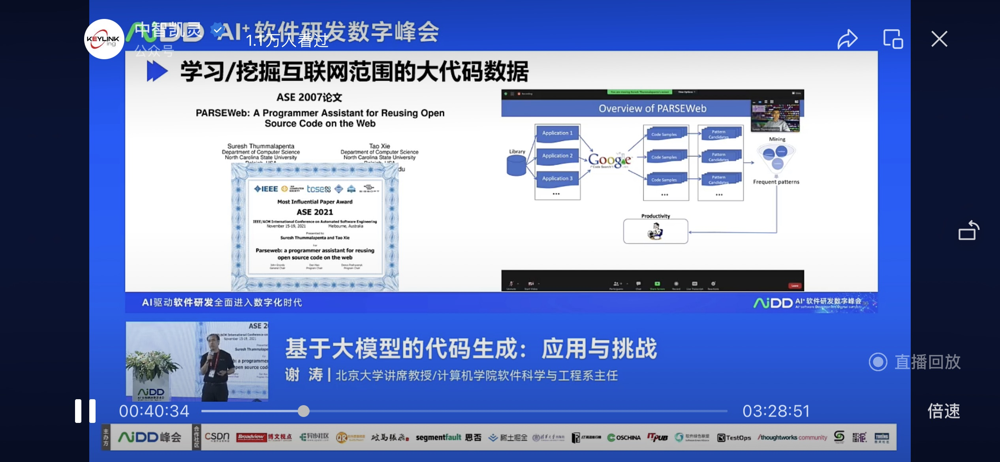

## 基于大模型的代码生成：应用与挑战

### 应用：

使用api和调用相关的内容喂给模型进行提示（Copilot labs），生成单元测试用例

遗传算法 + 大模型

### 挑战
- 大模型的能力提升（现状是：缺少上下文关联场景（竞赛等）应用好）
- 下游任务的生态建设。

- 代码大模型时代的工程师教育/训练。

## 讯飞星火大模型

GPT4的高阶能力

### 挑战

## 多模态大模型

## 基于大语言模型的软件工程

寻找上限

数据底座：重要！ 好的数据集

 

### 数字化软件资产

 

 
 