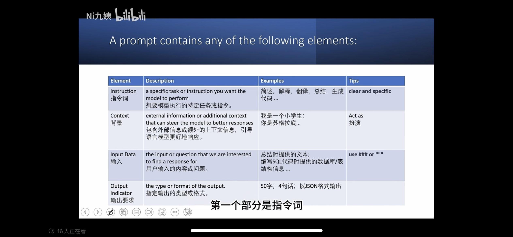
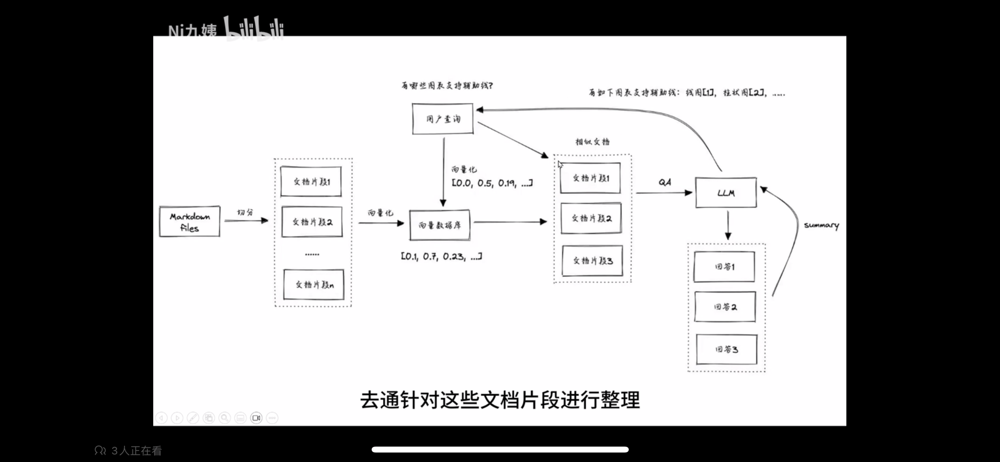
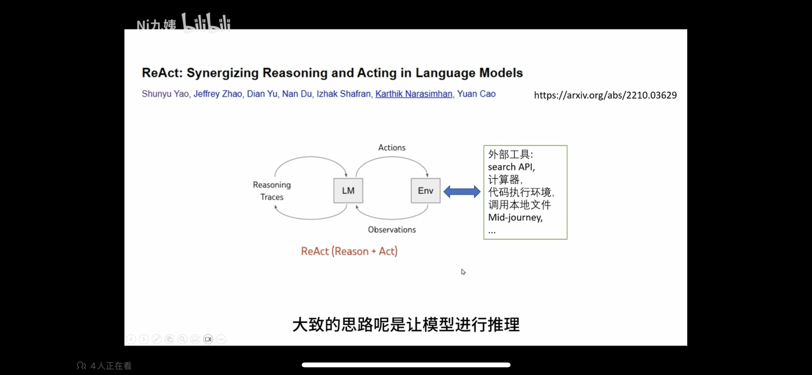

### 概览

#### 两个prompt合集网站：
- https://github.com/f/awesome-chatgpt-prompts
- https://github.com/PlexPt/awesome-chatgpt-prompts-zh

#### Prompt Engineering 最佳实践
- OpenAI:
https://help.openai.com/en/articles/6654000-best-practices-for-prompt-engineering-with-openai-api
- Azure OpenAI:
https://learn.microsoft.com/en-us/azure/cognitive-services/openai/concepts/advanced-prompt-engineering?pivots=programming-language-chat-completions

#### 吴恩达 Prompt Engineering 教程
- https://github.com/GitHubDaily/ChatGPT-Prompt-Engineering-for-Developers-in-Chinese

#### OpenAI cookbook里面的例子覆盖到了绝大多数应用场景，强烈推荐给大家
- https://github.com/openai/openai-cookbook

### ChatGPT的局限性：
- 数学计算
- 实时获取外部信息
- 执行代码

### prompt技巧：
- 使用清晰明确的词语
- 使用`###`或`"""`将指令与待处理内容分开
- 指定输出的格式
- 角色扮演（act as）
  - 我想让你扮演xxxx，给我一个xxx的解决方案。
  - 我是一个xxx，怎样xxx

- Few-shot
	- 少量的提示
- Got(chain of thought)
	- 告诉模型我们的思维方式
- Zero-shot + Cot
	- 在提问后加`let's think step by少量的提示 
### 模型与工具的整合
- Searchapi+chatgpt
	- 无法联网，但我们可以将搜索结果输入到模型
- Embedding search+chatgpt
	- 内容片段转化为向量
	- 问题转化为向量，判断问题与内容与片段的相似度
	- 将相似的片段与内容内容同时传给模型
	- 
### 模型同时与多个工具整合
ReAct（Reason+act）

告诉chatgpt有哪些工具可以调用，工具有什么功能。需要调用工具时，使用工具的api完成。

