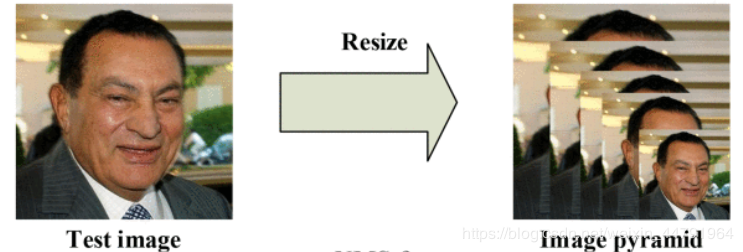

cdsn：https://blog.csdn.net/weixin_44791964/article/details/103530206
<!--more-->

# 什么是mtcnn
MTCNN，英文全称是Multi-task convolutional neural network，中文全称是多任务卷积神经网络，该神经网络将人脸区域检测与人脸关键点检测放在了一起。总体可分为P-Net、R-Net、和O-Net三层网络结构。

# 实现流程
## 1.构建图像金字塔
首先将图像进行不同尺度的变换，构建图像金字塔，以适应不同大小的人脸的进行检测。
构建方式是通过不同的缩放系数factor对图片进行缩放，每次缩小为原来的factor大小。
实现示意图如下：

当一个图片输入的时候，会缩放为不同大小的图片，但是缩小后的长宽最小不可以小于12

## 2.Pnet
Pnet的全称为Proposal Network，其基本的构造是一个全卷积网络。对上一步构建完成的图像金字塔，通过一个FCN进行初步特征提取与标定边框。
实现图片示意图如下：

在完成初步提取后，还需要进行Bounding-Box Regression调整窗口与NMS(非极大抑制)进行大部分窗口的过滤。
Pnet有两个输出，classifier用于判断这个网格点上的框的可信度，bbox_regress表示框的位置。
bbox_regress并不代表这个框在图片上的真实位置，如果需要将bbox_regress映射到真实图像上，还需要进行一次解码过程。

## 3.Rnet
Rnet全称为Refine Network，其基本的构造是一个卷积神经网络，相对于第一层的P-Net来说，增加了一个全连接层，因此对于输入数据的筛选会更加严格。在图片经过P-Net后，会留下许多预测窗口，我们将所有的预测窗口送入R-Net，这个网络会滤除大量效果比较差的候选框。
实现图片示意图如下：


## 4.Onet
Onet与Rnet工作流程类似。输出框的可信度，调整框的位置大小，五个标记点。
全称为Output Network，基本结构是一个较为复杂的卷积神经网络，相对于R-Net来说多了一个卷积层。O-Net的效果与R-Net的区别在于这一层结构会通过更多的监督来识别面部的区域，而且会对人的面部特征点进行回归，最终输出五个人脸面部特征点。
实现图片示意图如下：


# CODE
以Rnet为例，其他见cdsn中的github链接
## Rnet
```python
def create_Rnet(weight_path):
    input = Input(shape=[24, 24, 3])
    # 24,24,3 -> 11,11,28
    # 卷积层 28通道，卷积核大小（3*3），stride步长为1，padding（valid：无填充；same为0填充）。输出为28通道，22*22
    x = Conv2D(28, (3, 3), strides=1, padding='valid', name='conv1')(input)
    x = PReLU(shared_axes=[1, 2], name='prelu1')(x)
    # 池化层大小(3*3),步长为2，输出通道数不变，大小变为11*11
    x = MaxPool2D(pool_size=3,strides=2, padding='same')(x)

    # 11,11,28 -> 4,4,48
    x = Conv2D(48, (3, 3), strides=1, padding='valid', name='conv2')(x)
    x = PReLU(shared_axes=[1, 2], name='prelu2')(x)
    x = MaxPool2D(pool_size=3, strides=2)(x)

    # 4,4,48 -> 3,3,64
    x = Conv2D(64, (2, 2), strides=1, padding='valid', name='conv3')(x)
    x = PReLU(shared_axes=[1, 2], name='prelu3')(x)
    # 3,3,64 -> 64,3,3
    x = Permute((3, 2, 1))(x)
    x = Flatten()(x)
    # 576 -> 128
    x = Dense(128, name='conv4')(x)
    x = PReLU( name='prelu4')(x)
    # 128 -> 2 128 -> 4
    classifier = Dense(2, activation='softmax', name='conv5-1')(x)
    bbox_regress = Dense(4, name='conv5-2')(x)
    model = Model([input], [classifier, bbox_regress])
    model.load_weights(weight_path, by_name=True)
    return model
```
