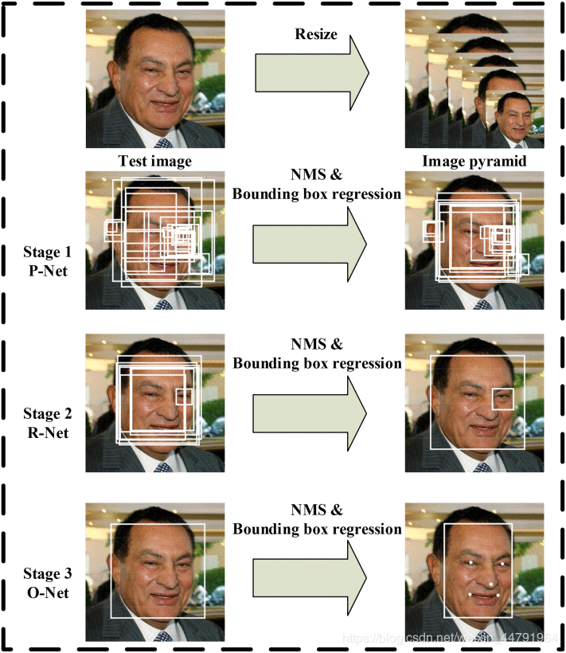

csdn链接：https://blog.csdn.net/weixin_44791964/article/details/103697409
<!--more-->
# 什么是mtcnn和facenet

## 1、mtcnn

MTCNN，英文全称是Multi-task convolutional neural network，中文全称是多任务卷积神经网络，该神经网络将人脸区域检测与人脸关键点检测放在了一起。总体可分为P-Net、R-Net、和O-Net三层网络结构。

## 2、facenet

谷歌人脸检测算法，发表于 CVPR 2015，利用相同人脸在不同角度等姿态的照片下有高内聚性，不同人脸有低耦合性，提出使用 cnn + triplet mining 方法，在 LFW 数据集上准确度达到 99.63%。

通过 CNN 将人脸映射到欧式空间的特征向量上，实质上：不同图片人脸特征的距离较大；通过相同个体的人脸的距离，总是小于不同个体的人脸这一先验知识训练网络。

测试时只需要计算人脸特征EMBEDDING，然后计算距离使用阈值即可判定两张人脸照片是否属于相同的个体。

简单来讲，在使用阶段，facenet即是：
1、输入一张人脸图片
2、通过深度学习网络提取特征
3、L2标准化
4、得到128维特征向量。

## 人脸对齐
常见的对齐方法有
1、通过双眼坐标进行旋正
2、通过矩阵运算求解仿射矩阵进行旋正

