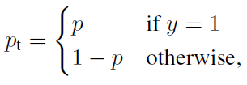

# 什么是Focal loss
<!--more-->
Focal loss是何恺明大神提出的一种新的loss计算方案。
其具有两个重要的特点。

1、控制正负样本的权重
2、控制容易分类和难分类样本的权重

正负样本的概念如下：
一张图像可能生成成千上万的候选框，但是其中只有很少一部分是包含目标的的，有目标的就是正样本，没有目标的就是负样本。

容易分类和难分类样本的概念如下：
假设存在一个二分类，样本1属于类别1的pt=0.9，样本2属于类别1的pt=0.6，显然前者更可能是类别1，其就是容易分类的样本；后者有可能是类别1，所以其为难分类样本。

如何实现权重控制呢，请往下看：
# 控制正负样本的权重
如下是常用的交叉熵loss，以二分类为例：

我们可以利用如下Pt简化交叉熵loss。

此时：

想要降低负样本的影响，可以在常规的损失函数前增加一个系数αt。与Pt类似，当label=1的时候，αt=α；当label=otherwise的时候，αt=1 - α，a的范围也是0到1。此时我们便可以通过设置α实现控制正负样本对loss的贡献。

其中：

分解开就是：

# 控制容易分类和难分类样本的权重
按照刚才的思路，一个二分类，样本1属于类别1的pt=0.9，样本2属于类别1的pt=0.6，也就是 是某个类的概率越大，其越容易分类 所以利用1-Pt就可以计算出其属于容易分类或者难分类。
具体实现方式如下。

其中$$(1-p_t)^{\gamma}$$称为调制系数
1、当pt趋于0的时候，调制系数趋于1，对于总的loss的贡献很大。当pt趋于1的时候，调制系数趋于0，也就是对于总的loss的贡献很小。
2、当γ=0的时候，focal loss就是传统的交叉熵损失，可以通过调整γ实现调制系数的改变。

# 两种权重控制方法合并
通过如下公式就可以实现控制正负样本的权重和控制容易分类和难分类样本的权重。

