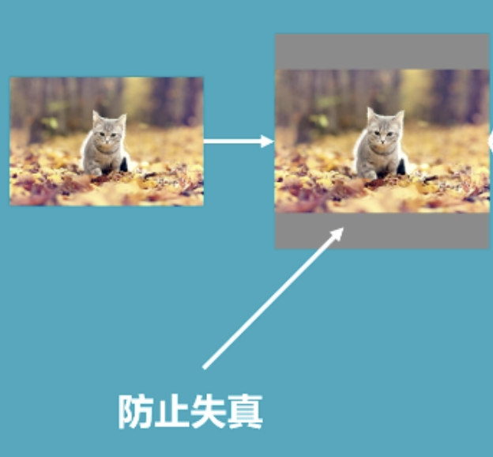

在将图片输入到模型中进行训练之前，往往需要对图片数据集进行增强处理等一系列操作。本文对这些预处理操作进行一些总结。
<!--more-->
# PIL和opencv格式的转换
```python
# OpenCV转换成PIL.Image格式
import cv2  
from PIL import Image  
import numpy  
  
img = cv2.imread("plane.jpg")  
cv2.imshow("OpenCV",img)  
image = Image.fromarray(cv2.cvtColor(img,cv2.COLOR_BGR2RGB))  
image.show()  
cv2.waitKey() 

# PIL.Image转换成OpenCV格式
import cv2  
from PIL import Image  
import numpy  
  
image = Image.open("plane.jpg")  
image.show()  
img = cv2.cvtColor(numpy.asarray(image),cv2.COLOR_RGB2BGR)  
cv2.imshow("OpenCV",img)  
cv2.waitKey() 
```


# letter_box的添加
为了防止将图片resize到固定大小的时候的失真，往往需要在对图片进行缩放后添加白边。如下图所示。

图像添加letter box的代码如下：
```python
from PIL import Image
def letterbox_image(image, size):
    # image为Image.open读入的图像
    # size为目标尺寸
    iw, ih = image.size
    w, h = size
    scale = min(w/iw, h/ih)
    nw = int(iw*scale)
    nh = int(ih*scale)

    image = image.resize((nw,nh), Image.BICUBIC) # BICUBIC:双三次插值
    new_image = Image.new('RGB', size, (128,128,128))
    new_image.paste(image, ((w-nw)//2, (h-nh)//2))
    return new_image

if __name__ == "__main__":
    import cv2
    import numpy as np
    pil_img = letterbox_image(Image.open("1.png"),(100,200))
    cv2_img = cv2.cvtColor(np.array(pil_img),cv2.COLOR_RGB2BGR)
    cv2.imshow("xx",cv2_img)
    cv2.waitKey() 
    
    # import numpy as np
    # plt.imshow(letterbox_image(Image.open("1.png"),(100,200)))
    # plt.show()
```


