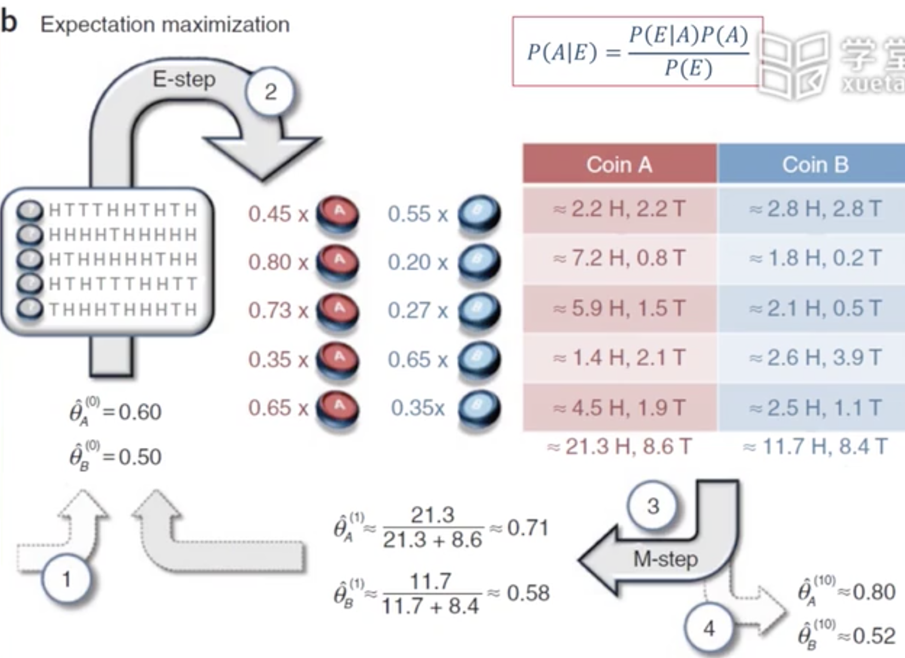

**PCA**实际上选择最大的特征向量，进行PCA时，不考虑label，即为非监督的。这就可能会导致进行PCA后，将原本可分的数据变的不可分。这时需要进行**LDA**（线性判别分析）
<!--more-->
**SVM**常用的核函数：多项式（映射到$m_2$维度）、高斯（映射到无穷维）、双曲正切函数

**聚类**结果好坏的判定：J（越小越好），直观的看见silhouette

**Sequential leader clustering**

**高斯混合算法**，多个高斯分布，概率和为1。经典EM算法：期望最大,初值很重要，最后得到局部最优

基于密度的算法：**DBSCAN**（density-based spatial cluster of application with noise） 不用事先确定k，连通性（朋友的朋友）

层次聚类

# 关联规则：
频繁集（Frequent itemsets）：两个同时被购买
关联规则（association rule）：买了一本书会买另一本
序列模式（Sequential pattern）

支持度（support）：即频率，即多少个transactions（itemset）中包含了该item或itemset
置信度（confidence）：简单来说就是条件概率，即P（Y｜X）：num（包含itemset的transaction）/num（包含itemset中的某个item的transaction）

关联规则的挖掘：找到所有满足支持度大于阈值，置信度大于阈值的规则

误区：
1.求的的置信度很大时，也有可能小于原始事件本身发生的概率
2.当两个item出现概率差别很大时，会误认为出现概率高的item一定会是的概率低的item发生。
3.两个时间相关，不代表两者之间有因果关系

**The Apriori Method**
key idea：1.频繁集的子集必定频繁； 2.一个item不频繁则其超集不频繁；

步骤：
1.生成确定大小的itemset
2.扫描数据库，看看哪些是频繁的
3.将已知频繁的itemset组合
4.进行2

比如对于大小为2的频繁集，如果要生成大小为3的频繁集，不需要将大小为1的频繁集加到2中，只需要将大小为2的频繁集加上其中的频繁item。如{(2,3),(2,5),(3,5),(1,3)} -> {(2,3,5)}

# 推荐算法
## TF-IDF
TF（term frequency）：单词在特定文档中出现的频率
IDF（inverse document frequency）：log（所有文档个数/包含特定词的个数）
TF-IDF = TF*IDF

## Vector Space Model
每一位表示一个单词
比较相似度：$cos(\theta)=\frac{p·q}{|p|·|q|}$

## Latent Semantic Analysis
类似PCA的降维

## PageRank
指向别的网页少，指向其的网页PageRank的和

## Collaborative filtering（协同过滤）
**User-based CF**
找类似的item做参考
需要用到平均值作为基值
**Model-based CF**
将表格转换为分类问题，再训练

# 框架
## 集成学习（ensemble）---用于监督学习中的分类问题
包含bagging和boosting

均值
投票（可以加权）
学习combiner

## bagging
基于bootstrap的分类器：训练多个分类器，来个样本，多个分类器投票。如随机森林
**bootstrap sample**
有放回的采样

**stacking**
学习分类器的权重

## boosting
串行的，根据生成的分类器，再生成第二个分类器，让后面的分类器学习第一个分类器分错的样本（或权重大的样本），第三个分类器学习前两个分类器分类不一致的样本。

### adaboost
修改权重

### regionboost
给权重增加了与输入的关联性

# 进化算法
## 遗传算法
https://blog.csdn.net/u010451580/article/details/51178225
所以我们总结出遗传算法的一般步骤：
开始循环直至找到满意的解。

1.评估每条染色体所对应个体的适应度。

2.遵照适应度越高，选择概率越大的原则，从种群中选择两个个体作为父方和母方。

3.抽取父母双方的染色体，进行交叉，产生子代。

4.对子代的染色体进行变异。

5.重复2，3，4步骤，直到新种群的产生。

结束循环。

