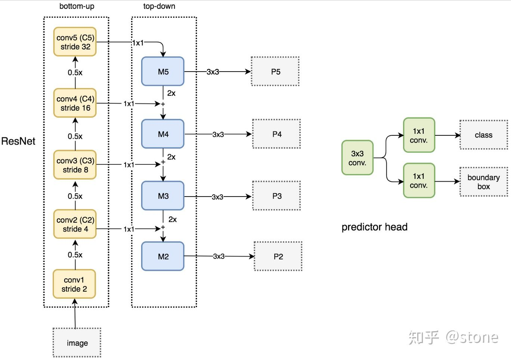
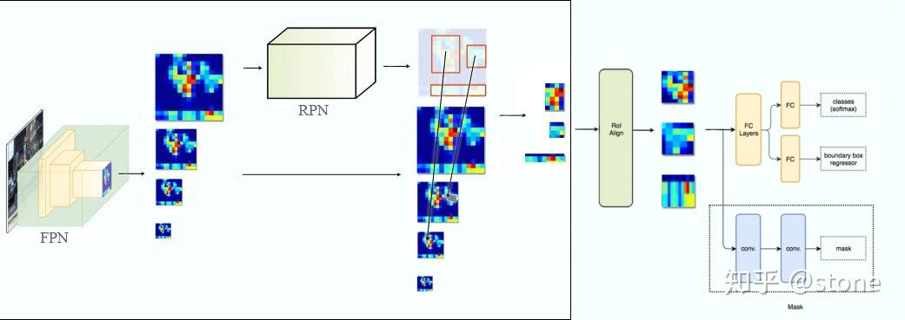
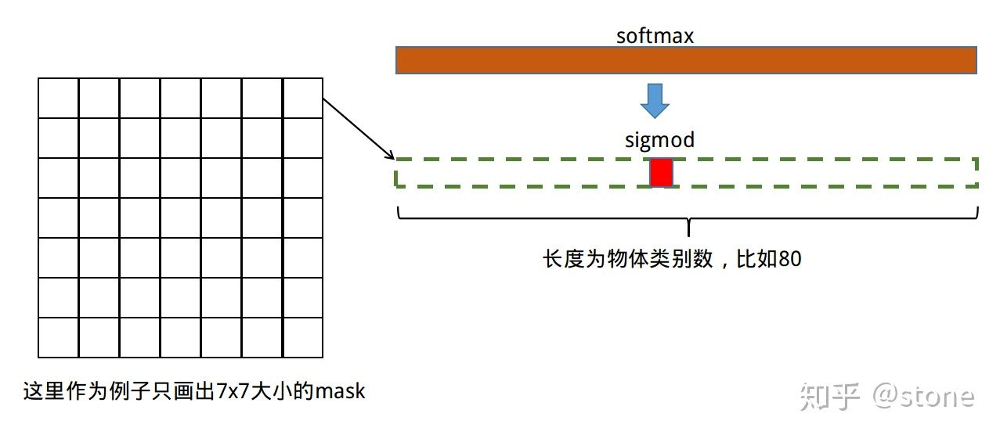

参考链接：https://zhuanlan.zhihu.com/p/37998710
# 简介
<!--more-->
mask rcnn是ICCV2017的best paper。
Mask RCNN沿用了Faster RCNN的思想，特征提取采用ResNet-FPN的架构，另外多加了一个Mask预测分支。
ResNet-FPN+Fast RCNN+Mask，实际上就是Mask RCNN。
# 回顾
## ResNet-FPN（Feature Pyramid Networks）
多尺度检测在目标检测中变得越来越重要，对小目标的检测尤其如此。现在主流的目标检测方法很多都用到了多尺度的方法，包括最新的yolo v3。Feature Pyramid Network (FPN)则是一种精心设计的多尺度检测方法，下面就开始简要介绍FPN。

FPN结构中包括自下而上，自上而下和横向连接三个部分，如下图所示。这种结构可以将各个层级的特征进行融合，使其同时具有强语义信息和强空间信息，在特征学习中算是一把利器了。

FPN实际上是一种通用架构，可以结合各种骨架网络使用，比如VGG，ResNet等。Mask RCNN文章中使用了ResNNet-FPN网络结构。如下图：

**自下而上**
从下到上路径。可以明显看出，其实就是简单的特征提取过程，和传统的没有区别。具体就是将ResNet作为骨架网络，根据feature map的大小分为5个stage。stage2，stage3，stage4和stage5各自最后一层输出conv2，conv3，conv4和conv5分别定义为C2，C3，C4，C5，他们相对于原始图片的stride是{4,8,16,32}。需要注意的是，考虑到内存原因，stage1的conv1并没有使用。
**自上而下和横向连接**
自上而下是从最高层开始进行上采样，这里的上采样直接使用的是最近邻上采样，而不是使用反卷积操作，一方面简单，另外一方面可以减少训练参数。横向连接则是将上采样的结果和自底向上生成的相同大小的feature map进行融合。具体就是对C2，C3，C4，C5中的每一层经过一个conv 1x1操作（1x1卷积用于降低通道数），无激活函数操作，输出通道全部设置为相同的256通道，然后和上采样的feature map进行加和操作。在融合之后还会再采用3*3的卷积核对已经融合的特征进行处理，目的是消除上采样的混叠效应（aliasing effect）。

> 实际上，上图少绘制了一个分支：M5经过步长为2的max pooling下采样得到 P6，作者指出使用P6是想得到更大的anchor尺度512×512。但P6是只用在 RPN中用来得到region proposal的，并不会作为后续Fast RCNN的输入。
> 
> 总结一下，ResNet-FPN作为RPN输入的feature map是 [公式] ，而作为后续Fast RCNN的输入则是 [公式] 。

## ResNet-FPN+Fast RCNN

将ResNet-FPN和Fast RCNN进行结合，实际上就是Faster RCNN的了，但与最初的Faster RCNN不同的是，FPN产生了特征金字塔[P2,P3,P4,P5,P6]，而不只是一个featrue map。金字塔经过RPN之后会产生很多region proposal。这些region proposal是分别由[P2,P3,P4,P5,P6]经过RPN产生的，但用于输入到Fast RCNN中的是 [P2,P3,P4,P5]，也就是说要在[P2,P3,P4,P5]中根据region proposal切出ROI进行后续的分类和回归预测。问题来了，我们要选择哪个feature map来切出这些ROI区域呢？实际上，我们会选择最合适的尺度的feature map来切ROI。具体来说，我们通过一个公式来决定宽w和高h的ROI到底要从哪个Pk来切：
$$k=\left\lfloor{k_0+log_2(\sqrt{wh}/224)}\right\rfloor$$

这里224表示用于预训练的ImageNet图片的大小。$k_0$表示面积为$w\times h=224\times 224$的ROI所应该在的层级。作者将$k_0$设置为4，也就是说$w\times h=224\times 224$的ROI应该从P4中切出来。假设ROI的scale小于224（比如说是112 * 112），$k=k_0-1=4-1=3$，就意味着要从更高分辨率的P3中产生。另外，k值会做取整处理，防止结果不是整数。

这种做法很合理，大尺度的ROI要从低分辨率的feature map上切，有利于检测大目标，小尺度的ROI要从高分辨率的feature map上切，有利于检测小目标。

# ResNet-FPN+Fast RCNN+mask
将ResNet-FPN+Fast RCNN+mask，则得到了最终的Mask RCNN

# ROI Align
Faster R-CNN存在的问题是：特征图与原始图像是不对准的（mis-alignment），所以会影响检测精度。而Mask R-CNN提出了RoIAlign的方法来取代ROI pooling，RoIAlign可以保留大致的空间位置。

在Faster RCNN中，有两次整数化的过程：
- region proposal的xywh通常是小数，但是为了方便操作会把它整数化。
- 将整数化后的边界区域平均分割成 k x k 个单元，对每一个单元的边界进行整数化。

事实上，经过上述两次整数化，此时的候选框已经和最开始回归出来的位置有一定的偏差，这个偏差会影响检测或者分割的准确度。在论文里，作者把它总结为“不匹配问题”（misalignment）。

为了解决这个问题，ROI Align方法取消整数化操作，保留了小数，使用双线性插值的方法获得坐标为浮点数的像素点上的图像数值。但在实际操作中，ROI Align并不是简单地补充出候选区域边界上的坐标点，然后进行池化，而是重新进行设计。

下面通过一个例子来讲解ROI Align操作。如下图所示，虚线部分表示feature map，实线表示ROI，这里将ROI切分成2x2的单元格。如果采样点数是4，那我们首先将每个单元格子均分成四个小方格（如红色线所示），每个小方格中心就是采样点。这些采样点的坐标通常是浮点数，所以需要对采样点像素进行双线性插值（如四个箭头所示），就可以得到该像素点的值了。然后对每个单元格内的四个采样点进行maxpooling，就可以得到最终的ROIAlign的结果。

# 损失
Mask RCNN定义多任务损失：
$$L=L_{cls}+L_{box}+L_{mask}$$
$L_{cls}$和$L_{box}$与faster rcnn的定义没有区别。需要具体说明的是，假设一共有K个类别，则mask分割分支的输出维度是$K*m*m$, 对于$m*m$中的每个点，都会输出K个二值Mask（每个类别使用sigmoid输出）。需要注意的是，计算loss的时候，并不是每个类别的sigmoid输出都计算二值交叉熵损失，而是该像素属于哪个类，哪个类的sigmoid输出才要计算损失(如图红色方形所示)。并且在测试的时候，我们是通过分类分支预测的类别来选择相应的mask预测。这样，mask预测和分类预测就彻底解耦了。(nll)

这与FCN方法是不同，FCN是对每个像素进行多类别softmax分类，然后计算交叉熵损失，很明显，这种做法是会造成类间竞争的，而每个类别使用sigmoid输出并计算二值损失，可以避免类间竞争。实验表明，通过这种方法，可以较好地提升性能。

