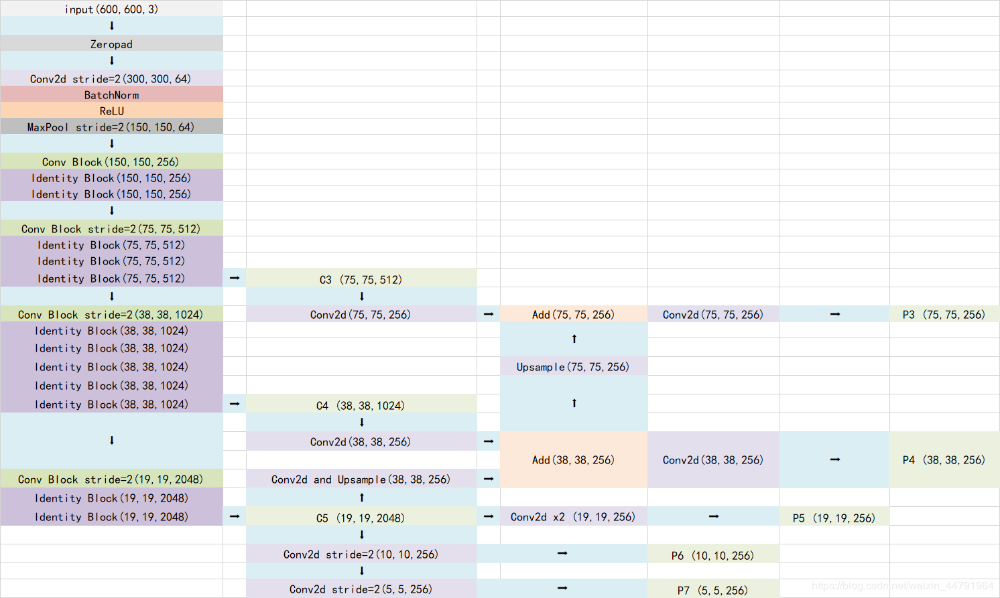
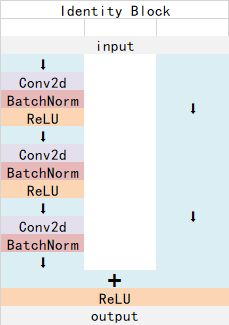

# Retinanet目标检测算法
<!--more-->

Retinanet是在何凯明大神提出Focal loss同时提出的一种新的目标检测方案，来验证Focal Loss的有效性。

One-Stage目标检测方法常常使用先验框提高预测性能，一张图像可能生成成千上万的候选框，但是其中只有很少一部分是包含目标的的，有目标的就是正样本，没有目标的就是负样本。这种情况造成了One-Stage目标检测方法的正负样本不平衡，也使得One-Stage目标检测方法的检测效果比不上Two-Stage目标检测方法。

Focal Loss是一种新的用于平衡One-Stage目标检测方法正负样本的Loss方案。

Retinane的结构非常简单，但是其存在非常多的先验框，以输入600x600x3的图片为例，就存在着67995个先验框，这些先验框里面大多包含的是背景，存在非常多的负样本。以Focal Loss训练的Retinanet可以有效的平衡正负样本，实现有效的训练。

ResNet50有两个基本的块，分别名为Conv Block和Identity Block，其中Conv Block输入和输出的维度是不一样的，所以不能连续串联，它的作用是改变网络的维度；Identity Block输入维度和输出维度相同，可以串联，用于加深网络的。
Conv Block的结构如下：

Identity Block的结构如下：

通过图像金字塔我们可以获得五个有效的特征层，分别是P3、P4、P5、P6、P7，
为了和普通特征层区分，我们称之为有效特征层，将这五个有效的特征层传输过class+box subnets就可以获得预测结果了。

class subnet采用4次256通道的卷积和1次num_priors x num_classes通道的卷积，num_priors指的是该特征层所拥有的先验框数量，num_classes指的是网络一共对多少类的目标进行检测。

box subnet采用4次256通道的卷积和1次num_priors x 4通道的卷积，num_priors指的是该特征层所拥有的先验框数量，4指的是先验框的调整情况。

