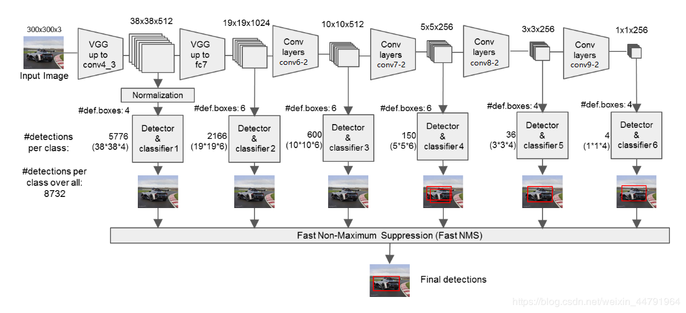

CSDN：https://blog.csdn.net/weixin_44791964/article/details/104107271
# SSD目标检测算法
<!--more-->
SSD是一种非常优秀的one-stage目标检测方法，one-stage算法就是目标检测和分类是同时完成的，其主要思路是利用CNN提取特征后，均匀地在图片的不同位置进行密集抽样，抽样时可以采用不同尺度和长宽比，物体分类与预测框的回归同时进行，整个过程只需要一步，所以其优势是速度快。
但是均匀的密集采样的一个重要缺点是训练比较困难，这主要是因为正样本与负样本（背景）极其不均衡（参见Focal Loss），导致模型准确度稍低。
SSD的英文全名是Single Shot MultiBox Detector，Single shot说明SSD算法属于one-stage方法，MultiBox说明SSD算法基于多框预测。

# SSD目标检测原理

SSD采用的主干网络是VGG网络，VGG网络相比普通的VGG网络有一定的修改，主要修改的地方就是：
1、将VGG16的FC6和FC7层转化为卷积层。
2、去掉所有的Dropout层和FC8层；
3、新增了Conv6、Conv7、Conv8、Conv9。

