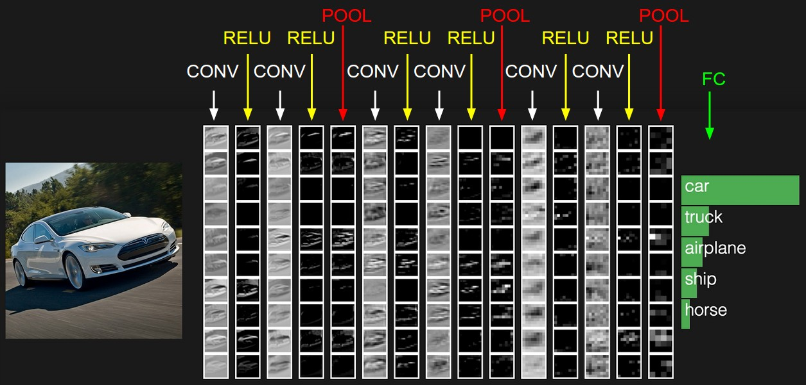
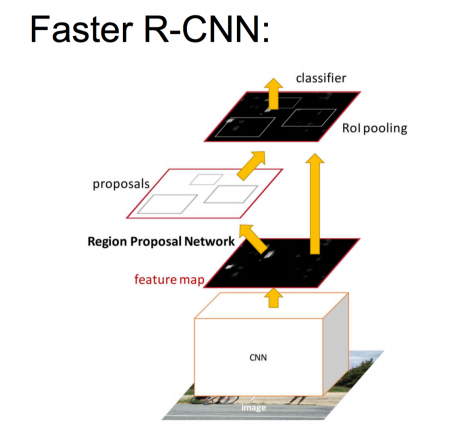
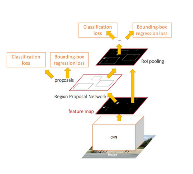

[参考链接](https://blog.csdn.net/v_JULY_v/article/details/80170182)
<!--more-->
# 常见的目标检测算法
object detection，就是在给定的图片中精确找到物体所在位置，并标注出物体的类别。所以，object detection要解决的问题就是物体在哪里以及是什么的整个流程问题。
然而，这个问题可不是那么容易解决的，物体的尺寸变化范围很大，摆放物体的角度，姿态不定，而且可以出现在图片的任何地方，更何况物体还可以是多个类别。

**目前学术和工业界出现的目标检测算法分成3类：**
1. 传统的目标检测算法：Cascade + HOG/DPM + Haar/SVM以及上述方法的诸多改进、优化；
2. 候选区域/窗 + 深度学习分类：通过提取候选区域，并对相应区域进行以深度学习方法为主的分类的方案，如：
R-CNN（Selective Search + CNN + SVM）
SPP-net（ROI Pooling）
Fast R-CNN（Selective Search + CNN + ROI）
Faster R-CNN（RPN + CNN + ROI）
R-FCN
等系列方法；
3. 基于深度学习的回归方法：YOLO/SSD/DenseBox 等方法；以及最近出现的结合RNN算法的RRC detection；结合DPM的Deformable CNN等

**传统目标检测流程：**
1）区域选择（穷举策略：采用滑动窗口，且设置不同的大小，不同的长宽比对图像进行遍历，时间复杂度高）
2）特征提取（SIFT、HOG等；形态多样性、光照变化多样性、背景多样性使得特征鲁棒性差）
3）分类器分类（主要有SVM、Adaboost等）

传统目标检测的主要问题是：
1）基于滑动窗口的区域选择策略没有针对性，时间复杂度高，窗口冗余
2）手工设计的特征对于多样性的变化没有很好的鲁棒性

# 候选区域/窗 + 深度学习分类
## R-CNN横空出世
预先找出图中目标可能出现的位置，即候选区域（Region Proposal）。利用图像中的纹理、边缘、颜色等信息，可以保证在选取较少窗口(几千甚至几百）的情况下保持较高的召回率（Recall）。
所以，问题就转变成找出可能含有物体的区域/框（也就是候选区域/框，比如选2000个候选框），这些框之间是可以互相重叠互相包含的，这样我们就可以避免暴力枚举的所有框了。
大牛们发明好多选定候选框Region Proposal的方法，比如Selective Search和EdgeBoxes。那提取候选框用到的算法“选择性搜索”到底怎么选出这些候选框的呢？具体可以看一下PAMI2015的“What makes for effective detection proposals？”
2014年，RBG（Ross B. Girshick）使用Region Proposal + CNN代替传统目标检测使用的滑动窗口+手工设计特征，设计了R-CNN框架，使得目标检测取得巨大突破，并开启了基于深度学习目标检测的热潮。

## RCNN算法分为4个步骤
R-CNN的简要步骤如下
(1) 输入测试图像
(2) 利用选择性搜索Selective Search算法在图像中从下到上提取2000个左右的可能包含物体的候选区域Region Proposal
(3) 因为取出的区域大小各自不同，所以需要将每个Region Proposal缩放（warp）成统一的227x227的大小并输入到CNN，将CNN的fc7层的输出作为特征
(4) 将每个Region Proposal提取到的CNN特征输入到SVM进行分类
(5) 使用回归器精细修正候选框位置：对于每一个类，训练一个线性回归模型去判定这个框是否框得完美。

**Selective Search 主要思想:**
使用一种过分割手段，将图像分割成小区域 (1k~2k 个),查看现有小区域，按照合并规则合并可能性最高的相邻两个区域。重复直到整张图像合并成一个区域位置,输出所有曾经存在过的区域，所谓候选区域
其中合并规则如下： 优先合并以下四种区域：
- 颜色（颜色直方图）相近的
- 纹理（梯度直方图）相近的
- 合并后总面积小的： 保证合并操作的尺度较为均匀，避免一个大区域陆续“吃掉”其他小区域 （例：设有区域a-b-c-d-e-f-g-h。较好的合并方式是：ab-cd-ef-gh -> abcd-efgh -> abcdefgh。 不好的合并方法是：ab-c-d-e-f-g-h ->abcd-e-f-g-h ->abcdef-gh -> abcdefgh）
- 合并后，总面积在其BBOX中所占比例大的： 保证合并后形状规则。

## SPP Net
SPP：Spatial Pyramid Pooling（空间金字塔池化）
SPP-Net是出自2015年发表在IEEE上的论文-《Spatial Pyramid Pooling in Deep ConvolutionalNetworks for Visual Recognition》。
众所周知，CNN一般都含有卷积部分和全连接部分，其中，卷积层不需要固定尺寸的图像，而全连接层是需要固定大小的输入。

所以当全连接层面对各种尺寸的输入数据时，就需要对输入数据进行crop（crop就是从一个大图扣出网络输入大小的patch，比如227×227），或warp（把一个边界框bounding box的内容resize成227×227）等一系列操作以统一图片的尺寸大小，比如224*224（ImageNet）、32*32(LenNet)、96*96等。

但warp/crop这种预处理，导致的问题要么被拉伸变形、要么物体不全，限制了识别精确度。SPP Net的作者Kaiming He等人逆向思考，既然由于全连接FC层的存在，普通的CNN需要通过固定输入图片的大小来使得全连接层的输入固定。那借鉴卷积层可以适应任何尺寸，为何不能在卷积层的最后加入某种结构，使得后面全连接层得到的输入变成固定的呢？
这个“化腐朽为神奇”的结构就是spatial pyramid pooling layer。下图便是R-CNN和SPP Net检测流程的比较：
**
它的特点有两个:**
1.结合空间金字塔方法实现CNNs的多尺度输入。
SPP Net的第一个贡献就是在最后一个卷积层后，接入了金字塔池化层，保证传到下一层全连接层的输入固定。
换句话说，在普通的CNN机构中，输入图像的尺寸往往是固定的（比如224*224像素），输出则是一个固定维数的向量。SPP Net在普通的CNN结构中加入了ROI池化层（ROI Pooling），使得网络的输入图像可以是任意尺寸的，输出则不变，同样是一个固定维数的向量。
简言之，CNN原本只能固定输入、固定输出，CNN加上SSP之后，便能任意输入、固定输出。神奇吧？
ROI池化层一般跟在卷积层后面，此时网络的输入可以是任意尺度的，在SPP layer中每一个pooling的filter会根据输入调整大小，而SPP的输出则是固定维数的向量，然后给到全连接FC层。
2.只对原图提取一次卷积特征
在R-CNN中，每个候选框先resize到统一大小，然后分别作为CNN的输入，这样是很低效的。
而SPP Net根据这个缺点做了优化：只对原图进行一次卷积计算，便得到整张图的卷积特征feature map，然后找到每个候选框在feature map上的映射patch，将此patch作为每个候选框的卷积特征输入到SPP layer和之后的层，完成特征提取工作。
如此这般，R-CNN要对每个区域计算卷积，而SPPNet只需要计算一次卷积，从而节省了大量的计算时间，比R-CNN有一百倍左右的提速。

## Fast R-CNN
SPP Net真是个好方法，R-CNN的进阶版Fast R-CNN就是在R-CNN的基础上采纳了SPP Net方法，对R-CNN作了改进，使得性能进一步提高。
**R-CNN与Fast R-CNN的区别有哪些呢？**
先说R-CNN的缺点：即使使用了Selective Search等预处理步骤来提取潜在的bounding box作为输入，但是R-CNN仍会有严重的速度瓶颈，原因也很明显，就是计算机对所有region进行特征提取时会有重复计算，Fast-RCNN正是为了解决这个问题诞生的。
与R-CNN框架图对比，可以发现主要有两处不同：一是最后一个卷积层后加了一个ROI pooling layer，二是损失函数使用了多任务损失函数(multi-task loss)，将边框回归Bounding Box Regression(先验框尺寸和位置的调整)直接加入到CNN网络中训练
(1) ROI pooling layer实际上是SPP-NET的一个精简版，SPP-NET对每个proposal使用了不同大小的金字塔映射，而ROI pooling layer只需要下采样到一个7x7的特征图。对于VGG16网络conv5_3有512个特征图，这样所有region proposal对应了一个7*7*512维度的特征向量作为全连接层的输入。
换言之，这个网络层可以把不同大小的输入映射到一个固定尺度的特征向量，而我们知道，conv、pooling、relu等操作都不需要固定size的输入，因此，在原始图片上执行这些操作后，虽然输入图片size不同导致得到的feature map尺寸也不同，不能直接接到一个全连接层进行分类，但是可以加入这个神奇的ROI Pooling层，对每个region都提取一个固定维度的特征表示，再通过正常的softmax进行类型识别。
(2) R-CNN训练过程分为了三个阶段，而Fast R-CNN直接使用softmax替代SVM分类，同时利用多任务损失函数边框回归也加入到了网络中，这样整个的训练过程是端到端的(除去Region Proposal提取阶段)。
也就是说，之前R-CNN的处理流程是先提proposal，然后CNN提取特征，之后用SVM分类器，最后再做bbox regression，而在Fast R-CNN中，作者巧妙的把bbox regression放进了神经网络内部，与region分类和并成为了一个multi-task模型，实际实验也证明，这两个任务能够共享卷积特征，并相互促进。

所以，Fast-RCNN很重要的一个贡献是成功的让人们看到了Region Proposal + CNN这一框架实时检测的希望，原来多类检测真的可以在保证准确率的同时提升处理速度，也为后来的Faster R-CNN做下了铺垫。

> **画一画重点：**
> R-CNN有一些相当大的缺点（把这些缺点都改掉了，就成了Fast R-CNN）。
> 大缺点：由于每一个候选框都要独自经过CNN，这使得花费的时间非常多。
> 解决：共享卷积层，现在不是每一个候选框都当做输入进入CNN了，而是输入一张完整的图片，在第五个卷积层再得到每个候选框的特征
> 
> 原来的方法：许多候选框（比如两千个）-->CNN-->得到每个候选框的特征-->分类+回归
> 现在的方法：一张完整图片-->CNN-->得到每张候选框的特征-->分类+回归
> 
> 所以容易看见，Fast R-CNN相对于R-CNN的提速原因就在于：不过不像R-CNN把每个候选区域给深度网络提特征，而是整张图提一次特征，再把候选框映射到conv5上，而SPP只需要计算一次特征，剩下的只需要在conv5层上操作就可以了。

## Faster R-CNN
Fast R-CNN存在的问题：存在瓶颈：选择性搜索，找出所有的候选框，这个也非常耗时。那我们能不能找出一个更加高效的方法来求出这些候选框呢？
**解决：**加入一个提取边缘的神经网络，也就说找到候选框的工作也交给神经网络来做了。
所以，rgbd在Fast R-CNN中引入Region Proposal Network(RPN)替代Selective Search，同时引入anchor box应对目标形状的变化问题（anchor就是位置和大小固定的box，可以理解成事先设置好的固定的proposal）。
具体做法：
　　• 将RPN放在最后一个卷积层的后面
　　• RPN直接训练得到候选区域

一种网络，四个损失函数;
　　• RPN calssification(anchor good.bad)
　　• RPN regression(anchor->propoasal)
　　• Fast R-CNN classification(over classes)
　　• Fast R-CNN regression(proposal ->box)

Faster R-CNN的主要贡献就是设计了提取候选区域的网络RPN，代替了费时的选择性搜索selective search，使得检测速度大幅提高。

最后总结一下各大算法的步骤：
RCNN
1.在图像中确定约1000-2000个候选框 (使用选择性搜索Selective Search)
2.每个候选框内图像块缩放至相同大小，并输入到CNN内进行特征提取 
3.对候选框中提取出的特征，使用分类器判别是否属于一个特定类 
4.对于属于某一类别的候选框，用回归器进一步调整其位置

Fast R-CNN
1.在图像中确定约1000-2000个候选框 (使用选择性搜索Selective Search)
2.对整张图片输进CNN，得到feature map
3.找到每个候选框在feature map上的映射patch，将此patch作为每个候选框的卷积特征输入到SPP layer和之后的层
4.对候选框中提取出的特征，使用分类器判别是否属于一个特定类 
5.对于属于某一类别的候选框，用回归器进一步调整其位置

Faster R-CNN
1.对整张图片输进CNN，得到feature map
2.卷积特征输入到RPN，得到候选框的特征信息
3.对候选框中提取出的特征，使用分类器判别是否属于一个特定类 
4.对于属于某一类别的候选框，用回归器进一步调整其位置

# 基于深度学习的回归算法
TOLO和SSD算法可以参看我的其他博文
## YOLO (CVPR2016, oral)
(You Only Look Once: Unified, Real-Time Object Detection)
Faster R-CNN的方法目前是主流的目标检测方法，但是速度上并不能满足实时的要求。YOLO一类的方法慢慢显现出其重要性，这类方法使用了回归的思想，利用整张图作为网络的输入，直接在图像的多个位置上回归出这个位置的目标边框，以及目标所属的类别。

## SSD
首先SSD获取目标位置和类别的方法跟YOLO一样，都是使用回归，但是YOLO预测某个位置使用的是全图的特征，SSD预测某个位置使用的是这个位置周围的特征（感觉更合理一些）。

那么如何建立某个位置和其特征的对应关系呢？可能你已经想到了，使用Faster R-CNN的anchor机制。如SSD的框架图所示，假如某一层特征图(图b)大小是8*8，那么就使用3*3的滑窗提取每个位置的特征，然后这个特征回归得到目标的坐标信息和类别信息(图c)。

不同于Faster R-CNN，这个anchor是在多个feature map上，这样可以利用多层的特征并且自然的达到多尺度（不同层的feature map 3*3滑窗感受野不同）。

小结：SSD结合了YOLO中的回归思想和Faster R-CNN中的anchor机制，使用全图各个位置的多尺度区域特征进行回归，既保持了YOLO速度快的特性，也保证了窗口预测的跟Faster R-CNN一样比较精准。SSD在VOC2007上mAP可以达到72.1%，速度在GPU上达到58帧每秒。
