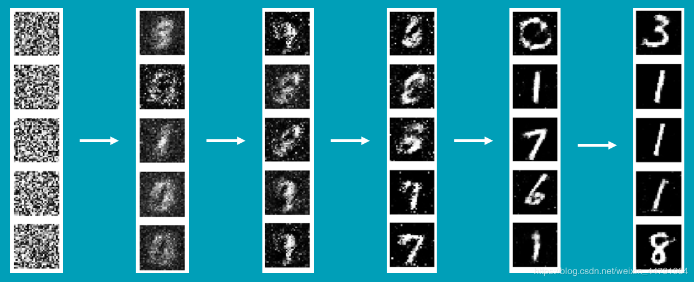

# 什么是GAN
CSDN: https://blog.csdn.net/weixin_44791964/article/details/103729797
<!--more-->
生成式对抗网络（GAN, Generative Adversarial Networks ）是一种深度学习模型，是近年来复杂分布上无监督学习最具前景的方法之一。
模型通过框架中（至少）两个模块：生成模型（Generative Model）和判别模型（Discriminative Model）的互相博弈学习产生相当好的输出。
原始 GAN 理论中，并不要求 G 和 D 都是神经网络，只需要是能拟合相应生成和判别的函数即可。但实用中一般均使用深度神经网络作为 G 和 D 。
一个优秀的GAN应用需要有良好的训练方法，否则可能由于神经网络模型的自由性而导致输出不理想。

其实简单来讲，一般情况下，GAN就是创建两个神经网络，一个是生成模型，一个是判别模型。

生成模型输入一行正态分布随机数生成相应的输出。
判别模型对生成模型的输出进行判别，判断它是不是真的。

生成模型的目的是**生成让判别模型无法判断真伪的输出**。
判别模型的目的是**判断出真伪**。

