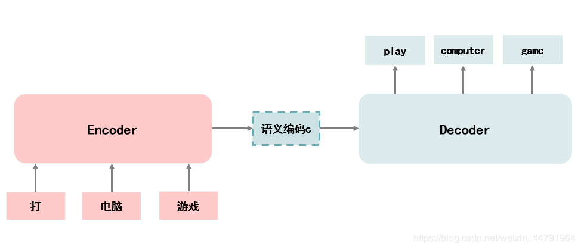
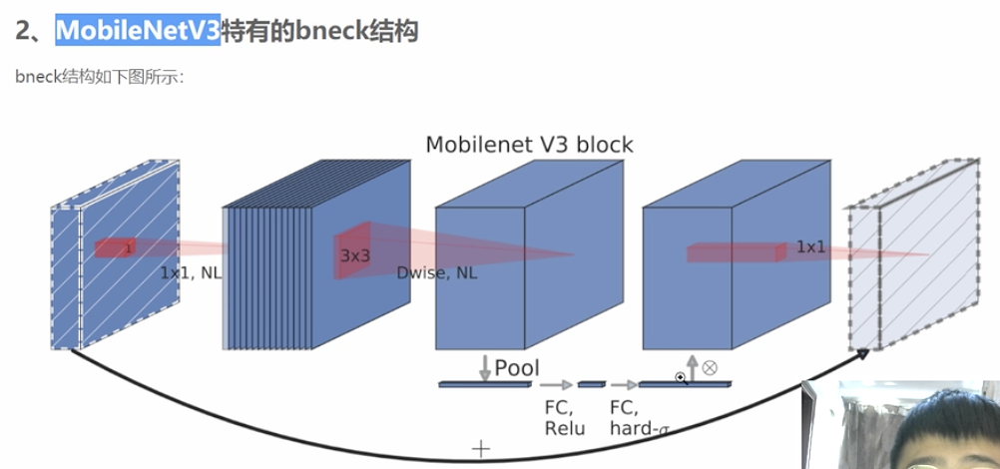

csdn: https://blog.csdn.net/weixin_44791964/article/details/104000722
# 什么是注意力机制
<!--more-->
利用神经网络找到输入进来的特征，哪一部分更有用。

假设我们要翻译一句话：
打电脑游戏。
也就是play computer game。

如果不引入注意力机制，那么我们从Encoder获得语义编码c之后，这个语义编码在Decoder中传递，其内容就和Encoder无关了。

但是事实上我们希望在翻译打电脑游戏中的打的时候，我们更注意打->play的转换，此时我们希望Decoder更加注意Encoder从打中提取出来的特征。

这就是注意力机制的概念，它的本意是让神经网络模型在做特定的事的时候可以注意到它需要注意的地方。

由于神经网络是一堆数字的传递，每个事物的特征也是由一堆数字组成的，比如打字的特征也是一堆数字，电脑的特征也是一堆数字，游戏的特征也是一堆数字，语义编码c就是这么多特征的组合。

那么如何使得神经网络模型对某个内容进行注意呢？其实就是将改变不同内容的权重，当我们需要神经网络注意到打的时候，我们只需要提高打字的特征的权重就可以了。
假设函数 f 可以用于提取特征，函数 g 可以实现解码。那么如果我们要神经网络注意到打，可以通过如下方式进行。

$$C_{play}=g(0.8∗f(打),0.1∗f(电脑),0.1∗f(游戏))$$

# 注意力机制的通俗解释

在mobelnet中注意力机制的应用如上，将图片通过全局均匀池化层变成一个长条，变成短条，恢复长条，恢复大小。长条变短条再变长条的过程就是重要特征提取的过程。短条中给了重要特征更高的权重。

总的来说类似自编码器，中间的全连接层用来将重要的特征进行提取（重要的特征给高的权重）。
