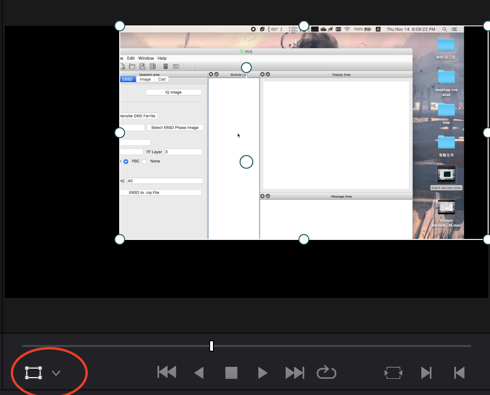

```yaml

title: Davinci教程
toc: true
date: 2020-02-25 11:22:30
tags: [达芬奇,剪辑]
categories:
- 其他工具

```

在家闲的无聊，随便学学，[B站链接](https://www.bilibili.com/video/av91200016/?spm_id_from=333.788.videocard.0)
**B站影视剧风达芬奇教程**

<!--more-->

# 软件初始设置

偏好设置 -> 用户 -> 项目加载与保存 -> 打开**实时保存与项目备份**

# 软件使用

## 素材导入

在媒体中将素材分类导入到各个媒体文件夹中。

## 快编和剪辑

**剪辑**
将视频拖拽到浏览窗口后，通过`I`和`O`键设置入口和出口，之后将截取的视频拖拽到时间线即可。

**添加特效**
在特效库中将效果拖拽到时间线对应的视频进行添加。
添加之后通过效果检查器面板设置参数

**快编**
快编适合粗剪

## Fusion

不推荐使用其制作特效。特效推荐使用AE等。

# 剪辑

## 项目设置

设置缓存的目录：文件 -> 项目设置 -> 主设置 -> 工作文件夹
设置帧率：文件 -> 项目设置 -> 主设置 -> 时间线格式 -> 时间线帧率/播放帧率(25)(因为国内交流电频率50Hz)

## 资源导入

先导入所有素材，然后文件夹分类

## 视频剪辑

设置出入点`I`和`O`键
拖入时间线时可以在浮动的框口中选择只导入画面或音频
创建时间线：建议创建时间线然后再进行拖拽
时间线操作：

- 时间线缩放：alt+鼠标中键   或  ctrl+加号/减号

图标功能：

修剪编辑模式：前后素材一起移动
动态修剪模式：不常用
切刀：快捷键B（command+B）
插入片段：在片段之间插入
覆盖片段：覆盖重合的部分
替换片段：替换对应的片段
磁力
链接：链接视频和音频
锁定：锁定时间线的位置


如果只导入视频，可以按下`F`来匹配帧，从而可以从素材显示窗口再导入音频。

# 效果添加

在特效库中将效果拖拽到时间线对应的视频进行添加。
添加之后通过效果检查器面板设置参数

## 调整效果检查器面板参数

- 直接输入
- 鼠标拖动数字
- alt+鼠标拖动（精细操作）

实时面板左下角可以进行裁切或变换等。



## 涉及到时间的特效

- 关键帧
通过效果检查及面板参数后面的菱形添加关键帧
在两个关键帧之间可以进行调整
在时间线上点击菱形

## 批处理

`ctrl+c`复制
右键片段粘贴属性
不同比例的素材统一，防止出现黑边：项目->图像缩放调整->输入缩放调整

## 插件

redgiant红巨星宇宙

# 代理生成

为了使视频流畅播放，就需要对素材进行优化。
几种方法：

1. 菜单栏-> 播放 -> 代理模式 -> 选择更低的分辨率
2. 优化媒体文件（将媒体文件优化到一个更优的文件）
- 选择媒体文件，右键-> 生成优化的媒体文件（编码设置：文件->项目设置->主设置->优化的媒体和渲染缓存，工作文件夹->...）
- 复杂操作后仍然会卡顿：播放->渲染缓存

# 智能媒体文件夹与双时间线剪辑

通常剪辑视频分为Aroll和Broll，Aroll代表内容的核心框架，Broll为帮助描述主内容的画面等。通常流程为Aroll->Broll->特效。
**智能媒体文件夹**：通过各种信息将素材文件进行分类。
**双时间线剪辑**：时间线右上角

- 一个时间线放素材和裁剪
- 将有用的片段拉到第二个时间线，防止对视频的破坏（编辑-》删除空隙）

# 快编界面

一次性快速浏览大量素材
选中素材按下c键可以快速进行自动调色