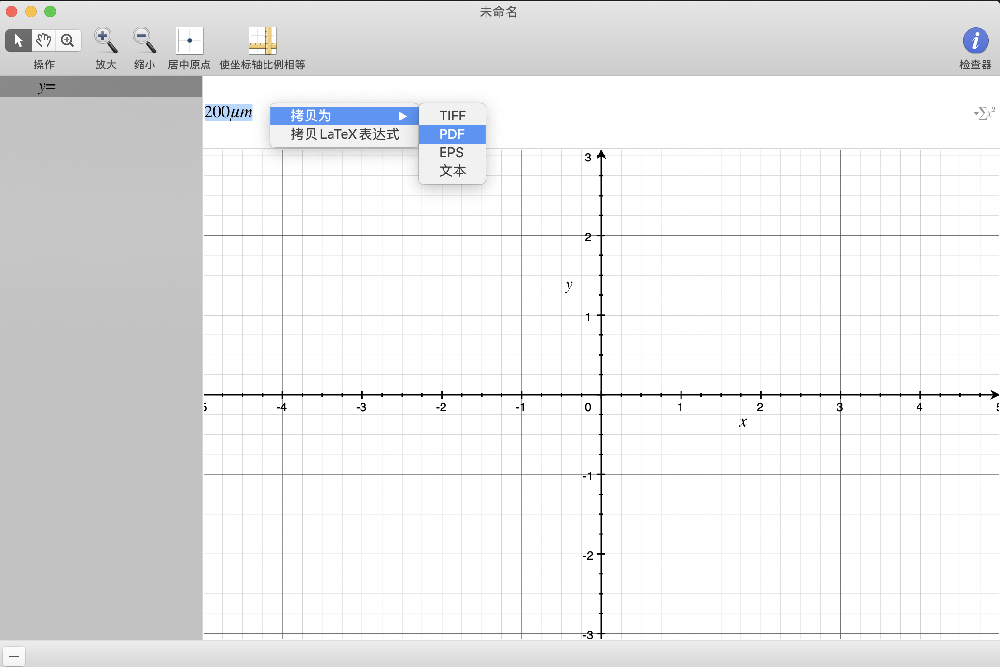

```yaml

title: OmniGraffle公式的插入
toc: true
date: 2020-04-03 16:34:49
tags:
categories:
- 其他工具

```

Windows上的visio在mac上用不了，omnigraffle是一个比较好的替代工具，但是，最近使用过程中发现omnigraffle中无法进行latex公式的编辑。

<!--more-->
在网上翻找了各种工具解决，但是都无法避免在mac上安装新的软件。
最后，在一个角落里发现了一种新的解决办法，利用mac自带的grapher。使用了之后发现简直是神器。

进入grapher后，任意选择一项，随便输入公式，右键便可保存（保存为pdf格式防止失真）。

