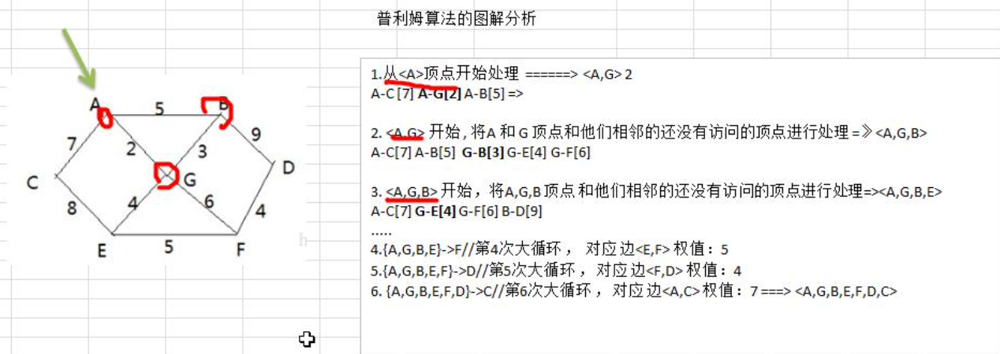
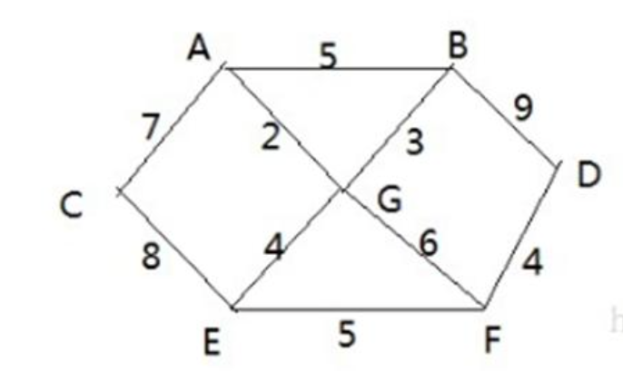

# 数据结构与算法

## 稀疏数组

## 链表

### 单链表

### 双向链表

### 约瑟夫环Josephu

约瑟夫问题：**N个人围成一圈，从第一个开始报数，第M个将被杀掉，最后剩下一个，其余人都将被杀掉**。 例如N=6，M=5，被杀掉的顺序是：5，4，6，2，3。

## 栈

### 计算器（逆波兰表达式）

## 递归

递归可以解决什么问题：

1、数学问题：八皇后、汉诺塔、阶乘、迷宫、球和篮子

2、算法：快速排序、归并排序、二分查找、分治算法

## 分治算法

步骤：

1、分解：将原问题分解为若干个规模较小，相互独立，与原问题形式相同的子问题

2、解决：若子问题规模较小而容易被解决则直接求解，否则递归解决各个子问题

3、合并：将各个子问题的解合并为原问题的解

案例：汉诺塔

## 动态规划

[经典动态规划：子集背包问题](https://labuladong.github.io/algo/3/27/82/)

核心思想：大问题分解为小问题

与分治算法的区别：子问题往往不是互相独立的

动态规划问题可以通过填表问题逐步推进得到最优解

### 例子（背包问题）：

问题：有一个背包，容量为4，现有如下物品，要求放入背包的总价值最大，且每个物品只能用一次。

| 物品 | 重量 | 价格 |
| --- | --- | --- |
| 吉他 | 1 | 1500 |
| 音响 | 4 | 3000 |
| 电脑 | 3 | 2000 |

思路：

背包问题分为两种：01背包（物品只能用一次），完全背包（物品无限）

无限背包可以转为01背包

### 01背包

01背包的思想：

```java
**package dp.packageProblem;

import java.util.Arrays;

public class PackageProblem {
    public static void main(String[] args) {
        int[] w = new int[]{1, 4, 3};
        int[] v = new int[]{1500, 3000, 2000};
        int capacity = 8;
        int itemCount = w.length;

				// 有前i个物品，背包总重量为j时，背包中可以放入的最大容量
        int[][] maxValue = new int[itemCount + 1][capacity + 1];
        for (int i = 1; i < maxValue.length; i++) {
            for (int j = 1; j < maxValue[0].length; j++) {
                if (w[i - 1] > j) {
                    // 如果物品的重量大于背包容量，那就用相同重量下，没有这种物品的最大物品价值作为最大价值。
                    maxValue[i][j] = maxValue[i - 1][j];
                } else {
                    // 如果物品重量小于背包容量，就试着放进背包
                    // 物品i放进去的价值
                    int m1 = maxValue[i - 1][j - w[i - 1]] + v[i - 1];
                    // 物品i不放进去的价值
                    int m2 = maxValue[i - 1][j];
                    maxValue[i][j] = Math.max(m1, m2);
                }
            }
        }
        for (int[] ints : maxValue) {
            System.out.println(Arrays.toString(ints));
        }
    }
}**
```

### 子集背包

力扣第 416 题「 [分割等和子集](https://leetcode.cn/problems/partition-equal-subset-sum/)」：

输入一个只包含正整数的非空数组 `nums`，请你写一个算法，判断这个数组是否可以被分割成两个子集，使得两个子集的元素和相等。

等价的背包问题：**给一个可装载重量为 `sum / 2` 的背包和 `N` 个物品，每个物品的重量为 `nums[i]`。现在让你装物品，是否存在一种装法，能够恰好将背包装满**？

```java
package dp.splitEqualSet;

import java.util.Arrays;

public class SplitEqualSet {
    public static Boolean canSetBeSplitTo2EqualSumSet(int[] originSet) {
        int sum = Arrays.stream(originSet).sum();
        if (sum % 2 != 0) return false;
        int setSum = sum / 2;

        boolean[][] dp = new boolean[originSet.length + 1][setSum + 1];
        for (boolean[] booleans : dp) {
            Arrays.fill(booleans, false);
            booleans[0] = true;
        }

        for (int i = 1; i < originSet.length + 1; i++) {
            for (int j = 1; j < setSum + 1; j++) {
                if (originSet[i - 1] > j) {
                    dp[i][j] = dp[i - 1][j];
                } else {
                    dp[i][j] = dp[i - 1][j] || dp[i - 1][j - originSet[i - 1]];
                }
            }
        }
        return dp[originSet.length][setSum];
    }
    
    // 因为每一次，只依赖上一行的结果，所以二维数组可以优化为一维数组
    public static Boolean canSetBeSplitTo2EqualSumSet_betterVersion(int[] originSet) {
        int sum = Arrays.stream(originSet).sum();
        if (sum % 2 != 0) return false;
        int setSum = sum / 2;

        boolean[] dp = new boolean[setSum + 1];
        Arrays.fill(dp, false);
        dp[0] = true;

        for (int i = 0; i < originSet.length; i++) {
            for (int j = setSum; j > 1; j--) {
                 if (originSet[i] <= j) {
                    dp[j] = dp[j] || dp[j - originSet[i]];
                }
            }
        }
        return dp[setSum];
    }

    public static void main(String[] args) {
        System.out.println(canSetBeSplitTo2EqualSumSet(new int[]{3, 5, 7, 11, 2}));
        System.out.println(canSetBeSplitTo2EqualSumSet_betterVersion(new int[]{3, 5, 7, 11, 2}));
    }
}
```

### 完全背包

```java
package dp.packageProblem;

public class PackageProblemWithInfiniteItem {
    public static void main(String[] args) {
        System.out.println(getMaxValue());
        System.out.println(getMaxValue_betterVersion());
    }

    private static int getMaxValue_betterVersion() {
        int[] w = new int[]{1, 4, 3};
        int[] v = new int[]{1500, 3000, 5000};
        int capacity = 8;

        int[] maxValue = new int[capacity + 1];
        for (int i = 1; i < w.length + 1; i++) {
            for (int j = 1; j < capacity + 1; j++) {
                if (j >= w[i - 1]) {
                    maxValue[j] = Math.max(maxValue[j - w[i - 1]] + v[i - 1], maxValue[j]);
                }
            }
        }
        return maxValue[capacity];
    }

    private static int getMaxValue() {
        int[] w = new int[]{1, 4, 3};
        int[] v = new int[]{1500, 3000, 5000};
        int capacity = 8;

        int[][] maxValue = new int[w.length + 1][capacity + 1];
        for (int i = 1; i < w.length + 1; i++) {
            for (int j = 1; j < capacity + 1; j++) {
                if (j >= w[i - 1]) {
                    maxValue[i][j] = Math.max(maxValue[i][j - w[i - 1]] + v[i - 1], maxValue[i - 1][j]);
                } else {
                    maxValue[i][j] = maxValue[i - 1][j];
                }
            }
        }
        return maxValue[w.length][capacity];
    }
}
```

## KMP算法

[算法学习笔记(13): KMP算法](https://zhuanlan.zhihu.com/p/105629613)

KMP算法解决了字符串匹配的重复问题，比如说`abcabcd`中的`abcabc`已经匹配上了但在d处失败，为了避免重复，可以直接从abc处进行匹配。

```java
package kmp;

import java.util.Arrays;

/**
 * KMP在mp算法的基础上，减少了回溯失败次数
 */
public class KMP {
    public static void main(String[] args) {
        System.out.println(getFirstMatch("ababccsababccdf", "ababccd"));
    }

    private static int getFirstMatch(String str, String pattern) {
        int i = 0;
        int j = 0;
        int[] pmt = getPmt(pattern);
        System.out.println(Arrays.toString(pmt));
        while (i < str.length() && j < pattern.length()) {
            if (str.charAt(i) == pattern.charAt(j)) {
                i++;
                j++;
            } else {
                if (j == 0 || pmt[j = 1] == 0) {
                    i++;
                    j = 0;
                } else {
                    j -= pmt[j - 1];
                }
            }
        }
        if (j == pattern.length()) {
            return i - j;
        } else {
            return -1;
        }
    }

    private static int[] getPmt(String pattern) {
        int[] pmt = new int[pattern.length()];
        int i = 1;
        int j = 0;
        while (i < pmt.length && j < pmt.length) {
            if (pattern.charAt(i) == pattern.charAt(j)) {
                if (i + 1 < pmt.length && pattern.charAt(i + 1) == pattern.charAt(j + 1)) {
                    // KMP优化的地方
                    pmt[i] = pmt[j];
                    ++i;
                    ++j;
                } else {
                    pmt[i] = ++j;
                    i++;
                }
            } else {
                if (j == 0) i++;
                j = 0;
            }
        }
        return pmt;
    }
}
```

## 贪心算法

贪心算法在对问题求解时，每一步都选择最好或最右的选择，从而希望结果最好。

贪心算法得到的结果不一定是最优的结果，但都是相对近似的最优解。

## Prim算法

最小生成树问题：

给定一个带权的无向连通图，如何选择一颗生成树，使树上所有边权值的总和最小：

- N个定点，一定有N-1条边
- 包含全部顶点
- N-1条边都在图中

Prim算法

从一个起始点开始，将节点分为两个集合，连通集合和其他集合，每次寻找连通集合和其他集合间最短的路径加入到集合中。



 

## Kruskal算法

与Prim一样，用来求解最小生成树

**基本思想**：按照边的权值，从小到大选择n-1条边，并保证这n条边不构成回路。

**具体做法**：首先构造一个只含n个节点的森林，然后依权值从小到大从图中选择边加入森林，并使森林不产生回路，知道森林变成一棵树。

## Dijkstra算法

求指定定点到其他顶点间的最短路径

[一篇文章讲透Dijkstra最短路径算法](https://www.cnblogs.com/goldsunshine/p/12978305.html)

[单源最短路径（1）：Dijkstra 算法](https://segmentfault.com/a/1190000009475858)

**`dijkstra的算法思想`**是从最短距离数组中每次选择一个最近的点，将其作为下一个点，然后重新计算从起始点经过该点到其他所有点的距离，更新最短距离数据。已经选取过的点就是确定了最短路径的点，不再参与下一次计算。

缺点：不能计算有负权值的图



## Floyd算法

求图中每个节点到其他顶点的最短路径

运用了动态规划的思想, 算法的时间复杂度为O(V^3)，空间复杂度O(V^2)。

思想：计算每个节点为中继节点时，两个节点间的最短路径。

[](https://www.jianshu.com/p/f73c7a6f5a53)

## 参考链接

参考：

[【尚硅谷】数据结构与算法（Java数据结构与算法）_哔哩哔哩_bilibili](https://www.bilibili.com/video/BV1E4411H73v/?spm_id_from=333.1007.top_right_bar_window_custom_collection.content.click&vd_source=e21f9d6df4d58d1af56dc2f1daf4d1c8)

[经典动态规划：子集背包问题](https://labuladong.github.io/algo/3/27/82/)