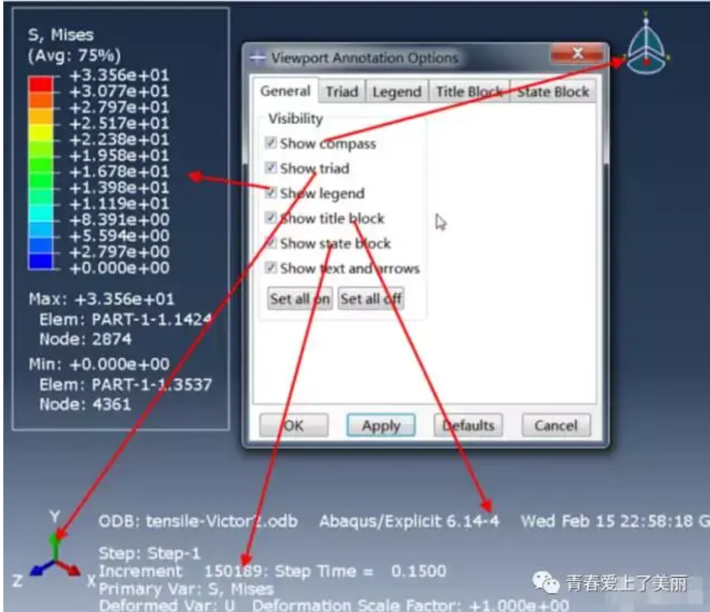
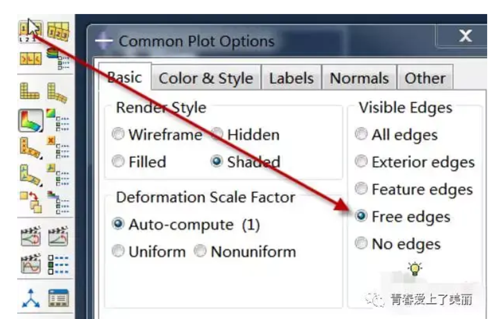
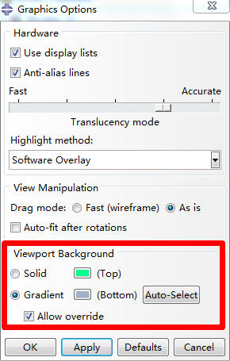

# 后处理
<!--more-->
## 保存图片
File -> Print -> 

## 查看指定增量步的结果
Result -> Step/Frame

## 创建显示组
Tools-> Display Group -> Create

## 显示窗口widget设置
Viewport->Viewport Annotion options->

## 后处理不显示网格
Options -> Common -> 

## 设置透明背景
  View->graphic options
 

## 设置超出设定范围的colorbar颜色
Options-> Contour ->Spectrum->Greater than max;

## abaqus多图层绘制

1. 打开odb后处理文件，将图层创建好之后设置好图片的各种参数，然后在View->Overlay Plot->create创建图层

2. 点击右侧的plot overlay可以将图层混合。

3. 如果需要进行对某个图层进行修改，在窗口勾选对应图层的Current。然后进行修改。

## abaqus导出清晰的后处理图片
abaqus在print->选择PS/EPS可以直接设定分辨率导出，但是导出的效率极低。
使用PNG即使导出高像素，图片仍然模糊。
**TIFF格式设置像素最大值为2730px，则可以导出较为清晰的图片**

导出的图片的字体，Arial较为合适，Times在缩放后较为模糊。

## 导出Mises和PEEQ记录
1. 打开cae文件，设置只显示viewport中的legend,legend->setFont->arial(大小12)
2. options -> common -> free edges
3. Mises stress -> 设置上下限(0-1e9)颜色 -> spectrum min/max      PEEQ -> 上下限制(0-1.390)
4. 选择增量步no gnd(21,34,77)  ff20(14,18,25)
5. print-> tiff->关闭reduceto256的选项-> width(2730)

## 导出expansion的记录
选择0.2F和0.5F
1. 打开cae文件，设置只显示viewport中的legend,legend-> setFont-> arial(大小12)
2. options -> common -> free edges
3. Tools -> display group -> create-> ferrite
4. mises limit (1.552e7-3.504e8) peeq limit(0-0.15)
5. contour view -> overlay plot -> create -> 
6. shape view -> overlay plot -> create

