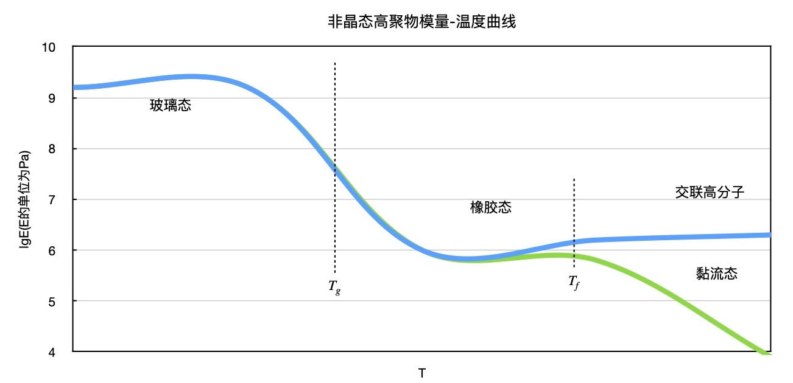
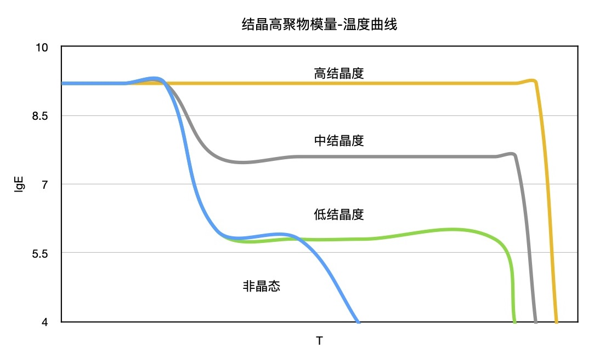

《高分子材料强度及破坏行为》 傅政  --读书笔记

<!--more-->
# 绪论
## 高分子材料的破坏特征
### 破坏过程是宏观与微观相结合的多层次过程
<b>微观损伤</b>($10^{-10}m$)

分子链末端的凝聚体、数根没有缠结分子链间的空穴、缠结的分子链、分子链束沿应力方向取向的部分等。

<b>细观损伤</b>($10^{-6}m$)

- 由微观损伤发展与汇合成的空隙、微裂纹。
- 多相材料中的异质界面损伤。
- 加工成型过程中由于工艺、机械、温度、湿度或各种物理化学作用形成的银纹、瑕疵、微孔、杂质和其他缺陷等。

### 破坏过程具有松弛特征，对时间（速度）、温度由强烈的依赖性。
### 破坏过程是逐渐发展的、不可逆的耗能过程
### 破坏过程伴随物理化学现象
- <b>电子激励现象</b>。高分子材料在力、热、声、光的能量作用下，可以产生电场或磁场。如：在外力作用下，成后复合的高分子主链化学键具有亲电子的能力，在破坏过程中发生电子迁移运动而产生受激电子。

- <b>力化学反应</b>。 高分子材料在破坏过程中，由于化学键的断裂而产生的自由基和离子等活性中心，在空气、热、光等环境中将导致裂解或结构化反应。特别是在动态破坏过程中，比如橡胶的疲劳过程等。

- <b>银纹化</b>。 在较高的应变下，许多高聚物会由于“空化”而发生变形，形变区域呈现白色，称为应力白化（内部银纹化）。

# 高分子材料的应力-应变行为
## 高分子材料的力学状态
高分子材料的力学状态实际上是分子运动的宏观表现。

非晶态高聚物在不同的温度下呈现出不同的力学状态，玻璃态、橡胶态、黏流态。

- <b>玻璃态</b>：只有较小的运动单元（侧基、短支链等）可以运动。
- <b>橡胶态</b>：链段运动被激发。拉伸时，分子链从卷曲的线团构象变为伸展构象；外力去除时，分子链通过链段运动恢复到原来的卷曲构象，宏观表现为弹性回缩。（高弹性）
- <b>黏流态</b>：整个分子链运动，宏观表现为不可逆的黏性流动。

处于玻璃态、橡胶态、结晶态的高分子材料可以视为弹性固体材料，可以利用固体力学的基本理论进行分析。

## 屈服和银纹化
对塑性材料，其使用极限是屈服强度。

高分子材料在载荷作用下会产生微开裂，但这种微开裂并不是真正的裂纹，其内部由高度取向的高聚物纤维束和空穴组成，并且有一定的稳定性，称为银纹化现象。

屈服和银纹化是材料破坏的前奏。

### 屈服
高分子材料一般使用真应力-表观应变描述其屈服行为。（由于其屈服后变形很大。）

应变硬化：分子链取向引起模量和拉伸强度提高；对结晶高聚物可能是因为应变诱发再结晶。

<b>屈服点的确定</b>
- 显而易见的屈服点
- $\sigma_{0.2}$
- Considere作图法（p25）

# 高分子材料的强度理论
## 影响高分子材料强度的因素
> 交联：通过化学反应使分子间的共价键相连接，形成网络结构，从而使材料的强度增加。
> 支化：高分子材料的支链
> 

- 化学结构
  - 主链结构
  - 取代基
  - 支化和交联
- 分子量及其分布
- 结晶和取向
- 温度和形变速率
- 填料和增塑剂
- 应力集中物
- 环境因素

# 高分子材料的断裂基础
断裂力学研究裂纹扩展的两种方法：应力法和能量法。

裂纹类型：张开型、滑开型、撕开型

## 线弹性断裂
适用于应力-应变遵循胡克定律的断裂行为。如果高分子材料的裂纹尖端塑性区很小，且不改变整体材料的线弹性行为，也可以用线弹性断裂理论。

对一个确定的裂纹，裂纹尖端的应力场与应力场强度因子有关（$K_I=\sigma\sqrt{\pi a}y$）

裂纹开始扩展时的应力场强度因子为断裂韧性$K_{IC}$

## 非线性断裂及表征
适合延性塑料、橡胶和热塑性弹性体等材料的应力-应变曲线是非线性行为。
### J积分
应变能积分。

# 冲击破坏和塑性增韧
<b>韧性</b>：材料破坏前吸收外加能量的能力。

# 纤维增强高聚物的强度与破坏
## 纤维增强高聚物的结构与损伤特征
纤维起到骨架作用，相当于混凝土中的钢筋的作用；高聚物是基体，把纤维粘接在一起，同时在纤维间传递和均匀载荷，从而充分发挥增强纤维的强度性能。

## 短纤维增强材料的应力分布和增强机理
### 影响短纤维增强效果的因素
短纤维的长径比、用量、取向状态和表面预处理等
1. 长径比
临界长径比是指能够发挥短纤维最大强度所需的最小长径比。一般短纤维长径比60～120，长径比过大，纤维易缠结，影响复合效果。
2. 取向程度
3. 预处理
  - 偶联剂：连接基体和纤维
  - 表面涂层：涂敷在纤维表面，改善纤维与基体界面的物理化学反应。
  - 表面氧化：增加纤维比表面积
  - 表面气相沉积：改善纤维形态
  - 低温等离子处理

  - 
