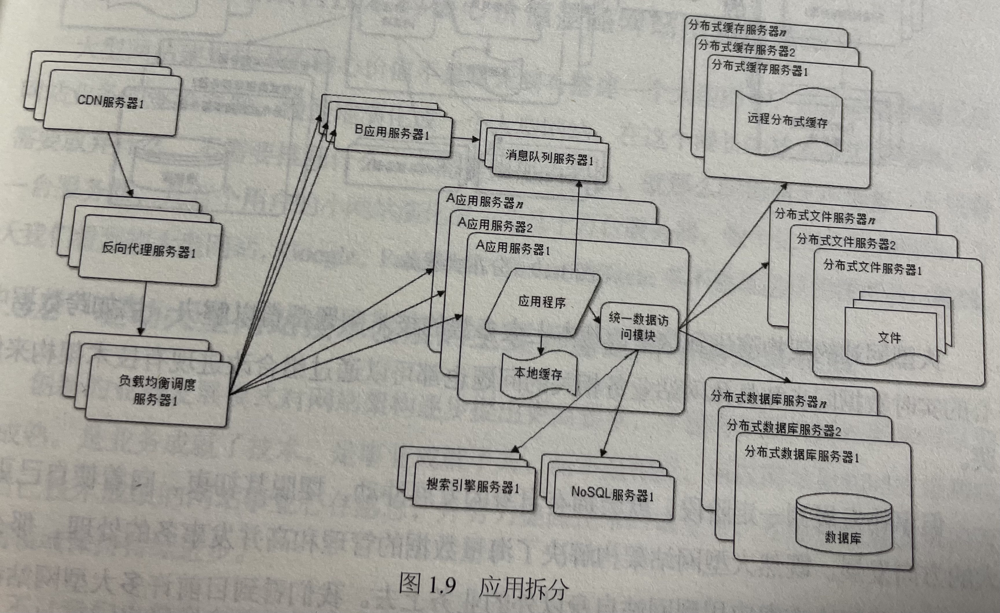

## 大型网站架构演化
### 最终形态
- 应用服务和数据库服务分离
- 使用缓存改进性能
- 使用集群改进并发性能
- 数据库读写分离
- 反向代理和CDN服务器加速网站响应
- 使用分布式文件系统和数据库系统
- 使用NoSQL和搜索引擎
- 业务拆分
- 分布式服务

## 大型网站架构模式
- 分层：横向切分，如数据层、服务层、应用层
- 分割：纵向切分，如业务切分
- 分布式：不同模块部署在不同的机器上
- 集群：相同应用的不同服务器通过集群负载均衡设备统一对外提供服务
- 缓存
	- CDN：网络服务商缓存静态资源
	- 反向代理：部署在网站的前端，缓存静态资源
	- 本地缓存
	- 分布式缓存
- 异步：消息队列
- 冗余
- 自动化
- 安全

## 大型网站核心架构要素
- 性能
- 可用性
- 伸缩性
- 扩展性
- 安全性

## 瞬时响应：网站的高性能架构
### 网站性能测试
#### 性能测试指标
- 响应时间
- 并发数：系统用户数>>在线用户数>>并发用户数 
- 吞吐量
- 性能计数器：服务器或操作系统性能的一些数据指标，如top中的负载
#### 性能测试方法
- 性能测试
- 负载测试
- 压力测试
- 稳定性测试 

### Web性能优化 
#### 浏览器访问优化 
- 减少http请求
- 浏览器缓存
- 服务器对文件压缩、浏览器解压缩
- CSS放在页面上、JS放在下，优先渲染
- 减少Cookie传输
#### CDN加速
#### 反向代理

### 应用服务器性能优化
#### 分布式缓存
> [!tip]
> 网站性能优化第一定律：优先使用缓存优化性能

- 缓存主要用于存放读写比很高、很少变化的数据
- 合理使用缓存
	- 频繁修改的数据不存入缓存，读写比2:1以上
	- 没有热点的访问没必要缓存
	- 应用要能接受数据不一致
	- 缓存要是高可用的，不能发生缓存雪崩（在缓存服务崩溃时，数据库不能承受压力导致宕机，进而导致整个网站不可用）
	- 缓存预热：启动时就加载好部分热点数据
	- 缓存穿透：将不存在的数据也缓存起来（防止业务不断请求不存在的值） 
- 分布式缓存架构
	- 需要更新的分布式缓存JBoss Cache
	- 
	- 互不通讯的分布式缓存
	- 
#### 异步操作

#### 集群

#### 代码优化
- 多线程
	- 
- 资源复用
- 数据结构
- 垃圾回收
#### 存储性能优化 
- SSD
- B+树（数据库） vs LSM树（NoSQL）
- 
> [!tips]
> 数据写操作在内存中进行，并且创建一条记录，这些数据在内存中仍然是一棵排序树，当数据量超过内存阈值，会和磁盘上的排序树合并。当排序树超过阈值则与下一级的排序树合并。
- RAID vs HDFS
## 高可用架构
### 网站可用性度量 
QQ的可用性是4个9，一年最多53分钟不可用。

### 高可用的网站架构 
- 可靠的软硬件：Oracle数据库、EMC存储设备、IBM小中型机器、专用操作系统（相比开源xx）
	- 数据和服务的冗余备份
- 分层架构
- 
	- 应用层服务高可用：负载均衡设备检测到不可用服务器，将其删除
	- 服务器高可用：服务注册中心，将不可用服务删除
	- 数据层：数据冗余备份 
### 高可用应用
#### 通过负载均衡进行无状态服务的失效转移
#### 应用服务器集群的Session管理 
> [!tips]
> 单机情况下session可以由服务器上的web容器管理

集群情况下
- Session复制（早期使用，目前服务器数量多，千万用户，不适用）
- Session绑定（通过ip或其他方式绑定到服务器，如果服务器宕机，不符合高可用）
- 适用Cookie记录Session（早期使用，受Cookie大小限制，用户可以关闭Cookie。由于使用简单，很多网站多少会用下）
- Session服务器（将服务器与应用服务器状态分离）
	- 
	- 有状态服务器使用分布式缓存、数据库进行包装 
### 高可用服务
- 负载均衡的失效转移策略
- 分级管理
	- 核心业务用好的硬件
	- 高优先级服务物理隔离（不同区域/服务器），低优先级虚拟机隔离
- 超时设置
	- 超时重试或请求转移
- 异步调用（失效也不影响服务）
- 服务降级
- 幂等性设计（重复调用结果一致）
### 高可用数据
- 数据备份和失效转移机制 
#### CAP原理
数据的存储系统无法同时满足下面三个条件

大型网站一般AP，一定程度上放弃C。
- 数据强一致
	- 各个副本数据在物理存储中总是一致
- 数据用户一致
	- 数据在物理存储中的各个副本的数据可能不一致，但用户访问时，通过纠错和校验机制，可以确定一个正确的数据返回。
- 数据最终一致性
	- 系统经过一个段时间的自我恢复和修正，数据最终一致。 
> [!tips]
> 通常会综合成本、技术、业务场景，结合应用服务和其他的数据监控和纠错功能，使存储系统达到用户一致，保证用户访问的正确性。
#### 数据备份
- 冷备份
	- 难以保证数据一致性，恢复时无法保证可用性
- 热备份
	- 异步热备份
	- 同步热备份（同时写入多个数据库）
#### 失效转移
- 失效确认
- 访问转移
- 数据恢复
### 高可用网站的软件质量保证
#### 网站发布

#### 自动化测试
#### 预发布验证

#### 代码控制-分支管理
#### 自动化发布
#### 灰度发布
每天只发布一部分服务器，观察运行稳定没有故障，第二天继续发布一部分服务器，持续几天才把整个集群全部发布完毕，期间如果发现问题，只需要回滚已经发布的服务器。

### 网站监控
#### 监控数据采集
- 用户行为日志收集
- 服务器性能监控
- 运行数据报告（缓存命中率、平均响应时间）
#### 监控管理
- 系统性能评估
- 集群规模伸缩性预测
- 风险预警
- 失效转移
- 自动负载调整

## 网站的伸缩性架构
所谓网站的伸缩性是指不需要改变网站的软硬件设计，仅仅通过改变部署的服务器数量就可以扩大或者缩小网站的服务处理能力。
### 网站架构的伸缩性设计
#### 应用服务器集群的伸缩性
- HTTP重定向负载均衡
- DNS域名解析负载均衡
- 反向代理负载均衡
- IP负载均衡（修改请求地址）
- 数据链路层负载均衡
#### 分布式缓存的伸缩性设计
普通hash在扩容时，如果使用余数算法，会导致大量缓存无法命中。
- 分布式缓存的一致性hash算法

- 使用虚拟节点避免扩容时负载不均衡。

### 数据存储服务器集群的伸缩性设计
#### 关系型数据库的伸缩性设计
一般会进行分库和主从复制。如果单表很大，就要进行分表。 

分布式关系数据库访问代理。Cobar。

分布式关系数据库解决方案很简陋。但是当网站业务面临不停增长的海量业务数据存储压力时，又不得不利用分布式关系数据库的集群伸缩能力，这时就必须从业务上回避分布式关系数据库的各种缺点：避免事务或利用事务补偿机制代替数据库事务;分解数据访问逻辑避免JOIN操作等。

还有一类分布式数据库可以支持JOIN操作执行复杂的SQL查询，如GreenPlum。但是这类数据库的访问延迟比较大(可以想象，JOIN操作需要在服务器间传输大量的数据)，因此一般使用在数据仓库等非实时业务中。

#### NoSQL数据库的伸缩性设计
如ES可以快速增加节点。当你向集群添加新节点时，Elasticsearch可以自动平衡分片分布，将数据分片和副本重新分配到新节点，以确保数据均匀分布和高可用性。

## 可扩展架构
**扩展性**

对现有系统影响最小的情况下，系统功能可持续扩展或提升的能力。

**伸缩性**

系统通过增加/减少自身资源规模的方式增强/减少自己计算处理事务的能力。

### 构建可扩展的网络架构
模块化，并在此基础上，降低模块间的耦合性，提高模块的复用性。

### 利用分布式消息队列降低系统的耦合性
#### 事件驱动架构
#### 分布式消息队列
### 利用分布式服务打造可复用的业务平台

## 网站的安全架构
### 网站应用攻击与防御
#### XSS
跨站点脚本攻击

**应对**
- 消毒: 如`>`转译为`&gt`
- HttpOnly: 禁止页面js访问带有HttpOnly属性的Cookie

#### 注入攻击
- SQL注入攻击
- OS注入攻击

#### CSRF攻击
跨站点请求伪造

#### 其他攻击和漏洞
- Error Code
- HTML注释
- 文件上传

#### Web应用防火墙

### 信息加密技术及密钥安全管理
- 单向散列加密（MD5、SHA）
- 对称加密（DES、RC）
- 非对称加密（RSA）

#### 密钥安全管理
密钥明文存储（源码、配置文件等），在公司内不安全。

- 把密钥的和算法放在独立的服务器，甚至做成专门的硬件，对外提供加解密服务。（成本高）
- 算法放在应用系统，密钥放在独立服务器。

### 信息过滤与反垃圾
#### 文本匹配
- 双数组Trie树
- 多级Hash表

#### 分类算法
垃圾短信分类等

#### 黑名单
- 少数可以使用hash表。大量时会占用大量内存空间
- 在对过滤需求要求不完全精确的场景下，可用布隆过滤器代替Hash表

