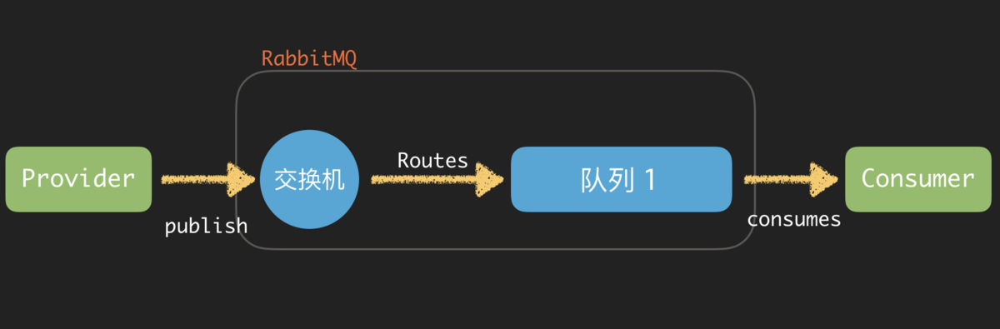
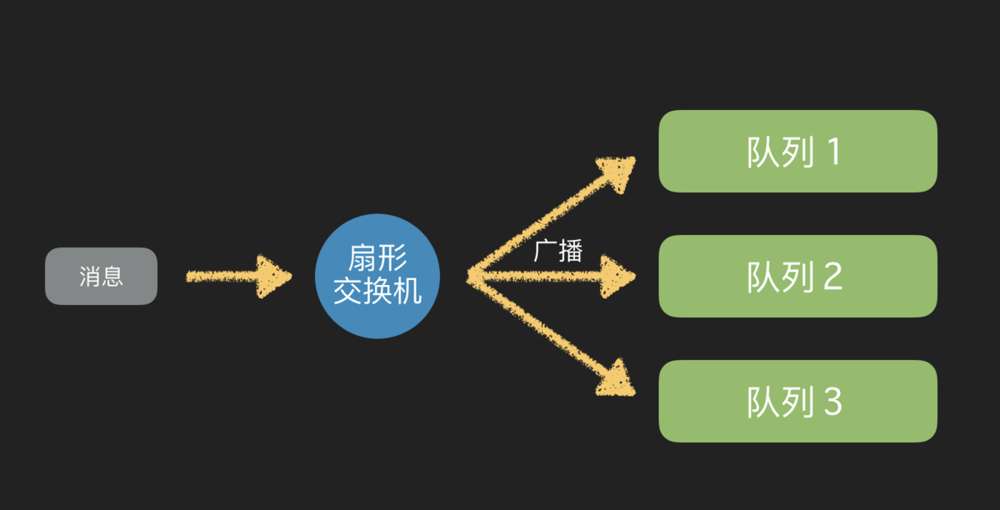
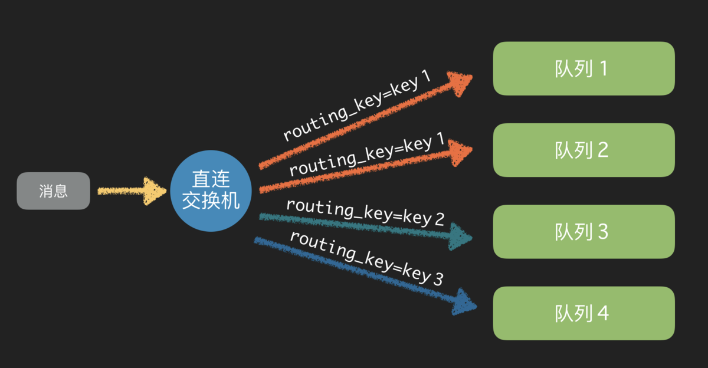
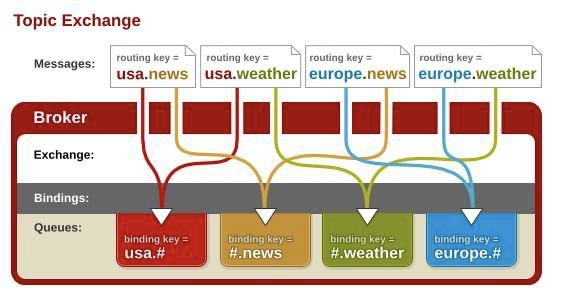

# RabbitMQ原理

## vhost

vhost本质是一个mini版本的RabbitMQ服务器，拥有自己的队列，绑定、交换机和权限控制。vhost之间是绝对隔离的。可以认为是namespace。

## 消息传输原理

原链接：https://www.jianshu.com/p/469f4608ce5d

### 交换机

有4种不同的交换机类型：

- 直连交换机：Direct exchange
- 扇形交换机：Fanout exchange
- 主题交换机：Topic exchange
- 首部交换机：Headers exchange

### 扇形交换机

扇形交换机是最基本的交换机类型，它所能做的事情非常简单———广播消息。扇形交换机会把能接收到的消息全部发送给绑定在自己身上的队列。因为广播不需要“思考”，所以扇形交换机处理消息的速度也是所有的交换机类型里面最快的。

### 直连交换机

直连交换机是一种带路由功能的交换机，一个队列会和一个交换机绑定，除此之外再绑定一个`routing_key`，当消息被发送的时候，需要指定一个`binding_key`，这个消息被送达交换机的时候，就会被这个交换机送到指定的队列里面去。同样的一个`binding_key`也是支持应用到多个队列中的。这样当一个交换机绑定多个队列，就会被送到对应的队列去处理。

适用场景：有优先级的任务，根据任务的优先级把消息发送到对应的队列，这样可以指派更多的资源去处理高优先级的队列。

### 主题交换机

直连交换机的`routing_key`方案非常简单，如果我们希望一条消息发送给多个队列，那么这个交换机需要绑定上非常多的`routing_key`，假设每个交换机上都绑定一堆的`routing_key`连接到各个队列上。那么消息的管理就会异常地困难。

所以`RabbitMQ`提供了一种主题交换机，发送到主题交换机上的消息需要携带指定规则的`routing_key`，主题交换机会根据这个规则将数据发送到对应的(多个)队列上。

主题交换机的`routing_key`需要有一定的规则，交换机和队列的`binding_key`需要采用`*.#.*.....`的格式，每个部分用`.`分开，其中：

- ``表示一个单词
- `#`表示任意数量（零个或多个）单词。

假设有一条消息的`routing_key`为`fast.rabbit.white`,那么带有这样`binding_key`的几个队列都会接收这条消息：

1. fast.*.*
2. *.*.white
3. fast.#
4. ……

当一个队列的绑定键为`#`的时候，这个队列将会无视消息的路由键，接收所有的消息。

### 首部交换机

首部交换机是忽略`routing_key`的一种路由方式。路由器和交换机路由的规则是通过`Headers`信息来交换的，这个有点像`HTTP`的`Headers`。将一个交换机声明成首部交换机，绑定一个队列的时候，定义一个`Hash`的数据结构，消息发送的时候，会携带一组hash数据结构的信息，当`Hash`的内容匹配上的时候，消息就会被写入队列。

绑定**交换机**和**队列**的时候，Hash结构中要求携带一个键**“x-match”**，这个键的`Value`可以是`any`或者`all`，这代表消息携带的`Hash`是需要**全部匹配**(all)，还是**仅匹配一个键**(any)就可以了。相比直连交换机，首部交换机的优势是匹配的规则**不被**限定为字符串(string)。