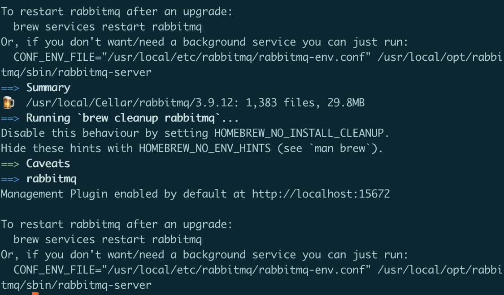

# RabbitMQ安装

[https://www.rabbitmq.com/install-homebrew.html](https://www.rabbitmq.com/install-homebrew.html)

# Mac

## 安装

1. `brew update` 
2. `brew install rabbitmq`

## 操作

The RabbitMQ server scripts and [CLI tools](https://www.rabbitmq.com/cli.html) are installed into the `sbin` directory under `/usr/local/Cellar/rabbitmq/<version>/`, which is accessible from `/usr/local/opt/rabbitmq/sbin`. Links to binaries have been created under `/usr/local/sbin`. In case that directory is not in PATH it's recommended to append it:

```bash
export PATH=$PATH:/usr/local/sbin
```

Add the above export to the shell profile (such as `~/.bashrc` for bash or `~/.zshrc` for zsh) to have PATH updated for every new shell, including OS restarts.

The server can then be started with rabbitmq-server in the foreground or with `brew services start rabbitmq` to have it run under launchd in the background.

With Homebrew, the node and CLI tools will use the logged in user account by default. Using sudo is not required.

## 安装结果



 `brew services start rabbitmq` 启动后，通过localhost:15672进入管理页面，默认用户名密码，guest，guest（只能通过安装机进行本地登陆）。

# Centos

[rabbitmq离线安装](https://www.jianshu.com/p/cf0ed6a5199e)

rpm包下载完成后：

```bash
sudo rpm -ivh erlang-22.1.8-1.el7.x86_64.rpm
sudo rpm -ivh socat-1.7.3.2-2.el7.x86_64.rpm
sudo rpm -ivh rabbitmq-server-3.8.2-1.el7.noarch.rpm
```

rabbitmq延迟队列插件安装

- 下载地址
[Community Plugins](http://www.rabbitmq.com/community-plugins.html)

- 下载完成后，解压到安装目录的plugin文件夹下 `/use/lib/rabbitmq/.....`
- `rabbitmq-plugins enable rabbitmq_delayed_message_exchange`
- 如果不生效，运行`/use/lib/rabbitmq/sbin`中的dignose。
    - 如果是eacces，为权限问题。将ez文件当作zip解压后，更新权限到6755然后复制到plugin下。

## 默认安装和其他文件夹目录
[RabbitMQ系列（五） RabbitMQ的文件和目录位置 - 掘金](https://juejin.cn/post/6844904139063820295)