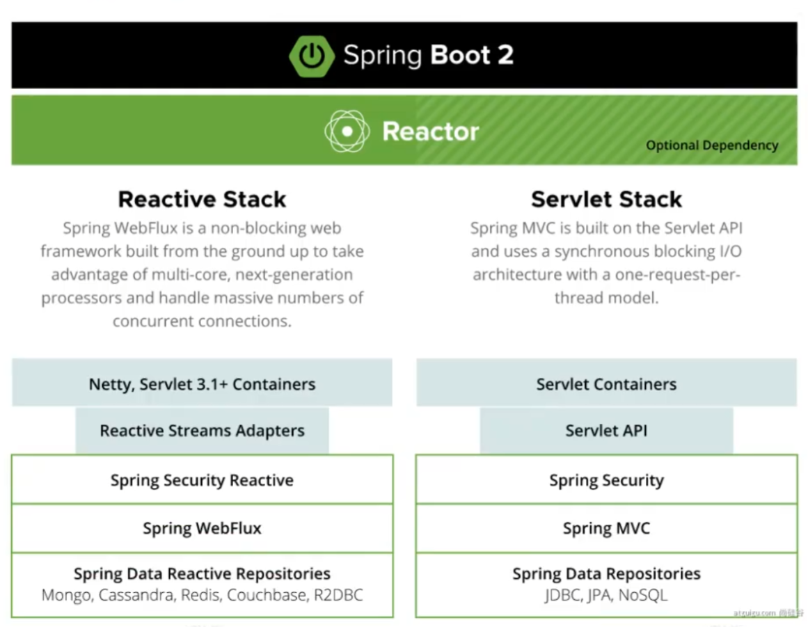
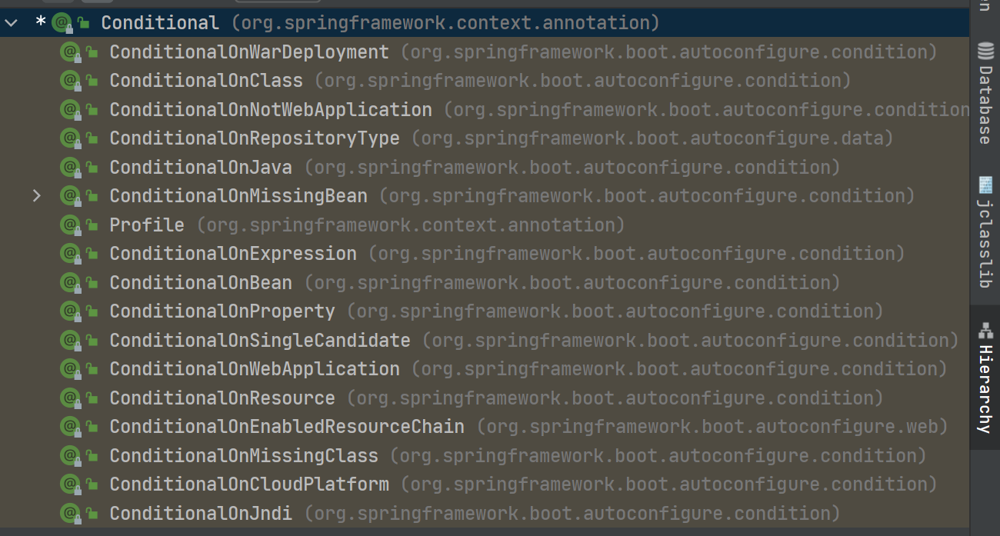

# 基础入门

# 1、Springboot

## 特性

- 微服务
- 响应式编程（使用异步非阻塞方式，占用少量线程资源，构建高吞吐量）
- 云
- web应用
- 无服务开发（FAAS，function as a service）
- 事件驱动（实时数据流）
- 批处理



## 优缺点

### 优点

- 创建独立的Spring应用
- 内嵌web服务器（不需要war包）
- 自动starter依赖，简化配置
- 自动配置Spring以继第三方功能
- 提供生产级别的监控、健康检查及外部化配置
- 无代码生成，无需编写XML

### 缺点

- 迭代快，需要关注变化
- 封装太深，内部远离复杂，不容易精通

## 时代背景

### 微服务

- 微服务是一种架构风格
- 一个应用拆分为一组小型服务
- 每个服务运行在自己的进程内，也就是可独立部署和升级
- 服务之间使用轻量级HTTP交互
- 服务围绕业务功能拆分
- 可以由全自动部署机制独立部署
- 去中心化，服务自治。服务可以使用不同的语言、不同的存储技术

### 分布式的困难（Spring+SpringCloud+SpringCloudDataFlow）

- 远程调用（一般使用http）
- 服务发现（需要知道发送到哪台机器）
- 负载均衡
- 服务容错
- 配置管理（所有服务从配置中心拿数据）
- 服务监控
- 链路追踪
- 日志管理
- 任务调度（定时任务是在哪一台机器触发，并行还是串行）
- ......

## 云原生（k8s）

### 上云的困难

- 服务自愈（服务自愈）
- 弹性伸缩（自动确定服务部署数量）
- 服务隔离
- 自动化部署
- 灰度发布
- 流量治理
- ......

# 2、Getting Started

## Hello word

### Maven依赖

```xml
<parent>
    <groupId>org.springframework.boot</groupId>
    <artifactId>spring-boot-starter-parent</artifactId>
    <version>2.3.4.RELEASE</version>
</parent>
<dependencies>
    <dependency>
        <groupId>org.springframework.boot</groupId>
        <artifactId>spring-boot-starter-web</artifactId>
    </dependency>
</dependencies>
```

`spring-boot-starter-parent`本身不提供任何依赖（可以通过`mvn denpendency:tree`查看依赖

### 主程序

<aside>
💡 主程序应该放在默认包（site.xx）的根目录，这样如果配置了ComponentScan就会自动扫描默认包及子目录下的所有的component。不要把主程序放在src的根目录下，会导致将所有依赖的包导入，会出错。

</aside>

```java
@SpringBootApplication
public class MainApplication {
    public static void main(String[] args) {
        SpringApplication.run(MainApplication.class,args);
    }
}
```

`@SpringBootApplication` 等价于`@ComponentScan`和`@Configuration`

### 业务代码

```java
// 等价于 @Controller @ResponseBody
@RestController
public class HelloController {
    @RequestMapping("/hello")
    public String handle01(){
        return "Hello, Spring Boot 2!";
    }
}
```

### 简化配置

```yaml
server.port=8888
```

### 简化部署

```xml
<build>
    <plugins>
        <plugin>
            <groupId>org.springframework.boot</groupId>
            <artifactId>spring-boot-maven-plugin</artifactId>
        </plugin>
    </plugins>
</build>
```

# 3、自动配置管理

## SpringBoot特点

### 依赖管理

- 父项目做依赖管理
    
    ```xml
    依赖管理    
    <parent>
            <groupId>org.springframework.boot</groupId>
            <artifactId>spring-boot-starter-parent</artifactId>
            <version>2.3.4.RELEASE</version>
    </parent>
    
    他的父项目
     <parent>
        <groupId>org.springframework.boot</groupId>
        <artifactId>spring-boot-dependencies</artifactId>
        <version>2.3.4.RELEASE</version>
      </parent>
    
    几乎声明了所有开发中常用的依赖的版本号,自动版本仲裁机制
    ```
    
- 开发导入starter场景启动器
    
    ```xml
    1、见到很多 spring-boot-starter-* ： *就某种场景
    2、只要引入starter，这个场景的所有常规需要的依赖我们都自动引入
    3、SpringBoot所有支持的场景
    https://docs.spring.io/spring-boot/docs/current/reference/html/using-spring-boot.html#using-boot-starter
    4、见到的  *-spring-boot-starter： 第三方为我们提供的简化开发的场景启动器。
    5、所有场景启动器最底层的依赖
    <dependency>
      <groupId>org.springframework.boot</groupId>
      <artifactId>spring-boot-starter</artifactId>
      <version>2.3.4.RELEASE</version>
      <scope>compile</scope>
    </dependency>
    ```
    
- 引入依赖默认都可以不写版本
- 引入非版本仲裁的jar，要写版本号。
- 可以修改默认版本号
    
    ```xml
    <properties>
        <mysql.version>5.1.43</mysql.version>
    </properties>
    ```
    

### 自动配置

- 自动配好Tomcat
    - 引入Tomcat依赖。
    - 配置Tomcat
- 自动配好SpringMVC
    - 引入SpringMVC全套组件
    - 自动配好SpringMVC常用组件（功能）
- 自动配好Web常见功能，如：字符编码问题
    - SpringBoot帮我们配置好了所有web开发的常见场景
- 默认的包结构
    - 主程序所在包及其下面的所有子包里面的组件都会被默认扫描进来
    - 无需以前的包扫描配置
    - 想要改变扫描路径，`@SpringBootApplication(scanBasePackages=**"com.atguigu"**)`
        - 或者@ComponentScan 指定扫描路径
- 各种配置拥有默认值
    - 默认配置最终都是映射到某个类上
    - 配置文件的值最终会绑定每个类上，这个类会在容器中创建对象
- 按需加载所有自动配置项
    - 非常多的starter
    - 引入了哪些场景这个场景的自动配置才会开启
    - SpringBoot所有的自动配置功能都在 spring-boot-autoconfigure 包里面

## 底层注解

### `@Configuration`

```java
/**
 * 1、配置类里面使用@Bean标注在方法上给容器注册组件，默认也是单实例的
 * 2、配置类本身也是组件
 * 3、proxyBeanMethods：代理bean的方法
 *      Full(proxyBeanMethods = true)、【保证每个@Bean方法被调用多少次返回的组件都是单实例的】
 *      Lite(proxyBeanMethods = false)【每个@Bean方法被调用多少次返回的组件都是新创建的】
 *      组件依赖必须使用Full模式默认。其他默认是否Lite模式
 *
 *
 *
 */
@Configuration(proxyBeanMethods = false) //告诉SpringBoot这是一个配置类 == 配置文件
public class MyConfig {
    @Bean //给容器中添加组件。以方法名作为组件的id。返回类型就是组件类型。返回的值，就是组件在容器中的实例
    public User user01(){
        User zhangsan = new User("zhangsan", 18);
        //user组件依赖了Pet组件
        zhangsan.setPet(tomcatPet());
        return zhangsan;
    }

    @Bean("tom")
    public Pet tomcatPet(){
        return new Pet("tomcat");
    }
}
```

### `@Bean、@Component、@Controller、@Service、@Repository`

Service、Controller、repository其实和Component效果是一样的，只是方便程序员区分组件的作用。

### `@import`

```java
// @Import({User.class, DBHelper.class})
// 给容器中自动创建出这两个类型的组件（使用无参构造器）、默认组件的名字就是全类名

@Import({User.class, DBHelper.class})
@Configuration(proxyBeanMethods = false) //告诉SpringBoot这是一个配置类 == 配置文件
public class MyConfig {
}
```

### `@Conditional`

条件装配：满足Conditional指定的条件，则进行组件注入（进入conditional之后，Ctrl+H可以打开继承树）



### `@ImportResource`

```xml
======================beans.xml=========================
<?xml version="1.0" encoding="UTF-8"?>
<beans xmlns="http://www.springframework.org/schema/beans"
       xmlns:xsi="http://www.w3.org/2001/XMLSchema-instance"
       xmlns:context="http://www.springframework.org/schema/context"
       xsi:schemaLocation="http://www.springframework.org/schema/beans http://www.springframework.org/schema/beans/spring-beans.xsd http://www.springframework.org/schema/context https://www.springframework.org/schema/context/spring-context.xsd">

    <bean id="haha" class="com.atguigu.boot.bean.User">
        <property name="name" value="zhangsan"></property>
        <property name="age" value="18"></property>
    </bean>

    <bean id="hehe" class="com.atguigu.boot.bean.Pet">
        <property name="name" value="tomcat"></property>
    </bean>
</beans>
```

```java
@ImportResource("classpath:beans.xml")
public class MyConfig {}

======================测试=================
        boolean haha = run.containsBean("haha");
        boolean hehe = run.containsBean("hehe");
        System.out.println("haha："+haha);//true
        System.out.println("hehe："+hehe);//true
```

### `@ConfigurationProperties`

```java
/**
* 只有容器中的组件才能使用自动配置
*/
@Component
@ConfigurationProperties(prefix = "mycar")
public class Car {
		private String brand;
    private Integer price;
}
```

@EnableConfigurationProperties + @ConfigurationProperties

在配置类中使用`@EnableConfigurationProperties(Car.class)` ，然后Car类中使用`@ConfigurationProperties` 可以实现等效的效果。

```java
@EnableConfigurationProperties(Car.class)
//1、开启Car配置绑定功能
//2、把这个Car这个组件自动注册到容器中
public class MyConfig {
}
```

### 自动配置原理

```java
@SpringBootConfiguration
@EnableAutoConfiguration
@ComponentScan(excludeFilters = { @Filter(type = FilterType.CUSTOM, classes = TypeExcludeFilter.class),
		@Filter(type = FilterType.CUSTOM, classes = AutoConfigurationExcludeFilter.class) })
public @interface SpringBootApplication{}

@Configuration
public @interface SpringBootConfiguration {
    @AliasFor(
        annotation = Configuration.class
    )
    boolean proxyBeanMethods() default true;
}

@AutoConfigurationPackage
@Import(AutoConfigurationImportSelector.class)
public @interface EnableAutoConfiguration {}

@Import(AutoConfigurationPackages.Registrar.class)  //给容器中导入一个组件
public @interface AutoConfigurationPackage {}
//利用Registrar给容器中导入一系列组件
//将指定的一个包下的所有组件导入进来

AutoConfigurationImportSelector
//1、利用getAutoConfigurationEntry(annotationMetadata);给容器中批量导入一些组件
//2、调用List<String> configurations = getCandidateConfigurations(annotationMetadata, attributes)获取到所有需要导入到容器中的配置类
//3、利用工厂加载 Map<String, List<String>> loadSpringFactories(@Nullable ClassLoader classLoader)；得到所有的组件
//4、从META-INF/spring.factories位置来加载一个文件。
//默认扫描我们当前系统里面所有META-INF/spring.factories位置的文件
//spring-boot-autoconfigure-2.3.4.RELEASE.jar包里面也有META-INF/spring.factories
//这些类中的组件并不是全部都导入了，而是按需导入。 ConditionalOnClass等等的。

```

总结：

- SpringBoot先加载所有的自动配置类 xxxxxAutoConfiguration
- 每个自动配置类按照条件进行生效，默认都会绑定配置文件指定的值。xxxxProperties里面拿。xxxProperties和配置文件进行了绑定
- 生效的配置类就会给容器中装配很多组件
- 只要容器中有这些组件，相当于这些功能就有了
- 定制化配置
    - 用户直接自己@Bean替换底层的组件
    - 用户去看这个组件是获取的配置文件什么值就去修改。

**xxxxxAutoConfiguration ---> 自动导入组件  ---> 组件从xxxxProperties里面拿值  ----> application.properties**

# 4、最佳实践

- 查看自动配置了哪些
    - 在配置中配置`debug=true` 可以在程序启动时，开启自动配置报告。
- 是否需要修改
    - 参照文档修改配置项
    - [https://docs.spring.io/spring-boot/docs/current/reference/html/appendix-application-properties.html#common-application-properties](https://docs.spring.io/spring-boot/docs/current/reference/html/appendix-application-properties.html#common-application-properties)
    - 自己分析。xxxxProperties绑定了配置文件的哪些。
    - 自定义加入或者替换组件
        - @Bean、@Component。。。
    - 自定义器 **XXXXXCustomizer**；

## Lombok

```xml
<dependency>
    <groupId>org.projectlombok</groupId>
    <artifactId>lombok</artifactId>
</dependency>
```

```java
===============================简化JavaBean开发===================================
@NoArgsConstructor
//@AllArgsConstructor
@Data
@ToString
@EqualsAndHashCode
public class User {

    private String name;
    private Integer age;

    private Pet pet;

    public User(String name,Integer age){
        this.name = name;
        this.age = age;
    }

}

================================简化日志开发===================================
@Slf4j
@RestController
public class HelloController {
    @RequestMapping("/hello")
    public String handle01(@RequestParam("name") String name){
        
        log.info("请求进来了....");
        
        return "Hello, Spring Boot 2!"+"你好："+name;
    }
}
```

## Dev-tools

```xml
<dependency>
  <groupId>org.springframework.boot</groupId>
  <artifactId>spring-boot-devtools</artifactId>
  <optional>true</optional>
</dependency>
```