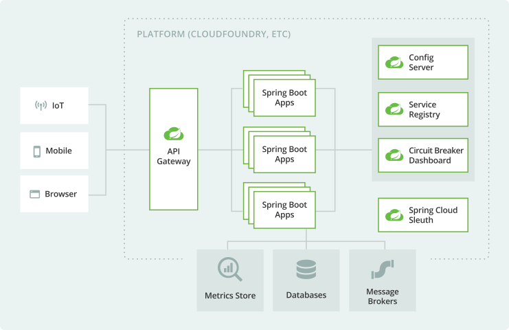

## 概览
[功能](https://spring.io/cloud)
[介绍和依赖](https://spring.io/projects/spring-cloud)
[springcloud alibaba依赖](https://github.com/alibaba/spring-cloud-alibaba/wiki/版本说明)
[依赖详细版本](https://start.spring.io/actuator/info)
微服务


### 组件问题
服务注册中心：Eureka（不更新）、Zookeeper（可以用）、Consul（不要用）、Nacos
服务调用：Ribbon、LoadBalancer
服务调用2：Feign（不更新）、OpenFeign
服务降级：Hystrix（不更新）、Resilience4j、Sentinel
服务网关：Zuul、Zuul2（死了）、gateway
服务配置：Config、Nacos
服务总线：Bus、Nacos

### 组件
服务注册发现相关组件解决的是，当微服务实例多了之后，微服务之间的调用问题。解决负载均衡
#### Eureka
[Introduction to Spring Cloud Netflix - Eureka | Baeldung](https://www.baeldung.com/spring-cloud-netflix-eureka)
微服务注册到Eureka Server，并维持心跳。
Eureka的两个组件：Eureka Server（注册服务），Eureka Client（通过中心访问）


Eureka集群：互相注册，互相守望。实现高可用，容错。
配置下hosts：
```
127.0.0.1   eureka7001
127.0.0.1   eureka7002
```
Eureka自我保护机制（AP）：某个微服务不可用时，不会立即注销，仍会保存微服务信息。

#### Zookeeper
docker启动zookeeper，通过2181端口注册服务
Eureka的最佳替代

#### Consul
[What is Consul? | Consul | HashiCorp Developer](https://developer.hashicorp.com/consul/docs/intro)
go语言开发。提供了服务治理、配置中心、控制总线等。

##### 启动服务
docker启动consul，绑定8xxx端口。
`http://localhost:8500/`

#### 三种服务注册中心
| 组件名    | 语言 | CAP | 服务健康检查 | 对外接口 |
| --------- | ---- | --- | ------------ | -------- |
| Eureka    | Java | AP  | 可配         | HTTP     |
| Consul    | Go   | CP  | 支持         | HTTP/DNS |
| Zookeeper | Java | CP  | 支持         | 客户端   |
|   Nacos   |      |     |      CP/AP切换        |          |

> [!tip] CAP理论
> Consistency：强一致性 
> 
> Availability：高可用
> 
> Partition tolerance：分区容错
> 
> 三者不可兼得

#### Ribbon
Nginx负责服务端负载均衡。客户端服务全转发给ngnix。

Ribbon是本地负载均衡，负责某个具体服务的负载均衡。从注册中心将服务的注册信息列表缓存到本地，在本地实现负载均衡策略。适用于微服务之间远程rpc调用。

LB
集中式LB，独立的LB设施。
进程内LB，集成到消费者。

#### OpenFeign
Feign可以和Eureka、Ribbon组合使用以支持负载均衡。
Ribbon+RestTemplate
通过接口+注解配置实现对服务提供方的接口绑定。

#### Hystrix
- 服务降级（fallback）
	- 触发：程序运行异常、超时、线程池满等
	- 立即向调用方返回一个友好的提示
- 服务熔断（break）
	- 拒绝访问，并调用降级方法返回友好提示.
> [!tip]
> 1. 调用失败触发降级，降级调用fallback方法
> 2. 降级的流程一定是调用正常方法后调用fallback
> 3. 单位时间内失败一定次数后触发熔断
> 4. 熔断后，不调用正常方法直接fallback
> 5. 熔断后不可用就是因为跳过了正常方法直接调用fallback

- 服务限流（flow limit）
	- 高并发时，一秒钟n个，有序进行
- 接近实时的监控

服务端响应超时
客户端对超时的限制小于服务端超时时间
```java
@HystrixCommand(fallbackMethod = "userTimeoutHandler",  
commandProperties = {  
@HystrixProperty(name = "execution.isolation.thread.timeoutInMilliseconds", value = "1000")  
})


@DefaultProperties(defaultFallback="")

@HystrixCommand(fallbackMethod = "userTimeoutHandler",  
commandProperties = {  
@HystrixProperty(name="circuitBreaker.enabled",value = "true"),//是否开启熔断器
@HystrixProperty(name="circuitBreaker.requestVolumeThreshold",value = "10"),//触及熔断的阈値 
@HystrixProperty(name="circuitBreaker.sleepWindowInMilliseconds",value = "10000"),//熔断器时间窗口
@HystrixProperty(name="circuitBreaker.errorThresholdPercentage",value = "60")//失败率过多触发熔断
})
```

Hystrix DashBoard

#### Gateway
SpringCloud Gateway基于WebFlux框架实现，底层使用高性能Reactor模式通讯框架Netty。


> [!tip] 
> 网关
> [【微服务】一文读懂网关概念+Nginx正反向代理+负载均衡+Spring Cloud Gateway（多栗子）-阿里云开发者社区 (aliyun.com)](https://developer.aliyun.com/article/1002990)
> 
> [为什么有了Spring-Gateway还要Nginx - 简书 (jianshu.com)](https://www.jianshu.com/p/f9b156fe3091)

- Route路由
- Predicate断言
- Filter 过滤：请求前后执行操作

常用Predicate：
[Spring Cloud Gateway](https://docs.spring.io/spring-cloud-gateway/docs/current/reference/html/#gateway-request-predicates-factories)

#### Config
给微服务提供集中化的外部配置支持，给不同的微服务应用提供了中心化的外部配置。

默认使用Git存储配置

几种路径方式
- `{label}/{application_name}-{profile}.yml`
- `/{application_name}-{profile}`
- `/{application_name}/{profile}/{label}`

> [!tip]
> `application.yml`是用户级别的配置文件
> `bootstrap.yml`是系统级别的配置文件，优先级更高（先加载）

#### Bus
支持两种消息RabbitMQ，Kafka

#### Stream
##### 几个概念
用于屏蔽不同MQ差异。使用发布-订阅模式，目前支持：RabbitMQ、kafka
- binder：连接中间件的对象
- source、sink：输入输出
- channel：通道，对队列的抽象
- group: 同一个组内消息只会消费一次（有group的消息默认会持久化到消息中间件中的队列中，没有group则不会持久化，服务停止后，消息会丢失）

##### 原理
- 应用程序通过inputs或outputs与Stream中的binder交互。
- binder对象负责与消息中间件交互
- 通过binding绑定

#### Sleuth
分布式全链路追踪

兼容Zipkin

### SpringCloud Alibaba 

#### Nacos服务注册和配置
##### 安装
[Nacos 快速开始](https://nacos.io/zh-cn/docs/v2/quickstart/quick-start.html)

##### CAP
CP：需要服务级别的编辑。如k8s服务DNS服务
AP：不需要存储服务级别的信息时。如临时实例

##### 配置中心
配置中心：https://nacos.io/zh-cn/docs/v2/ecology/use-nacos-with-spring-cloud.html


namespace：隔离生产、开发、测试环境
group：不同的微服务划分到一个分组（如，不同区域的机房）
service：微服务
instance：实例

##### 集群和持久化配置
集群： https://nacos.io/zh-cn/docs/v2/guide/admin/cluster-mode-quick-start.html
需要3个以上的nacos节点


**持久化**
自身默认使用derby嵌入式数据库，不方便观察。可以使用mysql替换
```
nginx -> nacos*3 -> mysql
```


1. 在mysql中新建数据库执行`nacos/conf/mysql-schema.sql`命令
2. 修改`nacos/conf/application.properties`中的如下配置

3. 重启nacos

#### Sentinel
[GitHub - alibaba/Sentinel: A powerful flow control component enabling reliability, resilience and monitoring for microservices. (面向云原生微服务的高可用流控防护组件)](https://github.com/alibaba/Sentinel)
熔断限流降级等

- 单独一个组件
- 界面化的细粒度统一配置

##### 启动
- 后台+前台
- jar包(从github)，8080端口
- 启动：`java -jar asdkfljasdf.jar`

> [!tips]
> 默认用户名密码都是sentinel
> 
> 执行一个请求才能访问

约定>配置>编码

##### 流控
**阈值类型**
- QPS：每秒请求数
- 线程数：一个页面可以认为一个线程

**流控模式**：
- 直接
- 关联：
	- 当关联的资源达到阈值时，对自己限流
- 链路

**流控效果**：
- 直接失败
- 预热：
	- 当系统负载短时间突然冲高时，让通过的流量缓慢增加（初始为`阈值/coldFactor`），在一定时间内逐渐增加到阈值上线。
- 排队等待

> [!tip] 熔断和降级 
> 
> 我认为： 
> - 熔断 = 停止转发流量到特定服务。
> - 降级 = 停用服务的部分功能

**Sentinel只有熔断没有降级**
熔断：
- 慢调用比例
- 熔断比例

**热点key降级**
某些数据经常被访问，对这些数据限流

对包含热点参数topk的调用进行限流。

`@SentinelResource`中的blockhandler不会处理接口中的运行时异常,fallback可以。

##### 系统规则
整个系统级别的限制

#### Seate
[Seata 是什么](https://seata.io/zh-cn/docs/overview/what-is-seata.html)


