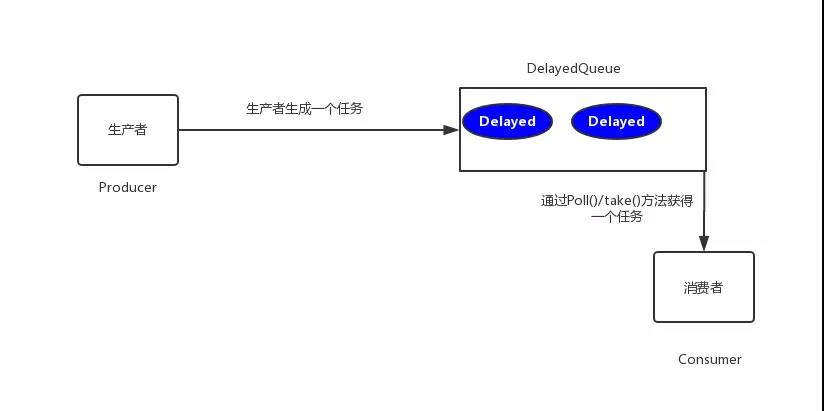
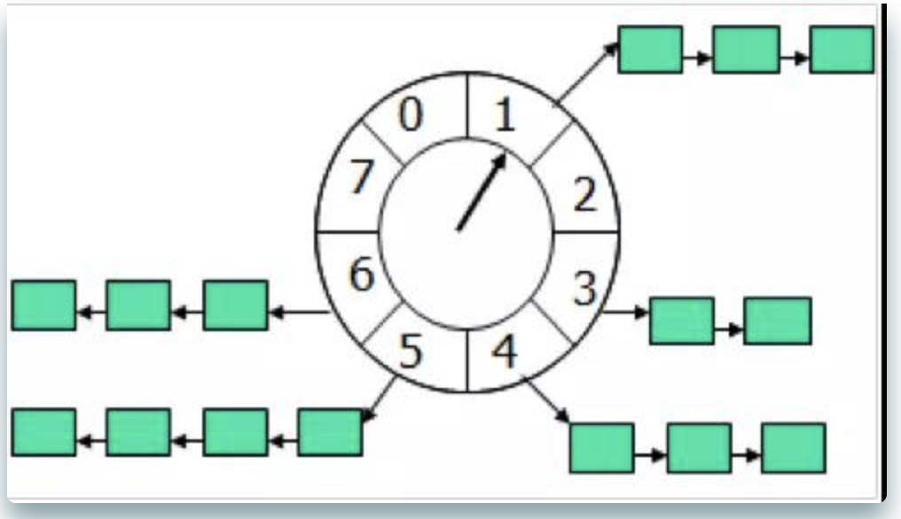
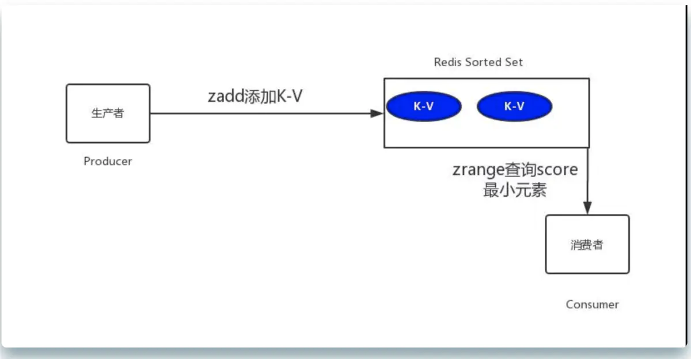

时队列

[延时任务](https://www.jianshu.com/p/0e7c2dd60655)

## 延时队列

|  | 定时任务 | 延时任务 |
| --- | --- | --- |
| 触发 | 有明确触发时间 | 没有明确触发时间 |
| 是否有明确执行周期 | 有执行周期 | 无执行周期，一般是事件触发 |
| 任务数 | 一般是批处理多个任务 | 一般是单个任务 |
|  |  |  |

## 延时队列的实现方式

### 数据库轮询

通常在小型项目中使用，通过一个线程扫描数据库，然后实现对任务的处理。

可以通过quartz（本质上还是一种定时触发机制）实现

- quartz实现示例
    
    maven项目引入一个依赖如下所示
    
    ```xml
       <dependency>
        <groupId>org.quartz-scheduler</groupId>
        <artifactId>quartz</artifactId>
        <version>2.2.2</version>
       </dependency>
    ```
    
    调用Demo类MyJob如下所示
    
    ```java
    import org.quartz.*;
    import org.quartz.impl.StdSchedulerFactory;
    
    public class MyJob implements Job {
        public void execute(JobExecutionContext context)
                throws JobExecutionException {
            System.out.println("要去数据库扫描啦。。。");
        }
    
        public static void main(String[] args) throws Exception {
            // 创建任务
            JobDetail jobDetail = JobBuilder.newJob(MyJob.class)
                    .withIdentity("job1", "group1").build();
            // 创建触发器 每3秒钟执行一次
            Trigger trigger = TriggerBuilder
                    .newTrigger()
                    .withIdentity("trigger1", "group3")
                    .withSchedule(
                            SimpleScheduleBuilder.simpleSchedule()
                                    .withIntervalInSeconds(3).repeatForever())
                    .build();
            Scheduler scheduler = new StdSchedulerFactory().getScheduler();
            // 将任务及其触发器放入调度器
            scheduler.scheduleJob(jobDetail, trigger);
            // 调度器开始调度任务
            scheduler.start();
        }
    }
    ```
    
    运行代码，可发现每隔3秒，输出如下
    
    ```
    要去数据库扫描啦。。。
    ```
    

优点：简单易行，支持集群操作

缺点：

- 服务器内存消耗大
- 存在延迟
- 频繁的数据库查询

### JDK延迟队列

JDK自带DelayQueue，属于无界阻塞队列，只有在延迟期满时才能从中获取元素，放入DelayQueue中的对象必须实现Delayed接口。

- DelayQueue原理
    
    
    
- DelayQueue示例
    
    OrderDelay对象
    
    ```java
    import java.util.concurrent.Delayed;
    import java.util.concurrent.TimeUnit;
    
    public class OrderDelay implements Delayed {
        private String orderId;
        private long timeout;
    
        OrderDelay(String orderId, long timeout) {
            this.orderId = orderId;
            this.timeout = timeout + System.nanoTime();
        }
    
        public int compareTo(Delayed other) {
            if (other == this) {
                return 0;
            }
            OrderDelay t = (OrderDelay) other;
            long d = (getDelay(TimeUnit.NANOSECONDS) -
                    t.getDelay(TimeUnit.NANOSECONDS));
            return (d == 0) ? 0 : ((d < 0) ? (-1) : 1);
        }
    
        // 返回距离你自定义的超时时间还有多少
        public long getDelay(TimeUnit unit) {
            return unit.convert(timeout - System.nanoTime(), TimeUnit.NANOSECONDS);
        }
    
        void print() {
            System.out.println(orderId + "编号的订单要删除啦。。。。");
        }
    }
    ```
    
    OrderConsumer
    
    ```java
    import java.util.ArrayList;
    import java.util.List;
    import java.util.concurrent.DelayQueue;
    import java.util.concurrent.TimeUnit;
    
    public class DelayQueueDemo {
        public static void main(String[] args) {
            List<String> list = new ArrayList<>();
            list.add("00000001");
            list.add("00000002");
            list.add("00000003");
            list.add("00000004");
            list.add("00000005");
            DelayQueue<OrderDelay> queue = new DelayQueue<>();
            long start = System.currentTimeMillis();
            for (int i = 0; i < 5; i++) {
                //延迟三秒取出
                queue.put(new OrderDelay(list.get(i), TimeUnit.NANOSECONDS.convert(3, TimeUnit.SECONDS)));
                try {
                    queue.take().print();
                    System.out.println("After " + (System.currentTimeMillis() - start) + " MilliSeconds");
                } catch (InterruptedException e) {
                    e.printStackTrace();
                }
            }
        }
    }
    ```
    

缺点：

- 服务器重启后，数据全部消失，怕宕机
- 集群扩展比较麻烦
- 内存条件受限，容易出现OOM的错误
- 代码复杂度比较高

### 时间轮算法



时间轮算法可以类比于时钟，如上图箭头（指针）按某一个方向按固定频率轮动，每一次跳动称为一个 tick。这样可以看出定时轮由个3个重要的属性参数，ticksPerWheel（一轮的tick数），tickDuration（一个tick的持续时间）以及 timeUnit（时间单位）

如果当前指针指在1上面，我有一个任务需要4秒以后执行，那么这个执行的线程回调或者消息将会被放在5上。那如果需要在20秒之后执行怎么办，由于这个环形结构槽数只到8，如果要20秒，指针需要多转2圈。位置是在2圈之后的5上面（20%8+1）

- netty timer实现
    
    ```xml
    <dependency>
                <groupId>io.netty</groupId>
                <artifactId>netty-all</artifactId>
                <version>4.1.73.Final</version>
            </dependency>
    ```
    
    ```java
    import io.netty.util.HashedWheelTimer;
    import io.netty.util.Timeout;
    import io.netty.util.Timer;
    import io.netty.util.TimerTask;
    
    import java.util.concurrent.TimeUnit;
    
    public class HashedWheelTimerTest {
        static class MyTimerTask implements TimerTask {
            boolean flag;
    
            public MyTimerTask(boolean flag) {
                this.flag = flag;
            }
    
            public void run(Timeout timeout) throws Exception {
                System.out.println("要去数据库删除订单了。。。。");
    //            this.flag = false;
            }
        }
    
        public static void main(String[] argv) {
            MyTimerTask timerTask = new MyTimerTask(true);
            Timer timer = new HashedWheelTimer();
            timer.newTimeout(timerTask, 5, TimeUnit.SECONDS);
            timer.newTimeout(timerTask, 11, TimeUnit.SECONDS);
            int i = 1;
            while (timerTask.flag) {
                try {
                    Thread.sleep(1000);
                } catch (InterruptedException e) {
                    e.printStackTrace();
                }
                System.out.println(i + "秒过去了");
                i++;
            }
        }
    }
    ```
    

缺点：

- 代码复杂度低，其他和DelayQueue一致

### redis缓存

利用redis的zset，zset是一个有序集合，每个元素都关联了一个score，可以进行排序

- 添加元素：zadd key score member
- 按顺序查询元素：zrange key start stop [WITHSCORES]
- 查询元素：ZSCORE key member
- 移除元素：ZREM key member

- 原理
    
    
    
- redis zset实例
    
    ### 实现一
    
    ```java
    import redis.clients.jedis.Jedis;
    import redis.clients.jedis.JedisPool;
    import redis.clients.jedis.Tuple;
    
    import java.util.Calendar;
    import java.util.Set;
    
    public class AppTest {
        private static final String ADDR = "127.0.0.1";
        private static final int PORT = 6379;
        private static JedisPool jedisPool = new JedisPool(ADDR, PORT);
    
        public static Jedis getJedis() {
            return jedisPool.getResource();
        }
    
        //生产者,生成5个订单放进去
        public void productionDelayMessage() {
            for (int i = 0; i < 5; i++) {
                //延迟3秒
                Calendar cal1 = Calendar.getInstance();
                cal1.add(Calendar.SECOND, 3);
                int second3later = (int) (cal1.getTimeInMillis() / 1000);
                AppTest.getJedis().zadd("OrderId", second3later, "OID0000001" + i);
                System.out.println(System.currentTimeMillis() + "ms:redis生成了一个订单任务：订单ID为" + "OID0000001" + i);
            }
        }
    
        //消费者，取订单
        public void consumerDelayMessage() {
            Jedis jedis = AppTest.getJedis();
            while (true) {
                Set<Tuple> items = jedis.zrangeWithScores("OrderId", 0, 1);
                if (items == null || items.isEmpty()) {
                    System.out.println("当前没有等待的任务");
                    try {
                        Thread.sleep(500);
                    } catch (InterruptedException e) {
                        // TODO Auto-generated catch block
                        e.printStackTrace();
                    }
                    continue;
                }
                int score = (int) ((Tuple) items.toArray()[0]).getScore();
                Calendar cal = Calendar.getInstance();
                int nowSecond = (int) (cal.getTimeInMillis() / 1000);
                if (nowSecond >= score) {
                    String orderId = ((Tuple) items.toArray()[0]).getElement();
                    jedis.zrem("OrderId", orderId);
                    System.out.println(System.currentTimeMillis() + "ms:redis消费了一个任务：消费的订单OrderId为" + orderId);
                }
            }
        }
    
        public static void main(String[] args) {
            AppTest appTest = new AppTest();
            appTest.productionDelayMessage();
            appTest.consumerDelayMessage();
        }
    }
    ```
    
    这一版本存在致命的硬伤，在高并发情况下，多消费者会取到同一个订单
    解决方案：
    
    - 用分布式锁，性能会下降
    - 对zrem返回值进行判断，只有大于0的时候，才消费
    
    ```java
    {
     String orderId = ((Tuple) items.toArray()[0]).getElement();
     Long num = jedis.zrem("OrderId", orderId);
     if(num != null && num > 0)
     {
      System.out.println(System.currentTimeMillis() + "ms:redis消费了一个任务：消费的订单OrderId为" + orderId);
     }
    }
    ```
    
- redis keyspace notifications
    
    该方案使用redis的keyspace notifications，在key失效之后会提供一个回调，实际上就是redis给客户端发送一个消息，需要redis版本2.8以上
    
    ```java
    import redis.clients.jedis.Jedis;
    import redis.clients.jedis.JedisPool;
    import redis.clients.jedis.JedisPubSub;
    
    public class RedisTest {
        private static final String ADDR = "127.0.0.1";
        private static final int PORT = 6379;
        private static JedisPool jedis = new JedisPool(ADDR, PORT);
        private static RedisSub sub = new RedisSub();
    
        public static void init() {
            new Thread(new Runnable() {
                public void run() {
                    jedis.getResource().subscribe(sub, "__keyevent@0__:expired");
                }
            }).start();
        }
    
        public static void main(String[] args) throws InterruptedException {
            init();
            for (int i = 0; i < 10; i++) {
                String orderId = "OID000000" + i;
                jedis.getResource().setex(orderId, 3, orderId);
                System.out.println(System.currentTimeMillis() + "ms:" + orderId + "订单生成");
            }
        }
    
        static class RedisSub extends JedisPubSub {
            @Override
            public void onMessage(String channel, String message) {
                System.out.println(System.currentTimeMillis() + "ms:" + message + "订单取消");
            }
        }
    }
    ```
    

### 使用消息队列

采用rabbitMQ的延时队列。

RabbitMQ具有以下两个特性，可以实现延迟队列：

- RabbitMQ可以针对Queue和Message设置 x-message-tt，来控制消息的生存时间，如果超时，则消息变为dead letter
- lRabbitMQ的Queue可以配置x-dead-letter-exchange 和x-dead-letter-routing-key（可选）两个参数，用来控制队列内出现了deadletter，则按照这两个参数重新路由。