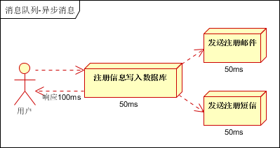
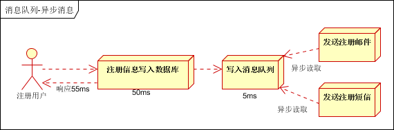
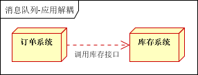
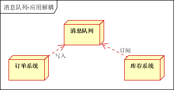

# 消息队列（Rabbit MQ）

## 消息队列

消息队列：消息传输过程中保存消息的容器，消息队列往往还包含一些特定的消息传递和接收机制。

[消息队列详解：ActiveMQ、RocketMQ、RabbitMQ、Kafka-梅竹生辉](https://www.dingsky.com/article/20.html)

## 应用场景

### 异步处理

引入消息队列前：

引入消息队列后：

### 应用解耦

引入消息队列前：

订单减库存失败会导致订单失败

引入消息队列后：

### 流量削峰

一般在秒杀或团抢活动中使用广泛，需要在应用前端加入消息队列。

- 可以控制活动的人数
- 可以缓解短时间内高流量压垮应用

### 日志处理

日志处理是指将消息队列用在日志处理中，比如Kafka的应用，解决大量日志传输的问题。架构简化如下

- 日志采集客户端，负责日志数据采集，定时写受写入Kafka队列
- Kafka消息队列，负责日志数据的接收，存储和转发
- 日志处理应用：订阅并消费kafka队列中的日志数据

以下是新浪kafka日志处理应用案例：

(1)Kafka：接收用户日志的消息队列

(2)Logstash：做日志解析，统一成JSON输出给Elasticsearch

(3)Elasticsearch：实时日志分析服务的核心技术，一个schemaless，实时的数据存储服务，通过index组织数据，兼具强大的搜索和统计功能

(4)Kibana：基于Elasticsearch的数据可视化组件，超强的数据可视化能力是众多公司选择ELK stack的重要原因

### 消息通讯

消息通讯是指，消息队列一般都内置了高效的通信机制，因此也可以用在纯的消息通讯。比如实现点对点消息队列，或者聊天室等

点对点通讯：

客户端A和客户端B使用同一队列，进行消息通讯。

聊天室通讯：

## Rabbit MQ

**AMQP**，即 Advanced Message Queuing Protocol，高级消息队列协议，是应用层协议的一个开放标准，为面向消息的中间件设计。消息中间件主要用于组件之间的解耦和通讯。AMQP的主要特征是面向消息、队列、路由（包括点对点和发布/订阅）、可靠性和安全。
**RabbitMQ**是一个开源的AMQP实现，服务器端用 Erlang 语言编写，支持多种客户端，如：Java、Python、Ruby、.NET、JMS、C、PHP、ActionScript、XMPP、STOMP等，支持AJAX。用于在分布式系统中存储转发消息，具有很高的易用性和可用性。

### **ConnectionFactory、Connection、Channel**

ConnectionFactory、Connection、Channel都是RabbitMQ对外提供的API中最基本的对象。Connection是RabbitMQ的socket链接，它封装了socket协议相关部分逻辑。ConnectionFactory为Connection的制造工厂。 Channel是我们与RabbitMQ打交道的最重要的一个接口，我们大部分的业务操作是在Channel这个接口中完成的，包括定义Queue、定义Exchange、绑定Queue与Exchange、发布消息等。

### **Queue**

Queue（队列）是RabbitMQ的内部对象，用于存储消息。

RabbitMQ中的消息都只能存储在Queue中，生产者（下图中的P）生产消息并最终投递到Queue中，消费者（下图中的C）可以从Queue中获取消息并消费。

生产者Send Message “A”被传送到Queue中，消费者发现消息队列Queue中有订阅的消息，就会将这条消息A读取出来进行一些列的业务操作。这里只是一个消费正对应一个队列Queue，也可以多个消费者订阅同一个队列Queue，当然这里就会将Queue里面的消息平分给其他的消费者，但是会存在一个一个问题就是如果每个消息的处理时间不同，就会导致某些消费者一直在忙碌中，而有的消费者处理完了消息后一直处于空闲状态，因为前面已经提及到了Queue会平分这些消息给相应的消费者。这里我们就可以使用prefetchCount来限制每次发送给消费者消息的个数。详情见下图所示：

这里的prefetchCount=1是指每次从Queue中发送一条消息来。等消费者处理完这条消息后Queue会再发送一条消息给消费者。

### **Message acknowledgment**

在实际应用中，可能会发生消费者收到Queue中的消息，但没有处理完成就宕机（或出现其他意外）的情况，这种情况下就可能会导致消息丢失。为了避免这种情况发生，我们**可以要求消费者在消费完消息后发送一个回执给RabbitMQ，RabbitMQ收到消息回执（Message acknowledgment）后才将该消息从Queue中移除**；如果RabbitMQ没有收到回执并检测到消费者的RabbitMQ连接断开，则RabbitMQ会将该消息发送给其他消费者（如果存在多个消费者）进行处理。这里不存在timeout概念，一个消费者处理消息时间再长也不会导致该消息被发送给其他消费者，除非它的RabbitMQ连接断开。 这里会产生另外一个问题，如果我们的开发人员在处理完业务逻辑后，忘记发送回执给RabbitMQ，这将会导致严重的bug——Queue中堆积的消息会越来越多；消费者重启后会重复消费这些消息并重复执行业务逻辑…

另外pub message是没有ack的。

### **Message durability**

如果我们希望即使在RabbitMQ服务重启的情况下，也不会丢失消息，我们**可以将Queue与Message都设置为可持久化的（durable），这样可以保证绝大部分情况下我们的RabbitMQ消息不会丢失**。但依然解决不了小概率丢失事件的发生（比如RabbitMQ服务器已经接收到生产者的消息，但还没来得及持久化该消息时RabbitMQ服务器就断电了），如果我们需要对这种小概率事件也要管理起来，那么我们**要用到事务**。由于这里仅为RabbitMQ的简单介绍，所以这里将不讲解RabbitMQ相关的事务。

### **Exchange**

首先明确一点就是**生产者产生的消息并不是直接发送给消息队列Queue的，而是要经过Exchange**（交换器），由Exchange再将消息路由到一个或多个Queue，当然这里还会对不符合路由规则的消息进行丢弃掉，这里指的是后续要谈到的Exchange Type。那么Exchange是怎样将消息准确的推送到对应的Queue的呢？那么这里的功劳最大的当属Binding，RabbitMQ是通过Binding将Exchange和Queue链接在一起，这样Exchange就知道如何将消息准确的推送到Queue中去。简单示意图如下所示：

在绑定（Binding）Exchange和Queue的同时，一般会指定一个Binding Key，生产者将消息发送给Exchange的时候，一般会产生一个Routing Key，当Routing Key和Binding Key对应上的时候，消息就会发送到对应的Queue中去。那么Exchange有四种类型，不同的类型有着不同的策略。也就是表明不同的类型将决定绑定的Queue不同，换言之就是说生产者发送了一个消息，Routing Key的规则是A，那么生产者会将Routing Key=A的消息推送到Exchange中，这时候Exchange中会有自己的规则，对应的规则去筛选生产者发来的消息，如果能够对应上Exchange的内部规则就将消息推送到对应的Queue中去。那么接下来就来详细讲解下Exchange里面类型。

Exchange Types

- fanout

fanout类型的Exchange路由规则非常简单，它会把所有发送到该Exchange的消息路由到所有与它绑定的Queue中。

上图所示，生产者（P）生产消息1将消息1推送到Exchange，由于Exchange Type=fanout这时候会遵循fanout的规则将消息推送到所有与它绑定Queue，也就是图上的两个Queue最后两个消费者消费。

- direct

direct类型的Exchange路由规则也很简单，它会把消息路由到那些binding key与routing key完全匹配的Queue中

当生产者（P）发送消息时Rotuing key=booking时，这时候将消息传送给Exchange，Exchange获取到生产者发送过来消息后，会根据自身的规则进行与匹配相应的Queue，这时发现Queue1和Queue2都符合，就会将消息传送给这两个队列，如果我们以Rotuing key=create和Rotuing key=confirm发送消息时，这时消息只会被推送到Queue2队列中，其他Routing Key的消息将会被丢弃。

- topic

前面提到的direct规则是严格意义上的匹配，换言之Routing Key必须与Binding Key相匹配的时候才将消息传送给Queue，那么topic这个规则就是模糊匹配，可以通过通配符满足一部分规则就可以传送。它的约定是：

1. routing key为一个句点号“. ”分隔的字符串（我们将被句点号“. ”分隔开的每一段独立的字符串称为一个单词），如“stock.usd.nyse”、“nyse.vmw”、“quick.orange.rabbit”
2. binding key与routing key一样也是句点号“. ”分隔的字符串
3. binding key中可以存在两种特殊字符“*”与“#”，用于做模糊匹配，其中“*”用于匹配一个单词，“#”用于匹配多个单词（可以是零个）

当生产者发送消息Routing Key=F.C.E的时候，这时候只满足Queue1，所以会被路由到Queue中，如果Routing Key=A.C.E这时候会被同是路由到Queue1和Queue2中，如果Routing Key=A.F.B时，这里只会发送一条消息到Queue2中。

- headers

headers类型的Exchange不依赖于routing key与binding key的匹配规则来路由消息，而是根据发送的消息内容中的headers属性进行匹配。在绑定Queue与Exchange时指定一组键值对；当消息发送到Exchange时，RabbitMQ会取到该消息的headers（也是一个键值对的形式），对比其中的键值对是否完全匹配Queue与Exchange绑定时指定的键值对；如果完全匹配则消息会路由到该Queue，否则不会路由到该Queue。

## Rabbit MQ教程

[保姆级别的RabbitMQ教程！一看就懂！（有安装教程，送安装需要的依赖包，送Java、Golang两种客户端教学Case）](https://www.cnblogs.com/ZhuChangwu/p/14093107.html)

包含持久化设置：

[RabbitMQ入门教程（概念，应用场景，安装，使用）](https://www.jianshu.com/p/dae5bbed39b1)