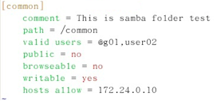
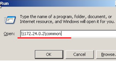
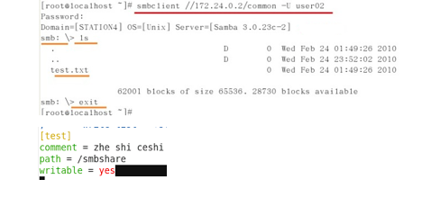
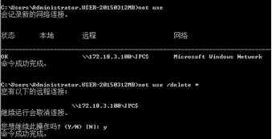

# linux命令.md

```yaml

title: linux命令
toc: true
date: 2020-06-29 21:46:56
tags:
categories:
- Linux

```

参考链接：https://www.cnblogs.com/linhaifeng/articles/6045600.html

<!--more-->

### 笔记

**1.常用命令**
df -hl 查看磁盘空间
ls 列出当前文件夹中文件（-l 详细信息 -a 显示隐藏文件 -all 同 -a）
ll = ls -l --color = auto
alias 别名
cd 切换到目录（- 返回  ..上一级）
pwd  当前目录
whoami 查看当前登录用户
who 查看所有登录用户
date 显示当前时间和日期
cal 月历
clear 清屏（ctrl+l）
useradd (用户名) 添加用户
passwd (用户名) 更改用户密码
su - (用户名) 切换用户
man 命令 使用说明（q退出）
echo 回显命令
history查看历史命令
grep 搜索过滤(-v 反向过滤)
lsof -i :8080 查看8080端口的进程(lsof:list of files，列出正在使用某文件的应用)

nestat -an|grep 8080 查看端口状态
init 0 关闭linux系统

命令 --help    帮助信息
命令跳到行首 ctrl+a   跳到行尾 ctrl+e

**2.目录**
/ 根目录

- 当前目录
.. 上一层目录
bin 可执行文件目录(binary)
sbin 系统的可执行文件
home 用户的文件
dev 设备文件目录
etc 配置文件目录
/mnt /opt /media 随便用

**3.目录及文件操作**
cp 复制（-i 询问是否覆盖 -r 递归拷贝 -）
mv 移动
mkdir 建文件夹（-p 递归建立文件夹）
touch 建文件 （touch /test/{a..z}.txt）
rm 删除（-f 不提示是否删除 -r 删除文件夹）
cat 查看文件内容
head 查看文件第一行(-n 前n行)
tail 查看文件最后一行（-n 最后n行 -f 动态查看文件内容变化）
more 按照百分比显示文件内容
less 可以用上下键翻

tail -1 /etc/passwd  用户信息
tail -1 /etc/shadow  密码
tail -1 /etc/group
tail -1 /etc/gshadow
tail -1 /var/spool/mail/username
tail -1 /home/username

useradd (-u 指定用户uid -g 指定用户所属的群组 -d指定用户的家目录 -c指定用户的备注信息 -s指定用户的shell)
userdel 删除用户
usermod 修改用户信息（-u -g -d -c -s同上 -G 将用户加入指定的群组 -L将用户加锁 -U将用户解锁）

**4.对文件的权限管理**
文件详细信息
10位
1:文件类型
-:普通文件  d:目录   l:软链接   b:设备   p:管道文件
2-4:属主权限 ---》u
分三类：读r，写w，执行x,没有权限-
5-7:属组权限 ---》g
8-10:其他用户 ---》o

修改权限：
chmod u=rw- a.txt
chmod u-rw a.txt

root 用户不受权限限制

执行文件：
sh 文件路径
bash 文件路径

- 文件路径
./ 文件路径
------------vim原理 读取到内存中，进行修改。

**5.对目录的权限管理**
ll -d 目录  获取目录权限
增加文件，删除文件

**6.属主属组及基于数字的权限管理**
chown 属主.属组 参数
只改属主： chown 属主 参数
只改属组： chown .属组 参数

chown -R (递归修改权限：目录和文件)

数字权限管理
-rw-rw-r-- 为 664

**7.文件合并与文件归档**
> 左侧命令输出结果覆盖右侧文件 cat /etc/passwd > a.txt
>> 左侧命令输出结果追加到右侧文件

wc -l 统计文件行数
| 管道符将前面的结果作为后面的指令的参数

归档
tar
c：创建一个新的tar文件。
t：列出tar文件中目录的内容。
x：从tar文件中抽取文件。
f：指定归档文件或磁带（也可能是软盘）设备（一般都要选）。
v：显示所打包的文件的详细信息，v是verbose的第1个字母。
z：使用gzip压缩算法来压缩打包后的文件。
j：使用bzip2压缩算法来压缩打包后的文件。

打包：tar cvf arch.tar arch
解包：tar xvf arch.tar -C 路径

压缩 gzip bzip2
解压 gunzip bunzip2
打包后压缩 tar czvf test1.tar.gz 1.txt 2.txt 3.txt

8.vim编辑器
命令行模式  esc
编辑模式  a i o
扩展模式  :     (:wq退出)

dd 删除（剪切）
ndd 删除光标所在的向下n行
yy 复制光标所在的那一行
nyy 复制光标所在的向下n行
p 将已复制的数据在光标的下一行粘贴
np 复制n次
P 将已复制的数据在光标的上一行粘贴
u 撤销上一步操作
ctrl+r 前进一步
0 移动到行首(home)
$ 移动到行尾(end)
gg 移动到文章开头
G 移动到文章最后一行
nG 移动到文章第n行
H 移动到屏幕最上方
M 移动到屏幕中央
L 移动到屏幕最下方
:w 将文件写入磁盘
:q 退出
:wq 写入并退出
:set nu 显示行号

**9.系统启动流程**
linux系统引导顺序： BIOS-->MBR(主引导记录,512B,从何处装载程序)-->Boot loader(引导)-->Kernel-->init progress

操作系统的启动级别 7个（/etc/inittab）
查看内核信息 uname -r
查看内核详细信息 uname -a

**10.grub加密**
**11.bios加密
12.top命令**
僵尸进程:父进程结束，子进程没有结束（仍然存在）
终端:bash程序
buffer：缓冲区（内存空间）
cache:高速缓存（内存空间，存放cpu经常使用的数据）
pid 进程号
PR
NI（nice） 好心值 值越高优先级越低
VIRT 虚拟内存
RES 物理内存
SHR 共享内存

**13.free命令**
free 查看内存信息
free -m 以兆为单位
free -g 以G为单位

**14.进程管理**
ps aux 查看所有进程
kill 进程号(-9 强制杀死进程)
kill %工作号
firefox & 打开firefox并在后台运行
jobs 查看后台进程
fg % 后台掉前台
bg % 在后台运行
pgrep == ps grep

**15.磁盘分区**
步骤： （1）fdisk /dev/sdb新建分区 （2）partprobe更新分区表（3）mkfs.ext4格式化（4）mount 挂载

ls /dev/sd
块存储(磁盘) 文件存储(文件夹) 对象存储(百度网盘)

查看硬盘详细信息 fdisk -l /dev/sdb
硬盘分区 fdisk /dev/sdb

写分区列表  w
更新分区列表  partprobe

格式化为ext4 : mkfs.ext4 /dev/sdb1
扩展分区为逻辑分区不能格式化

**16.文件系统与挂载**
挂载：由设备映射到目录
mount /dev/sdb1 /sdb1/ 将sdb1挂载到/sdb1/
df 查看挂载信息

文件系统
xfs 海量数据存贮
btrfs 存储效率高

一个设备可以有多个挂载点

卸载：umount 设备（删除最后一个挂载点）
umount 挂载点

touch /opt/a.txt 若/opt不存在则寻找/

查看挂载信息： df mount
统计某一目录下文件大小 du -sh /etc/

文件包括元数据（存放在inode块中）和数据信息
操作系统中的block：
super block
inode block中存放的信息：inode号。权限，属主，属组，创建时间，文件名，指针
directory block中存放的信息：文件+inode号
block：存放数据的块

df -i 查看inode的占用情况
写文件： dd if=输入文件目录 of=输出文件目录 bs=10G count=1（bs：一个块的大小一般为512）

**17.软链接和硬链接**

软链接(快捷方式)： ln -s <源文件路径> <目标文件路径>
硬链接： ln <源文件路径> <目标文件路径>
软链接的目标和源文件的inode号（类似指针，指向文件位置）不同，可以跨分区，删除源文件后，软链接无法访问
硬链接的目标和源文件的inode号相同，不可以跨分区，删除源文件后（硬盘中的并未删除），硬链接仍然可以访问文件

**18.linux网络地址管理**
ip地址
格式： 4段.分十进制（4段8位二进制数）
网络地址： ip地址和子网掩码按位与
查看网卡信息： ifconfig
永久修改网卡ip地址： vim /etc/sysconfig/network-scripts/ifcfg-eth0
BOOTPROTO=dhcp 从局域网的dhcp服务器获取
BOOTPROTO=static
IPADDR=192168.11.200
NETMASK=255.255.255.0
GATEWAY=192.168.11.1
DNS1=2.2.106.0.20
DNS2=8.8.8.8

**19.软件包管理**
编译安装：将程序编码为二进制文件存放到计算机中

软件包最后一位为奇数为测试版，偶数为稳定版

rpm 红帽软件包管理
rpm包本身就是编译好的二进制文件

yum软件包管理

**20.补充**
ssh服务
在服务端开启ssh服务，然后客户端输入ssh <ip地址>
主机密钥错误：vim ~/.ssh/known

### 一.简介

**操作系统的内核**：操作系统的内核是一个管理和控制程序，负责管理计算机的所有物理资源，其中包括。文件系统、内存管理、设备管理和进程管理。

**UNIX操作系统**的特点：多用户和多任务
a)	多用户表示在同一时刻可以有多个用户同时使用UNIX操作系统而且他们互不干扰；
b)	多任务表示任何一个用户在同一时间可以在UNIX操作系统上运行多个程序。

**Linux**的定义：Linux是一套免费使用和自由传播的类Unix操作系统，是一个基于POSIX和UNIX的多用户、多任务、支持多线程和多CPU的操作系统。

**登录和退出Linux**（操作演示图解见linux系统管理P17-P22）

掌握关闭Linux系统的命令：init 0

掌握什么是Linux终端：Linux终端也称为虚拟控制台。Linux终端采用字符命令行方式工作，用户通过键盘输入命令，通过Linux终端对系统进行控制。

掌握切换虚拟终端的方法：Ctrl+Alt+F[1～6]，如想切换到第二号虚拟终端，则同时按Ctrl+Alt+F2

掌握普通用户登录后系统的提示符：$

掌握root用户登录后系统的提示符：#

掌握退出命令：exit

### 二.linux命令

1. **whoami**命令（详见linux系统管理P24）

```
1)	了解whoami命令的功能:列出目前登陆Linux系统所使用的用户名（账号）。

```

1. **who**命令（详见linux系统管理P25）

```
1)	掌握who命令的功能：列出目前哪些用户在系统上工作。
2)	掌握who命令的输出结果：显示当前登录的所有用户，以及当前的日期和时间。

```

1. **date、cal、和clear**命令及带有参数的命令
（详见linux系统管理P28-P29）

```
1)	掌握date命令的功能：显示系统当前的日期和时间。
2)	掌握date命令设置时间时间的格式：date 月日时分年。
例如：将时间设定成2013年12月24日上午10点18的命令：
扩展（date 12241018201
hwclock –s 同步硬件 –w 同步系统）
3)	掌握cal命令的功能：显示某月的日历。
4)	灵活应用cal命令列出某一年某月的日历：例如显示2008年8月份日历的命令为：cal 8 2008
5)	掌握clear命令的功能：清除屏幕
6)	掌握清屏快捷键：ctrl+l

```

1. su和passwd命令（详见linux系统管理P29-P31）

```
1)	掌握su命令的功能：从当前的用户切换到另一个指定的其他用户。
2)	灵活应用su命令切换用户：
例如：切到root用户的命令：su – root
3)	掌握passwd命令功能：修改用户（既可以是普通用户，也可以是root用户）的密码，查看用户的密码状态等。Useradd
4)	掌握使用passwd命令修改用户密码：
例如：修改dog用户密码的命令：passwd dog

```

1. 利用man命令来获取帮助信息（详见linux系统管理P34）

```
1)	掌握man命令的功能：获取某个Linux命令的使用说明。
2)	掌握使用man命令查看某命令的使用说明：
例如：查看su命令的使用说明的命令为:man su

```

1. 使用“命令名 --help”获取帮助

```
1)	例如:查看ls命令帮助的命令为：(不使用man方法)
ls –-help

```

###三.目录文件的浏览

1.Linux系统中的一些**重要的目录**（详见linux系统管理P41）
a)	**bin目录**：用来存放常用的可执行文件
b)	**sbin目录**：用来存放系统的可执行文件
c)	**家目录**：用来存放用户自己的文件或目录，其中，超级用户root的家目录是/root，而普通用户的家目录被存放在/home目录下，并使用用户名作为最后一级目录（家目录）的名称，如cat用户的家目录为/home/cat
d)	**dev目录**：设备文件目录
e)	**etc目录**：配置文件目录
f)	**挂载点(目录)**：通常可移除式硬件会被挂载在/media或/mnt目录之下

1. 使用**pwd**和**cd**命令来确定和切换目录（详见linux系统管理P43-P46）

```
1)	掌握pwd命令的功能：确定现在所在的工作目录
2)	掌握cd命令的功能：切换当前目录
3)	掌握“cd –”命令：切换到用户之前的工作目录

```

1. 使用ls命令列出目录中的内容(详见linux系统管理P47-P50)

```
1)	掌握ls -a命令：列出目录下的所有文件，包括以“.”开头的隐含文件
2)	掌握ls –l命令：列出某个目录中每一个文件的详细资料

```

1. 使用cp命令复制文件和目录（详见linux系统管理P50）

```
1)	掌握cp命令的功能：将文件（可以是多个）复制成一个指定的目的文件或复制到一个指定的目标目录中。
2)	掌握cp命令的常用选项：  Cp 源文件 目标文件
a)	–r（recursive，递归的）：递归地复制目录。当复制一个目录时，复制该目录中所有的内容，其中包括子目录的全部内容。
b)	**-f（force，强制）：在目标文件已经存在的时候不询问直接强制复制**

```

1. 使用mv命令移动及修改文件和目录名（详见linux系统管理P54）

```
1)	掌握mv命令的功能：既可以在不同的目录之间移动文件和目录，也可以重新命名文件和目录。
2)	掌握mv命令的用法举例：
a)	移动文件和目录的例子：
将当前目录中的lists文件移动到其子目录babydog中的命令：
mv lists babydog
b)	重命名文件和目录的例子：
将bigdog目录名改为babydog的命令：
mv bigdog babydog

```

1. 使用mkdir命令创建目录（详见linux系统管理P55）

```
1)	掌握mkdir命令的功能：创建一个新目录
2)	掌握mkdir命令的用法举例：
创建目录daddog的命令：mkdir dadgog

```

1. 使用touch命令创建文件(详见linux系统管理P56)

```
1)	掌握touch命令的功能：可以创建一个空文件，也可以同时创建多个文件。
2)	掌握touch命令的用法举例：
在当前目录中创建一个名为babydog1的文件的命令：
touch babydog1 

```

1. 使用rm命令删除文件（详见linux系统管理P57）

```
1)	掌握rm命令的功能：永久地在文件系统中删除文件或目录。
2)	掌握rm命令的常用选项：
a)	–r(recursive，递归的）：递归地删除目录。当删除一个目录时，删除该目录中所有的内容，其中包括子目录中的全部内容。
b)	–f（force，强制）：系统并不询问而是强制删除，即直接删除原有的文件。
3)	掌握rm命令的用法举例：
删除当前目录中的babydog1文件的命令：rm babydog1

```

1. 使用rmdir或rm –r命令删除目录（详见linux系统管理P59）

```
1)	掌握**rmdir命令的功能：删除空目录。**
2)	掌握rmdir命令的用法举例：
删除空目录 mumdog/girldog/babydog的命令：
rmdir mumdog/girldog/babydog
3)	掌握rm –r命令的功能：删除包含文件和子目录的目录。
4)	掌握rm –r命令的用法举例：
删除非空目录mumdog的命令：
rm –r mumdog

```

1. 使用cat命令浏览正文文件的内容（详见linux系统管理P73）

```
5)	掌握cat命令的功能：将一个或多个文件的内容显示在屏幕上，该命令会不停的以只读的方式显示整个文件的内容。
6)	掌握cat命令的用法举例：
a)	浏览game.txt文件中的全部内容的命令：
cat game.txt

```

1. 使用head命令浏览文件中的内容（详见linux系统管理P75）

```
1)	掌握head命令的功能：默认将显示一个文件的前10行。
2)	掌握head命令的常用选项：
-n 改变显示的行数
3)	掌握head命令的用法举例：
a)	查看/etc/passwd文件中前10行的详细信息的命令：
head /etc/passwd
b)	查看/etc/passwd文件中前5行的详细信息的命令：
head –n 5 /etc/passwd

```

1. 使用tail命令浏览文件中的内容（详见linux系统管理P76）

```
1)	掌握tail命令的功能：默认显示文件最后10行的内容。
2)	掌握tail命令的常用选项：
-n 显示从文件末尾算起的n行
3)	掌握tail命令的用法举例：
a)	查看/etc/passwd文件中最后10行的详细信息的命令：
tail /etc/passwd
b)	查看/etc/passwd文件中最后5行的详细信息的命令：
tail –n 5 /etc/passwd

```

1. 使用more命令浏览文件（详见linux系统管理P78）

```
1)	掌握more命令的功能：使用more命令之后，每次在屏幕上显示一屏（一页）的文件内容，并且在屏幕的尾部将会出现“—More--（n%）”的信息，其中，n%是已经显示文件内容的百分比。
2)	灵活应用more命令
a)	分页浏览learning.txt文件内容的命令：(翻页：空格，查找：/字符串)
more learning.txt

```

### 四.用户群组和权限

1. 用户及**passwd**文件

```
1)	掌握/etc/passwd文件的功能：存储所有用户的相关信息，该文件也被称为用户信息数据库（Database）。
2)	/etc/passwd文件每个字段的具体含义：
a)	第1个字段（列）记录的是这个用户的名字（在创建用户时root用户起的）。
b)	第2个字段（列）如果是x，表示该用户登录Linux系统时必须使用密码；如果为空，则该用户在登录时无须提供密码。
c)	第3个字段（列）记录的是这个用户的uid。
d)	第4个字段（列）记录的是这个用户所属群组的gid。
e)	第5个字段（列）记录的是有关这个用户的注释信息（如全名或通信地址）。
f)	第6个字段（列）记录的是这个用户的家目录的路径。
g)	第7个字段（列）记录的是这个用户登录后，第一个要执行的进程。
	

```

1. **shadow文件**（详见linux系统管理P133）

```
1)	/etc/shadow文件的功能：存储所有用户的密码，每一个用户占用一行记录，该文件实际上就是存放用户密码的数据库（Database）。
2)	/etc/shadow文件每个字段的具体含义：
a)	第1个字段（列）是用户名。
b)	第2个字段（列）是密码，这个密码是经过MD5加密算法加密过的密码。
	

```

1. **群组及group文件**（详见linux系统管理P135）

```
1)	/etc/group文件的功能：存放了Linux系统中所有群组的信息，它实际上就是一个存放群组信息的数据库（Database）。
2)	/etc/group文件每个字段的具体含义：
a)	第1个字段是这个群组的名字。
b)	第2个字段中的x表示这个群组在登录Linux系统时必须使用密码。
c)	第3个字段记录的是这个群组的gid。
d)	第4个字段记录的是这个群组里还有哪些群组成员。
	

```

1. 怎样在Linux系统中添加一个新的用户账户（详见linux系统管理P449）

```
1)	掌握**useradd**命令的功能：新增一个用户。
2)	了解useradd命令的常用选项：
	
-m: 创建家目录
	
a)	–u：指定用户的UID
b)	–g：指定用户所属的群组
c)	–d：指定用户的家目录
d)	–c：指定用户的备注信息
e)	–s：指定用户所用的shell
3)	灵活应用useradd命令的举例：
a)	例如：在系统中新增一个fox（狐狸）用户的命令：useradd fox
b)	例如：在系统中新增一个用户user01，属组为police以及uid为600的命令：
useradd –u 600 –g police user01
	

```

1. 使用**usermod**命令修改用户账户（详见linux系统管理P458）
2. 掌握usermod命令的功能：修改用户的账户信息。
3. 解usermod命令的常用选项：
a)    –u：修改用户的UID
b)    –g：修改用户的GID
c)    –G：将一个用户加入到指定的群组中
d)    –d：修改用户的家目录
e)    –c：修改用户的备注信息
f)    –s：修改用户所用的shell
4. 活应用usermod命令的举例：
a)    修改babydog4用户的家目录为/home/babies的命令：
usermod –d /home/babies babydog4
b)    将babydog4这个用户添加到babydog6这个群组中的命令：
usermod –G babydog6 babydog4
c)    将babydog4这个用户的的gid变更为dog群组的命令：
usermod –g dog babydog4
5. 使用usermod命令**锁住用户及将用户解锁**（详见linux系统管理P461）
6. 了解usermod –L命户令的功能：将用户的账号锁住
7. 解usermod –L命户令的用法举例：
例如：将babydog6用户的账号锁住的命令：usermod –L babydog6
8. 解usermod –U命户令的功能：将用户的账号解锁
9. 解usermod –U命户令的用法举例：
例如：将babydog6用户的账号解锁的命令：usermod –U babydog6
10. 使用userdel命令删除用户账号（详见linux系统管理P462）
11. 掌握userdel命令的功能：删除用户。
12. 解userdel命令的常用选项：
a)    **–r：在删除用户的同时删除这个用户的家目录及其邮箱。**
13. 活应用userdel命令删除用户的举例：
a)    例如：删除babydog5用户不删除其家目录的命令：
14. 群组的管理
15. 掌握groupadd命令的功能：创建一个新的群组账号。
16. 解groupadd命令的常用选项：
c)    –g：指定群组的GID
17. 活应用groupadd命令的举例：
例如：在系统中新增加一个名为boydogs的群组的命令：
groupadd boydogs
18. 握groupmod命令的功能：修改一个群组账号的信息。
19. 解groupmod命令的常用选项：
a)    –g：修改群组的GID
b)    –n：修改群组的名称
20. 活应用groupmod命令的举例：
a)    例如：修改police群组的gid为521的命令：
groupmod –g 521 police
b)    例如：将群组boydogs改名为daddogs的命令：
groupmod –n daddogs boydogs
21. 握groupdel命令的功能：删除一个群组账号。
22. 活应用groupdel命令的举例：
例如：删除daddogs群组的命令：groupdel daddogs

###五.用户群组权限

1. 怎样查看文件的权限（详见linux系统管理P138）

```
1)	掌握使用ls –l命令查看文件上所设定的权限。
2)	掌握ls –l命令的显示结果中的第一列分成4组，其中;
a)	第1个字符为第1组，代表这是一个文件（-）或是一个目录（d），也可以是其他资源。
b)	第2、3、4个字符为第2组，定义了文件或目录的所有者（owner）所具有限的权，使用u代表所有者（owner）对文件的所有权限。
c)	第5、6、7个字符为第3组，定义了文件或目录的所有者所在的群组中其他（用户）所具有的权限，使用g代表这一组（group）权限。
d)	第8、9、10个字符为第4组，定义了既不是owner也不和owner在同一群组的其他用户对文件或目录所具有的权限。使用o代表这一组（other）权限。
3)	掌握ls –l命令的显示结果中的第三列、第四列为文件的属主和属组。

```

1. root用户及文件的安全控制（详见linux系统管理P136）

```
1)	掌握root用户的定义：root用户也称为超级用户，它可以完全不受限制地访问任何用户的账户和所有文件及目录。
2)	了解Linux系统中用户分类：
Linux系统是将系统中的所有用户分成了3类：
a)	第1类：所有者
b)	第2类：同组用户（修正：所属组，因为你创建一个用户的过程会以为这个用户名为名字创建一个同名的组）
c)	第3类：非同组的其他用户
3)	掌握文件操作权限包括读（read）、写（write）和执行（execute）
4)	掌握Linux操作系统在显示权限时，使用如下4个字符来表示文件操作权限：
a)	r：表示read权限，也就是可以阅读文件或者ls命令列出目录内容的权限。
b)	w：表示write权限，也就是可以编辑文件或者在一个目录中创建和删除文件的权限。
c)	x：表示execute权限，也就是可以执行程序或者使用cd命令切换到这个目录以及使用带有-l选项的ls命令列出这个目录中详细内容的权限等。
d)	-：表示没有相应的权限（与所在位置的r、w或x相对应）。

```

1. 掌握使用**chown修改文件的属主**
chown 属主:属组 文件
chown :属组 文件
chown 属主 文件
a)    例如，修改文件file1的属主为root的命令为：chown root file1
2. 握使用**chgrp修改文件的属组**
chgrp 属组 文件
a)    例如，修改文件file1的属组为wg的命令为：chgrp wg file1
3. 用符号法设定文件或目录上的权限（详见linux系统管理P132）

```
1)	掌握chmod命令的功能：设定或更改文件或目录上的权限。
2)	**掌握-R选项：不但设置（或更改）该目录权限，而且还要递归地设置（或）更改该目录中所有文件或子目录的权限。**
3)	掌握是符号表示法的定义：
符号表示法是使用几个特定的符号来设定权限的状态。
4)	掌握权限状态可以分为3个部分：
a)	第1个部分，表示要设定或更改谁的权限状态。其中的具体表示如下：
u:表示所有者（owner）的权限。
g：表示群组（group）的权限。
o：表示既不是owner也不与owner在同一个group的其他用户（other）的权限。
a：表示以上3组，也就是所有用户（all）的权限。
b)	第2部分，是运算符（operator），也有人称为操作符，其中的具体表示如下：
+：表示加入权限
-：表示去掉权限
=：表示设定权限
c)	第3部分，表示权限（permission），其中的具体表示如下：
r：表示read（读）权限。
w：表示write（写）权限。
X：表示execut（执行）权限。
5)	灵活应用符号表示法设定或更改文件或目录上的权限：
a)	例如：在dog_wolf文件上添加所有者和同组用户的可执行权限的命令：
chmod ug+x dog_wolf
b)	例如：在babydog目录上为其他用户添加写权限的命令：
chmod o+w babydog

```

1. 使用数字表示法设定文件或目录上的权限（详见linux系统管理P143）

```
1)	掌握数字表示法的定义：
数字表示法是指使用一组三位数的数字来表示文件或目录上的权限状态。其中：
第1个数字代表所有者（owner）的权限（u）。
第2个数字代表群组（group）的权限（g）。
第3个数字代表其他用户（other）的权限（o）。
2)	数字代表的资源权限状态：
4：表示具有读（read）权限。
2：表示具有写（write）权限。
1：表示具有执行（execute）权限。
0：表示没有相应的权限。
3)	灵活应用数字法表示法设定或更改文件或目录上的权限：
a)	例如：使用数字表示法对owner开放/home/dog/babydog目录和其中所有文件的一切权限，但是对同组用户开放读和执行权限，而对其他用户只开放读权限的命令：
chmod -R 754 /home/dog/babydog 

```

### 六.正文处理命令及tar命令

1. 使用cat命令进行文件的纵向合并

```
1)	掌握**使用cat命令实现文件的纵向合并**：
a)	例如：使用cat命令将baby.age、baby.kg和baby.sex这三个文件纵向**合并**为baby文件的方法：
cat baby.age baby.kg baby.sex >baby
b)	例如：使用cat命令将baby.age文件的内容**添加到**baby2文件中的方法：
cat baby.age >>baby2

```

1. 归档文件和归档技术（详见linux系统管理P209）

```
1)	掌握归档的定义：归档（archiving）就是将许多文件（或目录）打包成一个文件。
2)	了解归档的目的：归档的目的就是方便备份、还原及文件的传输操作。
3)	掌握tar命令的功能：将多个文件（也可能包括目录，因为目录本身也是文件）放在一起存放到一个磁带或磁盘归档文件中。并且将来可以根据需要只还原归档文件中的某些指定的文件。
4)	掌握tar命令的常用选项：
c：创建一个新的tar文件。
t：列出tar文件中目录的内容。
x：从tar文件中抽取文件。
f：指定归档文件或磁带（也可能是软盘）设备（一般都要选）。
v：显示所打包的文件的详细信息，v是verbose的第1个字母。
z：使用gzip压缩算法来压缩打包后的文件。
j：使用bzip2压缩算法来压缩打包后的文件。

```

1. 使用tar命令创建、查看及抽取归档文件（详见linux系统管理P210）

```
1)	掌握使用tar命令创建归档文件的用法举例：
例如：使用tar命令将arch目录打包成一个名为arch.tar的归档文件的方法(要求显示所有打包的文件和目录)：
tar cvf arch.tar arch 
掌握使用tar命令查看归档文件的用法举例：
例如：使用tar命令显示arch.tar这个归档文件（包）中的所有文件的方法：
tar tf arch.tar
2)	掌握使用tar命令抽取归档文件的用法举例：
例如：使用tar命令恢复arch.tar中的全部内容的方法：
**tar xvf arch.tar -C 路径**

```

1. 文件的压缩和解压缩（详见linux系统管理P212）

```
1)	掌握压缩的定义：压缩就是将一个大的文件通过一些压缩算法变成一个小文件。 
2)	了解压缩的目的：主要是缩小文件的大小，这样会节省存储文件的磁盘或磁带的空间，另外在网络上传输这些小文件也会减少网络的浏览（也就是节省网络的带宽）。
3)	掌握解压缩的定义：解压缩就是将一个通过一些压缩算法的文件恢复到压缩之前的样子。
4)	掌握gzip命令和gunzip命令的用法举例：
a)	例如：将文件file1压缩成.gz格式的压缩包应该使用的命令为：gzip file1 –c > /路径/name.gz
b)	例如：将压缩文件file1.gz解压缩的命令为：
gunzip file1.gz >
5)	掌握bzip2命令和bunzip2命令的用法举例：
a)	例如：将文件file1压缩成.bz2格式的压缩包应该使用的命令为：bzip2 file1 >
b)	例如：将压缩文件file1.bz2解压缩的命令为：
bunzip2 file1.bz2 >

```

1. 在使用tar命令的同时进行压缩和解压缩（详见linux系统管理P214）

```
1)	掌握在使用tar命令的同时进行压缩和解压缩的用法举例
a)	例如：使用tar命令将arch目录打包而且同时使用gzip的技术压缩打包后文件的方法（打包后的文件名为arch.tar.gz）：
**tar cvfz arch.tar.gz arch**
b)	例如：使用tar命令将arch目录打包而且同时使用bzip2的技术压缩打包后文件的方法（打包后的文件名为arch.tar.bz2）：tar cvfj arch.tar.bz2 arch

```

### 七.vi编辑器

1. vi编辑器的操作模式（详见linux系统管理P255）

```
1)	掌握vi编辑器的3中基本模式：
a)	命令行模式：vi的默认模式。在这一模式中，所有的输入被解释成vi命令，可以执行修改、复制、移动、粘贴和删除正文等命令，也可以进行移动光标、搜索字符串和退出vi的操作等。
b)	编辑模式：在编辑模式中，可以往一个文件中输入正文。在这一模式下，输入的每一个字符都被vi编辑器解释为输入的正文。使用ESC键返回命令行模式。
c)	扩展模式：在一些UNIX系统上也叫最后一行模式。在这一模式下，可以使用一些高级编辑命令，如搜寻和替代字符串、存盘或退出vi编辑器等。要进入最后一行模式，需要在命令行模式中输入冒号（：），冒号这一操作将把光标移到屏幕的最后一行。

```

1. 在vi编辑器中光标的移动（详见linux系统管理P256）

```
1)	掌握在vi编辑器中用来移动光标位置的键与光标移动之间的关系，如下表：

```


img

1. 进入插入模式（详见linux系统管理P258）
    1. 掌握从命令行模式进入插入模式的命令：
    a：进入插入模式并在光标之后进行添加。
    i：进入插入模式并在光标之前进行插入。
    o：进入插入模式并在当前（光标所在）行之下开启新的一行。
2. 在命令行模式下删除与复制的操作（详见linux系统管理P259）
    1. 掌握常用的删除与复制的常用按键


img

6.粘贴命令

1. 掌握粘贴命令：


img

\7. 复原和重做命令

1. 掌握常用的复原和重做命令：


img

8.扩展模式与文件的存储和退出

1)掌握扩展模式下常用的命令：


img

9.快速移动光标在文件中的位置

1）掌握快速移动光标在文件中的位置的命令


img

10.快速移动光标在屏幕中的位置

1）掌握快速在屏幕中移动光标的位置的命令


img

### 八.linux系统初始化和服务

1. **Linux系统引导的顺序**（详见linux系统管理P312）

```
	
最初始阶段
当我们打开计算机电源，计算机会自动**从主板的BIOS(Basic Input/Output System)读取其中所存储的程序**。这一程序通常知道一些直接连接在主板上的硬件(硬盘，网络接口，键盘，串口，并口)。现在大部分的BIOS允许你从软盘、光盘或者硬盘中选择一个来启动计算机。
下一步，计算机将从你所选择的存储设备中读取起始的512 bytes(比如光盘一开是的512 bytes，如果我们从光盘启动的话)。这512 bytes叫做**主引导记录MBR** (master boot record)。MBR会告诉电脑从该设备的某一个分区(partition)来装载引导加载程序(boot loader)。Boot loader储存有操作系统(OS)的相关信息，比如操作系统名称，操作系统内核 (kernel)所在位置等。常用的boot loader有GRUB和LILO。
随后，**boot loader会帮助我们加载kernel**。kernel实际上是一个用来操作计算机的程序，它是计算机操作系统的内核，主要的任务是管理计算机的硬件资源，充当软件和硬件的接口。操作系统上的任何操作都要通过kernel传达给硬件。Windows和Linux各自有自己kernel。狭义的操作系统就是指kernel，广义的操作系统包括kernel以及kernel之上的各种应用。
（Linus Torvalds与其说是Linux之父，不如说是Linux kernel之父。他依然负责Linux kernel的开发和维护。至于Ubuntu, Red Hat, 它们都是基于相同的kernel之上，囊括了不同的应用和界面构成的一个更加完整的操作系统版本。)
实际上，我们可以在多个分区安装boot loader，每个boot loader对应不同的操作系统，在读取MBR的时候选择我们想要启动的boot loader。这就是多操作系统的原理。
小结：BIOS -> MBR -> boot loader -> kernel
kernel
如果我们加载的是Linux kernel，Linux kernel开始工作。kernel会首先预留自己运行所需的内存空间，然后通过驱动程序(driver)检测计算机硬件。这样，操作系统就可以知道自己有哪些硬件可用。随后，kernel会启动一个init进程。它是Linux系统中的1号进程(Linux系统没有0号进程)。到此，kernel就完成了在计算机启动阶段的工作，交接给init来管理。
小结: kernel -> init process
init process
(根据boot loader的选项，Linux此时可以进入单用户模式(single user mode)。在此模式下，初始脚本还没有开始执行，我们可以检测并修复计算机可能存在的错误)
随后，init会运行一系列的初始脚本(startup scripts)，这些脚本是Linux中常见的shell scripts。这些脚本执行如下功能：
设置计算机名称，时区，检测文件系统，挂载硬盘，清空临时文件，设置网络……
当这些初始脚本，操作系统已经完全准备好了，只是，还没有人可以登录！！！init会给出登录(login)对话框，或者是图形化的登录界面。
	
输入用户名(比如说vamei)和密码，DONE！
在此后的过程中，你将以用户(user)vamei的身份操作电脑。此外，根据你创建用户时的设定，Linux还会将你归到某个组(group)中，比如可以是stupid组，或者是vamei组。
所以你将是用户vamei， 同时是vamei组的组员。(注意，组vamei和用户vamei只是重名而已，就好想你可以叫Dell, 同时还是Dell公司的老板一样。你完全也可以是用户vamei，同时为stupid组的组员)
总结
BIOS -> MBR -> boot loader -> kernel -> init process -> login
用户，组
	
1)	掌握Linux系统引导的顺序：（详见附1）

```


img

其中，**BIOS的工作是检查计算机的硬件设备**，如CPU、内存和风扇速度等；
MBR会在启动盘的第1个块中，大小为512B。其中前446中的程序代码是用来选择boot partition（分区），也就是由哪个分区来装入开机用的代码；
在**内核部分主要是安装计算机设备的驱动程序**以便操作系统可以控制计算机上的设备。并且以只读的方式挂载/(根)文件系统，也就是此时的操作系统只能读到根文件系统（目录）所在的分区；
init程序的进程id为1，即Linux操作系统第1个执行的程序。

1. BOIS的初始化和引导加载程序（详见linux系统管理P313）

```
1)	掌握BIOS的定义：BIOS（Basic Input/Output System）（基本输入/输出系统的缩写），它是硬件与软件之间的接口，而且是非常基本的接口。

```

1. GRUB程序和grub.conf文件（详见linux系统管理P317）

```
1)	掌握GRUB的定义：GRUB是Grand Unified Bootloader（多重操作系统启动管理器）的缩写。
2)	掌握grub的配置文件为：grub.conf
设置grub Md5加密命令 grub-MD5-crypt
Password = 明文或 password --md5 密文（编辑grub配置文件的密码）
Title red hat 标题
Password = 明文或 password --md5 密文（加载内核系统引导必须的密码）

```

1. 内核的初始化和init的初始化（详见linux系统管理P322）

```
1)	掌握init的配置文件为：/etc/inittab 
2)	了解init程序要做的工作：
a)	决定预设（默认）要使用哪个run levels（运行级别）。 
b)	执行一些系统初始化的脚本（程序）来初始化操作系统。
c)	根据run level的设置来执行所对应目录中的程序，以决定要启动哪些服务。
d)	设定某些组合键。
e)	定义UPS不间断电源系统，即当电源出现问题时或电源恢复时要执行哪些程序。 
f)	产生6个virtual consoles，也就是tty1～tty6。

```

1. run levels（运行级别）（详见linux系统管理P326）

```
1)	掌握所有的运行级别及每一个运行级别对应的功能：

```

1. 关闭系统及重启系统（详见linux系统管理P342）

```
1)	掌握常用的可以关闭系统的命令：
shutdown -h now 
halt
poweroff
init 0
2)	掌握常用的可以重启系统的命令：
shutdown -r now
reboot
init 6
Ctrl+Alt+Delete键

```

1. 掌握单用户模式修改用户的密码
2. 握救援模式

### 九.系统监控

1. 系统监视和进程控制工具—top和free

```
1)	掌握top命令的功能：top命令是Linux下常用的性能分析工具,能够实时显示系统中各个进程的资源占用状况,类似于Windows的任务管理器。
2)	了解使用top命令列出系统状态时，系统默认每5秒刷新一下屏幕上的显示结果。

```

\1. 第一行是任务队列信息
| 当前时间                                 | 12:38:33                       |
|--------------------------------------|--------------------------------|
| 系统运行时间，格式为时:分                        | up 50days                      |
| 当前登录用户数                              | 1 user                         |
| 系统负载。 三个数值分别为  1分钟、5分钟、15分钟前到现在的平均值。 | load average: 0.06, 0.60, 0.48 |


\2. 第二、三行为进程和CPU的信息
| 进程总数                     | Tasks: 29 total |
|--------------------------|-----------------|
| 正在运行的进程数                 | 1 running       |
| 睡眠的进程数                   | 28 sleeping     |
| 停止的进程数                   | 0 stopped       |
| 僵尸进程数                    | 0 zombie        |
| 用户空间占用CPU百分比             | Cpu(s): 0.3% us |
| 内核空间占用CPU百分比             | 1.0% sy         |
| 用户进程空间内改变过优先级的进程占用CPU百分比 | 0.0% ni         |
| 空闲CPU百分比                 | 98.7% id        |
| 等待输入输出的CPU时间百分比          | 0.0% wa         |
| 硬件中断占用CPU时间的百分比          | 0.0% hi         |
| 软件中断占用CPU时间的百分比          | 0.0% si         |


\3. 第四五行为内存信息。


img

\4.  进程信息
| 进程总数                     | Tasks: 29 total |
|--------------------------|-----------------|
| 正在运行的进程数                 | 1 running       |
| 睡眠的进程数                   | 28 sleeping     |
| 停止的进程数                   | 0 stopped       |
| 僵尸进程数                    | 0 zombie        |
| 用户空间占用CPU百分比             | Cpu(s): 0.3% us |
| 内核空间占用CPU百分比             | 1.0% sy         |
| 用户进程空间内改变过优先级的进程占用CPU百分比 | 0.0% ni         |
| 空闲CPU百分比                 | 98.7% id        |
| 等待输入输出的CPU时间百分比          | 0.0% wa         |
| 硬件中断占用CPU时间的百分比          | 0.0% hi         |
| 软件中断占用CPU时间的百分比          | 0.0% si         |


cpu利用率与load average

cpu利用率：上一天班的时间是8个小时，而码农敲代码的时间为2个小时，2/8=0.25  ,25%就是码农在一天的时间内的利用率（正常情况，cpu利用率<70%）

cpu负载：公司在一分钟内为某个码农安排了3个任务，而1分钟内该码农能做6个任务，那么该码农一分钟内的负载为0.5

如果公司在5分钟内为某个码农安排了100个任务，而5分钟内该码农只能做50个任务，那么该码农5分钟内的负载为2.0，即超负荷运转

cpu负载<=1:能正常应付

​             cpu负载>1:超负荷运转

​

如果有4核，相当于将100个任务交给4个码农去干，如果每个码农的负载都是100%，那么整体的cpu负载达到4.0则是很正常的现象

​             多核cpu， **load average 应该 <= cpu核数 * 0.7**

为何要有1分钟，5分钟，15分钟三种cpu负载？

其实之所以要给出3个值，就是希望我们能结合起来看。或者说希望展示一个动态的图表式的数据，比如最近一分钟显示负载120%。而最近5分钟和15分钟显示负载为50%。可能你不用太过担心。但是如果你发现系统的负载一直维持在120%以上，就必须要提高硬件配置了。

cpu利用率和cpu负载过高，都是不好的现象，但是也有可能出现，低利用率，高负载的情况：

为一个码农分配了100个项目，毫无疑问，该码农的负载是很高的，但是码农在具体去做一个项目时，可能会碰到需要购买机器，或者查询资料等耗费时间的问题，真正动手写代码的时间可能很短，而这段时间才是码农真正为公司干活的时间，如果每个项目都有类似这种问题，那么100个项目加到一起，码农真正工作的时间也不会太多，这就造成了低利用率。

在两种情况下会导致一个进程在逻辑上不能运行，

进程挂起是自身原因，遇到I/O阻塞，便要让出CPU让其他进程去执行，这样保证CPU一直在工作

与进程无关，是操作系统层面，可能会因为一个进程占用时间过多，或者优先级等原因，而调用其他的进程去使用CPU。

因而一个进程有三种状态


img

1. 掌握free命令的功能：显示内存的使用状态。(下图centos6中查看效果，用二维数组代表FO即free output)

```
                   1          2          3          4          5          6
1              total       used       free     shared    buffers     cached
2 Mem:      24677460   23276064    1401396          0     870540   12084008
3 -/+ buffers/cache:   10321516   14355944
4 Swap:     25151484     224188   24927296

```

从操作系统的角度：

物理内存FO[2][1]=24677460KB

物理内存被使用的内存FO[2][2]=23276064KB

可以用内存F[2][3]=1401396KB

等式：FO[2][1] = FO[2][2] + FO[2][3]

共享内存F[2][4]=0,表示几个进程共享的内存（数据共享）

F[2][5]=870540表示已经分配但是还未使用的buffers大小

F[2][6]=12084008表示已经分配但是还未使用的buffers大小

buffer和cache的解释：

- 
    - *A buffer is something that has yet to be "written" to disk.*
    - *A cache is something that has been "read" from the disk and stored for later use.*也就是说buffer是用于存放要输出到disk（块设备）的数据的，而cache是存放从disk上读出的数据。这二者是为了提高IO性能的，并由OS管理。Linux和其他成熟的操作系统（例如windows），为了提高IO read的性能，总是要多cache一些数据，这也就是为什么FO[2][6]（cached memory）比较大，而FO[2][3]比较小的原因。我们可以做一个简单的测试
1. 释放掉被系统cache占用的数据；echo 3>/proc/sys/vm/drop_caches
2. 读一个大文件，并记录时间；
3. 关闭该文件；
4. 重读这个大文件，并记录时间；

第二次读应该比第一次快很多。

free输出的第二行是从一个应用程序的角度看系统内存的使用情况。

- 对于FO[3][2]，即-buffers/cache，表示一个应用程序认为系统被用掉多少内存；
- 对于FO[3][3]，即+buffers/cache，表示一个应用程序认为系统还有多少内存；因为被系统cache和buffer占用的内存可以被快速回收，所以通常FO[3][3]比FO[2][3]会大很多。这里还用两个等式：
- FO[3][2] = FO[2][2] - FO[2][5] - FO[2][6]
- FO[3][3] = FO[2][3] + FO[2][5] + FO[2][6]free命令的所有输出值都是从/proc/meminfo中读出的。
1. 掌握free命令的功能：显示内存的使用状态。(下面均为centos7中查看效果)

http://www.linuxatemyram.com/提到使用`free`命令查看`Linux`系统使用内存时，`used`一项会把当前`cache`的大小也会加进去，这样会造成`free`这一栏显示的内存特别少：

```
$ free -m
               total        used        free      shared  buff/cache   available
Mem:           1504        1491          13           0         855      869
Swap:          2047           6        2041

```

可是实际上，`cache`根据应用程序的需要是可以回收利用的，因此`free`这一栏并不能真实地表现有多少“可以使用”的内存。实际系统可用内存应该以`available`数据为准。

`linuxatemyram`所提到的`free`命令也许是比较老的版本，我尝试了`RHEL 7.2`，`Ubuntu 16.04`和`Arch Linux`这`3`个`Linux`发行版，均没有出现`used`包含`cache`的情况：

```
$ free -m
              total        used        free      shared  buff/cache   available
Mem:          64325       47437        3150        1860       13737       14373

```

另外，从`man free`命令中也可以得到，目前计算`used`的值是要减掉`free`和`buff/cache`的：

> used Used memory (calculated as total – free – buffers – cache)
> 

可以使用`-w`命令行选项得到`buff`和`cache`各自使用的数量：

```
$ free -wm
              total        used        free      shared     buffers       cache   available
Mem:          64325       48287        2476        1859        1430       12131       13524

```

需要注意的是，`free`表示的是当前完全没有被程序使用的内存；而`cache`在有需要时，是可以被释放出来以供其它进程使用的（当然，并不是所有`cache`都可以释放，比如当前被用作`ramfs`的内存）。而`available`才真正表明系统目前可以提供给应用程序使用的内存。`/proc/meminfo`从`3.14`内核版本开始提供`MemAvailable`的值；在`2.6.27`~`3.14`版本之间，是`free`程序自己计算`available`的值；早于`2.6.27`版本，`available`的值则同`free`一样。

\2. **系统中进程的监控—ps**（详见linux系统管理P363）

掌握进程的定义：进程是程序的一次动态执行。

掌握守护进程的定义：守护进程是在后台运行并提供系统服务的一些进程。

掌握父进程、子进程的定义：当一个进程创建另一个进程时，第1个进程被称为新进程的父进程，而新进程被称为子进程。

掌握ps命令的功能：用来显示当前进程的状态。
**ps –aux 显示所有的与用户相关的完整信息**
系统中进程的监控pstree、kill

**centos7默认没有pstree，需要yum -y install psmisc**

掌握pstree命令的功能：以树状图显示程序。

掌握pstree命令的用法举例：
例如：列出PID为4729的进程的进程状态树的命令：pstree 4729

掌握kill命令的功能：把一个信号发送给一个或多个进程。默认发送终止信号。

灵活应用kill命令终止进程
例如：终止PID为3852的进程的命令：kill 3852

灵活应用kill -9命令杀死进程
例如：杀死PID为3906的进程的命令：kill -9 3906

1. 掌握pgrep命令的功能：通过名称或其他属性查找进程
例如：查找名为firefox的进程的命令为：pgrep firefox
2. 握pkill命令的功能：通过名称或其他属性发信号给进程
例如：杀死名为firefox的进程的命令为：pkill firefox

### 十.硬盘分区、格式化、文件系统管理

1. 硬件设备与文件名的对应关系（详见linux系统管理P297）

```
1)	掌握在Linux系统中，每个设备都被当初一个文件来对待。
2)	掌握各种设备在Linux中的文件名

```


img

1. 硬盘的结构及硬盘分区（详见linux系统管理P301）
    1. 了解为什么要进行硬盘分区：
    a)    更容易管理和控制系统，因为相关的文件和目录都放在一个分区中。
    b)    系统效率更高。
    c)    可以限制用户使用硬盘的份额（磁盘空间的大小）。
    d)    更容易备份和恢复。
    2. 掌握硬盘的逻辑结构：
    一个硬盘逻辑上可以被划分成块、磁道、磁柱和分区。
    3. 掌握块的定义：块是盘片上寻址（访问）的最小单位，一个块可以存储一定字节的数据。
    4. 掌握磁道的定义：磁道是由一系列头尾相连的块组成的圆圈。
    5. 掌握磁柱的定义：磁柱是由一叠磁道，由在相同半径上每个盘面的磁道所组成。
    6. 掌握分区的定义：分区是由一组相邻的磁柱所组成。
2. inux系统中硬盘的分区（详见linux系统管理P303）

```
1)	掌握硬盘分区的分类：硬盘的分区可以分为主分区、扩展分区和逻辑分区。
2)	掌握**主分区的数量：在一个硬盘上最多可以划分出4个主分区。**
3)	了解Linux操作系统的内核支持每个硬盘上的分区数量还是有一定限制的，Linux内核在每个硬盘上可以最多支持：
a)	在SCSI硬盘上划分15个分区（Partitions）。
b)	在IDE硬盘上划分63个分区（Partitions）。

```

1. 使用fdisk和partprobe命令来管理硬盘分区（详见linux系统管理P394）

```
1)	掌握fdisk命令的功能：创建磁盘分区。
2)	掌握fdisk命令列表中常用的命令：
a)	d：删除一个（已经存在的）分区，其中d是delete的第1个字母。
b)	l：列出（已经存在的）分区的类型，其中l是list的第1个字母。
c)	m：列出fdisk中使用的所有命令，其中m是menu的第1个字母。
d)	n：添加一个新的分区，其中n是new的第1个字母。
e)	p：列出分区表的内容，其中p是print的第1个字母。
f)	q：退出fdisk，但是不存储所做的变化，其中q是quit的第1个字母。
g)	t：改变分区系统的id，其中t是title的第1个字母。
h)	w：退出fdisk并存储所做的变化，其中w是write的第1个字母。
3)	掌握partprobe命令的功能：重新初始化内存中内核的分区表。

```

1. 创建文件系统（数据的管理）（详见linux系统管理P399）

```
1)	掌握格式化的定义：所谓的格式化就是将分区中的硬盘空间划分成大小相等的一些数据块（Blocks），以及设定这个分区中有多少个i节点可以使用等。
2)	掌握文件系统的定义：文件系统是操作系统用于明确磁盘或分区上的文件的方法和数据结构；即在磁盘上组织文件的方法。
3)	了解常用的文件系统类型
ext2：Linux系统中标准的文件系统
ext3：一种日志式文件系统
ext4：一种针对ext3系统的扩展日志式文件系统
lvm：逻辑盘卷管理 
iso9660：目前唯一通用的光盘文件系统 
4)	掌握mkfs命令的功能：格式化磁盘。
5)	灵活应用常用的**格式化命令**：
mkfs.文件系统类型
例如，将分区/dev/sdb1格式化为ext4文件系统的命令为：
**mkfs.ext4 /dev/sdb1**

```

1. 为一个分区设定label（分区名）（详见linux系统管理P405）

```
1)	掌握e2label命令的功能：设定或查看一个设备的label名称。
2)	灵活应用e2label命令设定label：
a)	例如：查看/dev/sdb1分区的label的命令为：
e2label /dev/sdb1
b)	例如：将/dev/sdb1分区的label设定为wg的命令：
e2label /dev/sdb1 wg

```

1. 文件系统的挂载与卸载（详见linux系统管理P406）

```
1)	掌握挂载的定义：挂载指将一个设备（通常是存储设备）挂接到一个已存在的目录上。
2)	掌握mount命令的功能：实现文件系统的挂载。
3)	灵活应用mount命令实现文件系统的挂载：
例如：将/dev/sdb1分区挂载到/wg目录上的命令：
mount /dev/sdb1 /wg
4)	掌握umount命令的功能：实现文件系统的卸载。
5)	灵活应用umount命令实现文件系统的卸载：
例如：卸载/wg上的文件系统的命令：
umount /wg

```

1. 虚拟内存的概念以及设置与管理（详见linux系统管理P414）

```
1)	掌握虚拟内存的定义：所谓虚拟内存就是一块硬盘空间被当做内存使用，也被称为交换分区（swap）。
2)	了解Linux交换分区的类型为：0x82
3)	掌握mkswap命令的功能：设置交换分区。
4)	掌握使用mkswap命令设置交换分区的用法举例：
例如：将分区/dev/sdb2设置为交换分区的命令：mkswap /dev/sdb2
5)	掌握swapon命令的功能：启动交换分区。
6)	掌握swapon –a命令的功能：启动全部的交换分区。
7)	掌握swapon –s命令的功能：列出当前正在使用的所有系统交换分区的状态。
8)	掌握使用swapon命令的用法举例：
例如：启用交换分区/dev/sdb2的命令：swapon /dev/sdb2

```

1. i节点（详见linux系统管理P170）

```
1)	掌握i节点的定义：i节点实际上是一个数据结构，它存放了有关一个普通文件、目录或其他文件系统对象的基本信息。

```

1. 符号（软）链接（详见linux系统管理P174）

```
1)	**掌握符号链接的定义：符号链接是指向另一个文件的一个文件。**
2)	掌握ln命令创建软连接的用法举例：
a)	为wolf/dog.wolf.baby文件建立一个dog_ wolf.boy符号链接并放在bodydog目录中的命令：
ln –s wolf/dog.wolf.baby bodydog/dog_ wolf.boy

```

1. 硬链接（详见linux系统管理P179）

```
1)	掌握硬链接的定义：**一个硬链接（hard link）是一个文件名与一个i节点之间的对应关系**，也可以认为一个硬链接是在所对应的文件上添加了一个额外的路径名。
2)	掌握ln命令创建硬连接的用法举例：
a)	为wolf/wolf.dog文件在backup目录中建立一个名为wolf.dog2的硬链接命令：
ln wolf/wolf.dog backup/wolf.dog2

```

1. Linux系统中的文件类型（详见linux系统管理P183）

```
1)	掌握Linux系统中常见的文件类型：
-：普通文件（regular file），也有人称为正规文件。
d:目录（directory）。
l：符号（软）链接。
b:块特殊文件（b是block的第1个字符），一般指块设备，如硬盘。
c:字符特殊文件（c是character的第1个字符），一般指字符设备，如键盘。

```

1. 怎样检查磁盘空间（详见linux系统管理P185）

```
1)	掌握df命令的功能：**显示文件系统中磁盘使用和空闲区的数量。**
-a 显示所有磁盘
-h 单位转换
2)	掌握du命令的功能： 显示目录和文件的大小a h同上

```

### 十一.linux网络

1. 使用ifconfig命令来维护网络（详见linux系统管理P422）

```
1)	掌握ifconfig命令的功能：显示所有正在启动的网卡的详细信息或设定系统中网卡的IP地址。
2)	灵活应用ifconfig命令设定网卡的IP地址：
例如：修改eth0网卡的IP地址为172.18.48.56和子网掩码255.255.255.128的命令：
ifconfig eth0 172.18.48.56 netmask 255.255.255.128

```

1. 使用ifup和ifdown命令启动和停止网卡（详见linux系统管理P424）

```
1)	掌握ifup命令的功能：启动系统上指定的网卡。
2)	掌握ifdown命令的功能：停止系统上指定的网卡。
3)	掌握使用ifup命令启用指定网卡的举例：
例如：启动eth0网卡的命令：ifup eth0
4)	掌握使用ifdown命令停用指定网卡的举例：
只能作用于配置文件
例如：停用eth0网卡的命令：ifdown eth0

```

1. 网络配置文件 （详见linux系统管理P425）

```
1)	了解网卡的配置文件存放在/etc/sysconfig/network-scripts目录中，且每个网卡对应的配置文件的文件名以ifcfg-开始，如eth0这个网卡对应的网络配置文件就是ifcfg-eth0。
补：虚拟机新添加网卡没有配置文件需手动添加配置或图形添加网卡
λ	掌握网络配置的定义：所谓的网络配置（设定）就是要修改网卡所对应的网络配置文件，可以通过使用文字编辑器（vi）直接编辑网络配置文件来重新配置网络。

```

### 十二.软件包管理

1. 使用RPM安装及移除软件（详见linux系统管理P374）

```
1)	掌握RPM的定义：RPM就是Red Hat Package Manger（红帽软件包管理工具）的缩写。
2)	了解rpm的文件名分为5部分，其中：
第1部分是name，表示这个rpm软件包的名称；
第2部分是version，表示这个rpm软件包的版本编号；
第3部分是release，表示这个rpm软件包的版本发布次数（修正号码）；
第4部分是architectures，表示这个rpm软件包适用于哪些平台；
最后一部分是rpm，表示这个rpm软件包的文件扩展名。
3)	掌握rpm软件安装与移除工作中经常使用的选项：
a)	–i：安装（Install）软件。
b)	–U：升级（Upgrade）旧版本的软件。
c)	–e：移除/删除（Erase）软件。
d)	–v：显示详细的处理信息。
e)	–h：显示安装进度。卸载不能用

```

1. 查看RPM软件包中的信息（详见linux系统管理P379）

```
1)	掌握常用的查询已安装的软件包信息的命令：
a)	rpm –qa：显示目前操作系统上安装的全部软件包，其中q是query（查询）的第1个字母，a是all（全部）的第1个字母。
Rpm –qa | grep dhcp
b)	rpm –qf 文件名：显示这个文件是由哪个软件包安装的，f是file（文件）的第1个字母。
例如：列出安装/bin/tar文件的软件包的命令为：rpm –qf /bin/tar
c)	rpm –qi 软件包名：显示这个软件包的信息，i是information（信息）的第1个字母。
例如：列出tar-1.14-10.RHEL4这个软件包的详细信息的命令：rpm –qi tar-1.14-10.RHEL4
d)	rpm –ql 软件包名：列出这个软件包中所包含的全部文件，其中l是list的第1个字母。
例如：列出tar-1.14-10.RHEL4这个软件包中所包含的全部文件的命令：rpm –ql tar
p数据包

```

1. RPM包的属性依赖性问题（详见linux系统管理P388）

```
1)	掌握RPM软件包的属性依赖性问题的定义：所谓的RPM软件包的属性依赖性问题，即这个软件包的安装依赖于其他软件包的安装。

```

1. yum的功能：yum是Yellow dog Updater, Modified的缩写，目的就是为了解决RPM的依赖关系的问题，方便使用者进行软件的安装、升级等等工作。
2. 握光盘挂载和镜像挂载
a)    光盘挂载
mount /dev/sr0 挂载点
或者
mount /dev/cdrom 挂载点
b)    镜像文件的挂载
mount -o loop -t iso9660 镜像文件 挂载点
其中，-o loop：用来把一个文件当成硬盘分区挂接上系统
3. 握yum的配置
yum的配置一般有两种方式，一种是直接配置/etc目录下的yum.conf文件，另外一种是在/etc/yum.repos.d目录下增加.repo文件。
4. 握本地yum配置
```shell
[root@localhost ~]# mount /dev/cdrom /mnt #挂载光盘到/mnt目录
[root@localhost ~]# cd /etc/yum.repos.d/
[root@localhost yum.repos.d]# ls
rhel-source.repo
[root@localhost yum.repos.d]# cp rhel-source.repo rhel.repo #拷贝一份配置文件
[root@localhost yum.repos.d]# vi rhel.repo #编辑配置文件如下[rhel-local] #模块名称，须修改不能与其他.repo文件中的重名name=Red Hat Enterprise Linux 6 local repo #名称随便起baseurl=file:///mnt #指定rpm仓库的位置
enabled=1 #1开启该配置，0为关闭
gpgcheck=1 #1为校对软件
[root@localhost ~]# yum install vsftpd httpd #安装vsftpd及httpd服务
5. 握远程yum配置方法
6. 用vsftpd搭建yum源服务器：
Vsftpd默认的配置文件是允许匿名访问，这里直接启动就可以了：
[root@localhost ~]# umount /dev/cdrom #卸载光盘
[root@localhost ~]# mount /dev/cdrom /var/ftp/pub/ #挂载光盘到vsftpd的公众目录
[root@localhost ~]# service vsftpd restart #重启vsftpd服务
必须关闭防火墙和selinux
Service iptables stop
Getenforce :查看selinux状态
临时关闭：不用重启：setenforce 0
0 permissive允许 1 enforcing 执行
```
1. 掌握使用yum安装软件
yum –y install 软件名
2. 握使用yum删除软件
yum –y remove 软件名
3. 握使用yum安装组件
yum –y groupinstall 组件名
4. 握使用yum删除组件
yum –y groupremove 组件名
5. 握清除yum缓存
yum clean all
6. 用yum查找软件包
yum search

### 十三.samba服务

1. 掌握samba的功能： samba是一个网络服务器，用于Linux和Windows之间共享文件。
2. 握samba服务的启动、停止、重启
service smb start|stop|restart
3. 握samba的主配置文件为：/etc/samba/smb.conf
4. 握配置samba服务

注意：

1 客户端要对目录是否有权限，必须samba软件放权+系统放权

2 每个用户的访问方式是：\服务端ip\用户名，默认访问自己的家目录（该用户对该目录有w权限，且samba对用户的家目录开启了writeable=yes的权限）

3 对于共享的目录，是所有人打开目录进行操作的，而不是一个打印机，所以printable一定要设置no

4 writeable=yes代表对所有用户放行了写权限，write list=user1,user2无效，因为放行的所有用户中已然包含user1和user2

5 writeable=no，write list=user1,user2代表所有人都没有写权限，唯独user1和user2有



comment = ......   设置共享注译
path =    设置共享目录的物理路径
valid users = @组名,用户名   设置允许哪些合法组或用户访问
public = yes|no  设置共享资源是否能给游客帐号访问
browseable = yes|no  设置该共享为隐藏共享
writable = yes|no 设置是否允许客户端写入数据
hosts allow =  设置允许访问该共享的合法网段或IP
samba安全认证掌握两种：share （匿名访问）user：用户名密码
添加smb用户和设置密码：smbpasswd –a 用户
Useradd u
5.	掌握windows客户端的访问方式



img

6.掌握Linux客户端的访问方式



img



img

### 十四.NFS服务

### 十五.计划任务crond服务

**什么是计划任务：**
后台运行，到了预定的时间就会自动执行的任务，前提是：事先手动将计划任务设定好。这就用到了crond服务

**crond服务相关的软件包**
[root@MiWiFi-R3-srv ~]# rpm -qa |grep cron
cronie-anacron-1.4.11-14.el7.x86_64
crontabs-1.11-6.20121102git.el7.noarch
cronie-1.4.11-14.el7.x86_64

这些包在最小化安装系统时就已经安装了，并且会开机自启动crond服务，并为我们提供好编写计划任务的crontab命令。

**计划任务分为两类：系统级和用户级**

首先需要知道的是，无论是系统级还是用户级的cron计划都是文本文件，系统的计划文件存放在/etc/crontab路径下。用户的计划文件放在/var/spool/cron/用户名,不管是哪一种，都可以满足我们定制计划任务的需求。

root用户可以直接对文件进行修改来编写计划任务也可以使用 crontab -e命令，而普通用户只能使用后者。除此之外，系统crontab文件中任务的定义也有所不同，在前五个部分之后插入了一个“用户”部分。

[root@MiWiFi-R3-srv ~]# cat /etc/crontab #查看全局计划任务
SHELL=/bin/bash
PATH=/sbin:/bin:/usr/sbin:/usr/bin
MAILTO=root

# For details see man 4 crontabs

```
# Example of job definition:
# .---------------- minute (0 - 59)
# | .------------- hour (0 - 23)
# | | .---------- day of month (1 - 31)
# | | | .------- month (1 - 12) OR jan,feb,mar,apr ...
# | | | | .---- day of week (0 - 6) (Sunday=0 or 7) OR sun,mon,tue,wed,thu,fri,sat
# | | | | |
# * * * * * user-name command to be executed

* * * * * root run-parts /test #run-parts命令，可以执行一个目录下所有的可执行文件，目录下文件必须有执行权限

You have new mail in /var/spool/mail/root

[root@MiWiFi-R3-srv ~]# crontab -u tom -l #通过命令查看用户tom的计划任务
*/1 * * * * echo 123213123213

[root@MiWiFi-R3-srv ~]# cat /var/spool/cron/tom #从文件中查看用户tom的计划任务
*/1 * * * * echo 123213123213

```

**crontab命令编写计划任务**

```
语　　法：crontab [-u <用户名称>][配置文件] 或 crontab [-u <用户名称>][-elr]
```

crontab任务配置基本格式：
`*  *　 *　 *　 *　　command`
分钟(0-59)　小时(0-23)　日期(1-31)　月份(1-12)　星期(0-6,0代表星期天)　 命令

第1列表示分钟1～59 每分钟用`*`或者 `*/1`表示
第2列表示小时1～23（0表示0点）
第3列表示日期1～31
第4列表示月份1～12
第5列标识号星期0～6（0表示星期天）
第6列要运行的命令

参　　数：
-e 　编辑该用户的计时器设置。
-l 　列出该用户的计时器设置。
-r 　删除该用户的计时器设置。
-u<用户名称> 　指定要设定计时器的用户名称。

注意：

1 查看计划任务的执行：tail -f /var/log/cron

2 写计划任务时，命令必须加上绝对路径，否则会出现这种情况：从日志中看，确实触发了计划任务的执行，但是命令却没有执行成功，比如* * * * * reboot就会出现这种情况，需要将reboot写成/usr/sbin/reboot

crontab例子：

`30 21 * * * /usr/local/etc/rc.d/apache restart` 每晚的21:30 重启apache

`45 4 1,10,22 * * /usr/local/etc/rc.d/apache restart `每月1、10、22日的4 : 45重启apache

`10 1 * * 6,0 /usr/local/etc/rc.d/apache restart `每周六、周日的1 : 10重启apache
`0,30 18-23 * * * /usr/local/etc/rc.d/apache restart` 每天18 : 00至23 : 00之间每隔30分钟重启apache

`0 23 * * 6 /usr/local/etc/rc.d/apache restart` 每星期六的11 : 00 pm重启apache

`* 23-7/1 * * * /usr/local/etc/rc.d/apache restart` 晚上11点到早上7点之间，每隔一个小时的每分钟重启 apache

`0 */1 * * * /usr/local/etc/rc.d/apache restart` 每一小时重启apache

`0 11 4 * mon-wed /usr/local/etc/rc.d/apache restart `每月的4号与每周一到周三的11点重启apache

**对于一些常见的时间格式可以用如@yearly的方式代替**

`@reboot` 代表的意思Run once, at startup.
`@yearly `代表的意思Run once a year, "0 0 1 1 *".
`@annually` 与`@yearly`相同意思
`@monthly` 代表的意思Run once a month, "0 0 1 * *".
`@weekly` 代表的意思Run once a week, "0 0 * * 0".
`@daily `代表的意思Run once a day, "0 0 * * *".
`@midnight`与`@daily`的意思相同
`@hourly` 代表的意思Run once an hour, "0 * * * *".
**除此之外，系统还有一些自带的计划任务**

cron默认配置了调度任务，分别为：hourly、daily、weekly、mouthly，默认配置文件为/etc/anacrontab

将需要执行的脚本放到相应的目录下即可，目录分别为：

/etc/cron.hourly

/etc/cron.daily

/etc/cron.weekly

/ect/cron.mouthly

**查看cron服务是否起作用：**

如果我们要查看定时任务是否准时调用了可以/var/log/cron中的运行信息

cat /var/log/cron

也可以用tail -f /var/spool/mail/用户名，来查看普通用户的计划任务执行情况

此处需要记住两点：

**第一：cron 守护进程每分钟都检查 /etc/crontab 文件、etc/cron.d/ 目录、以及 /var/spool/cron 目录中的改变。如果发现了改变，它们就会被载入内存。这样，当某个 crontab 文件改变后就不必重新启动守护进程了。**

**第二：crontab的用户手册中推荐每一个命令使用绝对路径，例如调用rm命令时写作：/bin/rm，这是为了防止由于每一个用户的PATH环境变量不同而导致命令无法找到的错误。**

**网上查询到的资料crontab不执行的问题：**

转自：http://blog.csdn.net/jbgtwang/article/details/7995801

第一，脚本的原因：大多数情况下，我们要相信科学，相信计算机，不是有鬼，就是我们的脚本的问题，这种问题导致crontab不能执行的概率占到 70%以上。因为程序执行到某一步导致crontab终止执行，我就碰到一次在迁移代码的时候将数据库连错了。导致无法访问而死在那里了。

第二，执行环境问题，当我们碰到第一情况下，一般都可以通过手动执行程序将问题扼杀在摇篮里，一般情况下高手是不应该犯第一种错误的。问题是当我们 手动执行成功而crontab不能执行的时候，笔者碰到一次就是执行环境的问题，例如相关路径的设置问题。解决方案：在代码最前面执行 source /home/user/.bash_profile

第三，系统时间不正确。这种问题最好理解，也是比较常见和隐蔽的问题，解决方案：date -s ********

第四，就是我们的脚本是否有可执行权限。必须保证执行脚本的用户有执行改文件的权限。

第五，crontab 守护进程死掉了。这种情况是极少发生的，但也不排除，当我们实在是找不到其他原因的时候可以用。解决方案：重启该进程。

第六，crontab不执行的问题困扰了好长时间，脚本写的都正确，但是就是不执行，最终解决方法如下：
crontab -u root /var/spool/cron/root
这样root用户的crontab就生效了
service crond restart
重启下服务就好了

第七，crond没有启动

第八，脚本编码问题，脚本在window下编写，传到linux下后报“锘?!/bin/bash”，用vi编辑器新建新shell脚本，输入内容后保存。

第九

*** * * * * tar czf /tmp/`date '+%Y'` /etc 该计划任务中命令的执行流程是crond->tar命令，而crond在执行tar命令时，无法识别通配符%的意思（shell能识别），所以该命令无法正常执行**

**改正结果：* * * * * tar czf /tmp/`date '+\%Y'` /etc**

**通常都会把要执行的操作放到文件中，然后/bin/bash a.sh去执行，* * *** * *** /bin/bash a.sh  ，这样的执行流程就变成了crond->bash shell->a.sh,这样a.sh内即便是写%号，也能被识别出来**