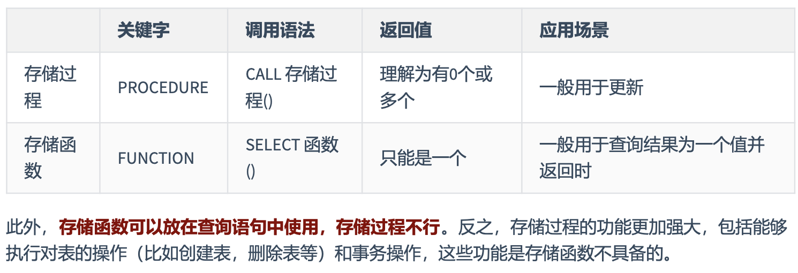

## 存储过程

```sql
-- 模板
CREATE PROCEDURE 存储过程名(IN|OUT|INOUT 参数名 参数类型,...) [characteristics ...]
BEGIN
存储过程体
END

-- characteristics为约束条件，可以为下
LANGUAGE SQL
| [NOT] DETERMINISTIC
| { CONTAINS SQL | NO SQL | READS SQL DATA | MODIFIES SQL DATA }
| SQL SECURITY { DEFINER | INVOKER }
| COMMENT 'string'

-- 创建
DELIMITER //
CREATE PROCEDURE CountProc(IN sid INT,OUT num INT)
BEGIN
    SELECT COUNT(*) INTO num FROM fruits
    WHERE s_id = sid;
END //
DELIMITER ;
-- 调用
CALL CountProc (101, @num);

CREATE PROCEDURE test_iterate()
BEGIN
    DECLARE num INT DEFAULT 0;
    declare sum int;
    set sum = 0;
    my_loop: LOOP
        SET num = num + 1;
        IF num < 10
        THEN
            ITERATE my_loop;
        ELSEIF num > 15
        THEN
            LEAVE my_loop;
        END IF;
        set sum = sum + num;
    END LOOP my_loop;
    select sum;
END;
drop procedure test_iterate;

-- 调用
SET @name=值; 
CALL sp1(@name); 
SELECT @name;
```

## 存储函数

```sql
-- 模板
CREATE FUNCTION 函数名(参数名 参数类型,...) RETURNS 返回值类型
[characteristics ...]
BEGIN
函数体 #函数体中肯定有 RETURN 语句 END

-- 调用
SELECT 函数名(实参列表)

-- 创建
DELIMITER //
CREATE FUNCTION email_by_id(emp_id INT)
RETURNS VARCHAR(25)
DETERMINISTIC
CONTAINS SQL
BEGIN
    RETURN (SELECT email FROM employees WHERE employee_id = emp_id);
END //
DELIMITER ;

-- 调用
SET @emp_id = 102;
SELECT email_by_id(@emp_id);

```



## 删改查

```sql
SHOW CREATE {PROCEDURE | FUNCTION} 存储过程名或函数名
SHOW {PROCEDURE | FUNCTION} STATUS [LIKE 'pattern']
SELECT * FROM information_schema.Routines WHERE ROUTINE_NAME='存储过程或函数的名' [AND ROUTINE_TYPE = {'PROCEDURE|FUNCTION'}];

ALTER {PROCEDURE | FUNCTION} 存储过程或函数的名 [characteristic ...]

DROP {PROCEDURE | FUNCTION} [IF EXISTS] 存储过程或函数的名
```

<aside>
💡 存储过程的优缺点
**优点：**
- 存储过程可以一次编译多次使用。
- 可以减少开发工作量。
- 存储过程的安全性强。
- 减少网络传输量
- 良好的封装性
**缺点**
- 可移植性差
- 调试困难
- 存储过程版本管理困难
- 不适合高并发

</aside>