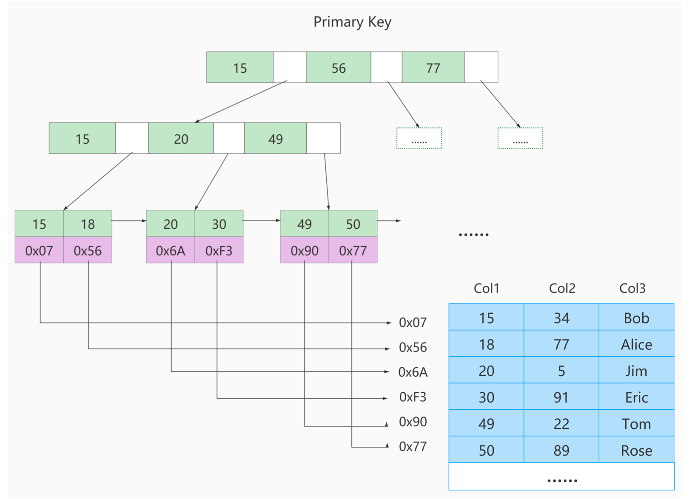

# SQL执行流程

# 存储引擎

| 对比项         | MyISAM                     | InnoDB                       |
| -------------- | -------------------------- | ---------------------------- |
| 外键           | 不支持                     | 支持                         |
| 事务           | 不支持                     | 支持                         |
| 行表锁         | 表锁，不适合高并发         | 行锁，适合高并发             |
| 缓存           | 只缓存索引                 | 缓存索引和真实数据           |
| 自带系统表使用 | Y                          | N                            |
| 关注点         | 节约资源、消耗少、也无简单 | 事务：并发写、事务、更大资源 |
| 默认安装       | Y                          | Y                            |
| 默认使用       | N                          | Y                             |

# 索引

## InnoDB 中的索引

- 根页面位置万年不动
- 内节点中目录项纪录的唯一性（不重复）
- 一个页面最少存储两条记录

> **常见的索引概念**
> 聚簇索引
> - 特点：使用记录主键值的大小进行记录和页的排序
> - B+树的叶子结点存储的是完整的数据记录 
> - 对于主键的排序查找和范围查找速度非常快

回表：在利用二级索引时，先查到主键，然后从主键索引中找到真实的数据

## MyISAM中的索引
使用`B+树`作为索引结构，叶子结点存放`数据地址`

## MyISAM与InnoDB索引对比
MyISAM的索引方式都是“非聚簇”的，与InnoDB包含1个聚簇索引是不同的。小结两种引擎中索引的区别:
1. 在InnoDB存储引擎中，我们只需要根据主键值对 聚簇索引 进行一次查找就能找到对应的记录，而在 MyISAM 中却需要进行一次`回表`操作，意味着MyISAM中建立的索引相当于全部都是 二级索引 。
2. InnoDB的数据文件本身就是索引文件，而MyISAM索引文件和数据文件是 分离的 ，索引文件仅保存数 据记录的地址。
3. InnoDB的非聚簇索引data域存储相应记录主键的值，而MyISAM索引记录的是地址。换句话说， InnoDB的所有非聚簇索引都引用主键作为data域。
4. MyISAM的回表操作是十分快速的，因为是拿着地址偏移量直接到文件中取数据的，反观InnoDB是通过获取主键之后再去聚簇索引里找记录，虽然说也不慢，但还是比不上直接用地址去访问。
5. InnoDB要求表 必须有主键 ( MyISAM可以没有 )。如果没有显式指定，则MySQL系统会自动选择一个可以非空且唯一标识数据记录的列作为主键。如果不存在这种列，则MySQL自动为InnoDB表生成一个隐含字段作为主键，这个字段长度为6个字节，类型为长整型。

## InnoDB 数据存储结构
存储单位（与内存交互的最小单位）：页
存储大小：默认`16KB`
记录按照`行`来记录，读取按照`页`来读取。

区：64个连续的页，1MB（区中页的位置是连续的，减少连续数据io时间）
段：数据库中分配的基本单位（）
表空间

### 页
页的结构

### 行格式
一个表没有手动定义主键时，会选取一个unique键作为主键，如果没有，则为表默认添加一个名为row_id的隐藏列作为主键。

# 性能分析工具

