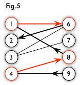
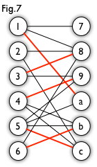
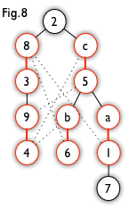

原链接：

https://www.renfei.org/blog/bipartite-matching.html

<!--more-->

## 基本概念

**二分图**：如果图中点可以被分为两组，并且使得所有边都跨越组的边界，则这就是一个二分图。准确地说：把一个图的顶点划分为两个不相交集 U 和V ，使得每一条边都分别连接U、V中的顶点。如果存在这样的划分，则此图为一个二分图。二分图的一个等价定义是：不含有「含奇数条边的环」的图。

**匹配：**一个「匹配」（matching）是一个边的集合，其中任意两条边都没有公共顶点。

**最大匹配：**一个图所有匹配中，所含匹配边数最多的匹配，称为这个图的最大匹配。

**完美匹配：**如果一个图的某个匹配中，所有的顶点都是匹配点，那么它就是一个完美匹配。显然，完美匹配一定是最大匹配（完美匹配的任何一个点都已经匹配，添加一条新的匹配边一定会与已有的匹配边冲突）。但并非每个图都存在完美匹配。

**交替路**：从一个未匹配点出发，依次经过非匹配边、匹配边、非匹配边…形成的路径叫交替路。

**增广路**：从一个未匹配点出发，走交替路，如果途径另一个未匹配点（出发的点不算），则这条交替路称为增广路（agumenting path）。例如，图 5 中的一条增广路如图 6 所示（图中的匹配点均用红色标出）：

增广路有一个重要特点：非匹配边比匹配边多一条。因此，研究增广路的意义是**改进匹配**。只要把增广路中的匹配边和非匹配边的身份交换即可。由于中间的匹配节点不存在其他相连的匹配边，所以这样做不会破坏匹配的性质。交换后，图中的匹配边数目比原来多了 1 条。

我们可以通过不停地找增广路来增加匹配中的匹配边和匹配点。找不到增广路时，达到最大匹配（这是增广路定理）。匈牙利算法正是这么做的。

**最大匹配数**：最大匹配的匹配边的数目

**最小点覆盖数**：选取最少的点，使任意一条边至少有一个端点被选择

**最大独立数**：选取最多的点，使任意所选两点均不相连

**最小路径覆盖数**：对于一个 DAG（有向无环图），选取最少条路径，使得每个顶点属于且仅属于一条路径。路径长可以为 0（即单个点）。

定理1：最大匹配数 = 最小点覆盖数（这是 Konig 定理）

定理2：最大匹配数 = 最大独立数

定理3：最小路径覆盖数 = 顶点数 - 最大匹配数

## 匈牙利树

**匈牙利树**一般由 BFS 构造（类似于 BFS 树）。从一个未匹配点出发运行 BFS（唯一的限制是，必须走交替路），直到不能再扩展为止。例如，由图 7，可以得到如图 8 的一棵 BFS 树：

    

这棵树存在一个叶子节点为非匹配点（7 号），但是匈牙利树要求所有叶子节点均为匹配点，因此这不是一棵匈牙利树。如果原图中根本不含 7 号节点，那么从 2 号节点出发就会得到一棵匈牙利树。这种情况如图 9 所示（顺便说一句，图 8 中根节点 2 到非匹配叶子节点 7 显然是一条增广路，沿这条增广路扩充后将得到一个完美匹配）

## 匈牙利算法

**匈牙利算法的要点如下**

1. 从左边第 1 个顶点开始，挑选未匹配点进行搜索，寻找增广路。
    1. 如果经过一个未匹配点，说明寻找成功。更新路径信息，匹配边数 +1，停止搜索。
    2. 如果一直没有找到增广路，则不再从这个点开始搜索。事实上，此时搜索后会形成一棵匈牙利树。我们可以永久性地把它从图中删去，而不影响结果。
2. 由于找到增广路之后需要沿着路径更新匹配，所以我们需要一个结构来记录路径上的点。DFS 版本通过函数调用隐式地使用一个栈，而 BFS 版本使用 `prev` 数组。

DFS实现：

1. 遍历左侧每一个节点
    1. 对于每一个节点
        1. 如果相连右侧节点未被使用，建立两个节点间的链接。
        2. 如果右侧已经被使用，则判断相连的左侧节点是否还有左侧连接，如果有，则让直接相连的节点换一个连接。该右侧节点连接到新的节点。
        3. 否则，左侧节点无法找到连接。
