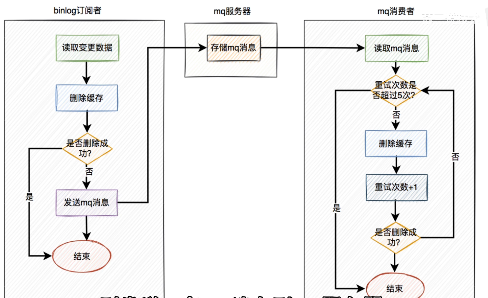

# 如何确保数据库和缓存的一致性

## 问题

如果缓存查询后，数据库数据立马进行了更新，就会导致缓存数据不准确

## 缓存更新的几种方案

- 先写缓存，再写数据库
    - 如果写完缓存，数据库无法更新。缓存数据为脏数据
- 先写数据库，再写缓存
    - 低并发有人在用
    - 写缓存如果失败。
        - 如果把写数据库和缓存放在同一个事务下，会导致大事务（会造成死锁）
        - 如果放在不同的事务下，就会导致数据库和缓存不一致
    - 高并发下
        - 如果a写缓存慢于b写缓存，就会导致缓存数据错误
        - 写完数据库立刻写缓存，会浪费系统资源
- 先删除缓存，再写数据库
    - 存在缓存为旧数据的问题
    
    
    
    - 如果删除缓存，写数据库，再删除缓存
    
    
    
- 先写数据库，再删除缓存
    - 下面这种情况会在满足条件时才会出现
        - 缓存刚好自动失效
        - 请求f从数据库查询旧值，更新缓存的耗时比请求e写数据库，删除缓存的时间长
    
    
    
    - 删除缓存失败怎么办
        - 增加重试机制。
            - 接口并发量高的时候，影响性能
                - 使用异步重试，每次都单独起一个线程
                - 重试交给线程池，服务器重启时，数据可能丢失
                - 将重试数据写表，使用elastic-job等定时任务重试
                - 重试请求写入mq等消息中间件中
                - 监听mysql的binlog，在数据更新后删除缓存（在binlog订阅这种，增加重试机制）
                
                
                
                