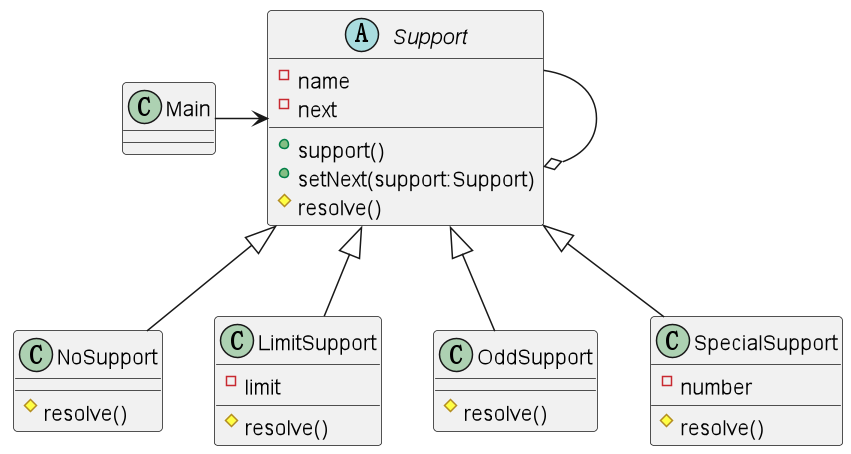

# 设计模式

# 设计原则

## 正交设计原则

1. 消除重复
2. 分离关注点
3. 缩小依赖范围
4. 向稳定的方向依赖

## 简单设计原则

1. 通过测试
2. 消除重复
3. 清晰表达（可读性）
4. 最小的代码元素

1>2=3>4

## SOLID原则

1. 单一职责
2. 开放封闭
3. 里氏替换
    1. 子类可以完全替代父类
    2. 子类尽量不要重写父类的方法，如果非要重写，就不要继承，使用依赖、聚合、组合等
4. 接口隔离
    1. 客户端不应该依赖他不需要的接口，即一个类对另一个类的依赖应建立在最小的接口上
    - UML
        
        ```java
        @startuml
        
        class A
        class B
        class C{
            op1()
            op2()
        }
        class D{
            op3()
            op4()
        }
        interface interface1{
            operation1()
            operation2()
            operation3()
            operation4()
            operation5()
        }
        
        interface1 <|-- C
        interface1 <|-- D
        A --> interface1
        B --> interface1
        
        @enduml
        ```
        
    - UML图（interface应根据依赖进行拆分）
        
        
        
5. 依赖倒置
    1. 高层模块不依赖低层，二者都依赖于抽象
    2. 抽象不依赖细节，细节应该依赖抽象
    3. 核心思想是面向接口编程
    - 依赖关系传递的三种方式
        - 接口传递（interface1中的方法调用interface2）
        - 构造方法传递（interface1使用interface2构造）
        - setter传递（interface1中字段使用interface2初始化）

补充

1. 迪米特法则
    1. 一个对象应该对其他对象保持最少的了解
    2. 陌生类（在参数，返回值，成员变量中没有出现的类）不要出现在局部变量中
    3. 只要求降低类之间的耦合，并不是要求完全没有依赖关系
2. 合成复用原则
    1. 尽量使用合成/聚合，而不是继承

# UML

## UML语言

1. 依赖
    1. A中用到了B类
2. 关联（一对多，多对多等）
    1. 双向关系或单向关系
3. 泛化
    1. 继承
    2. 依赖的特例
4. 实现
5. 聚合
    1. 聚合是关联关系的特例
    2. 整体和部分的关系，整体和部分可以分开
6. 组合
    1. 整体和部分的关系，整体和部分不可以分开
    2. new整体对象时，同时new部分对象

# 设计模式

## 分类

创建型模式：单例、抽象工厂、原型、建造者、工厂模式

结构型模式：适配器、桥接、装饰、组合、外观、享元、代理

行为型模式：模板方法、命令、访问者、迭代器、观察者、中介、备忘录、解释器、状态、策略、职责链

## 装饰者模式

功能：动态的将新功能附加到对象上

原理：就像打包一个快递，可以层层包装

案例：日志、时间计算、尝试

# 迭代器模式

## 概念

一种遍历集合的工具

## 角色

- Iterator迭代器
    - 定义按顺序遍历元素的接口。
- ConcreteIterator具体的迭代器
    - 实现Iterator角色所定义的接口
- Aggregate集合
    - 定义创建Iterator角色的接口
- ConcreteAggregate具体的集合
    - 负责实现Aggregate角色所定义的接口

## 类图

- code
    
    ```kotlin
    @startuml
    interface Aggregate{
    iterator()
    }
    
    interface Iterator{
    hasNext()
    next()
    }
    
    class BookShelf{
    books
    last
    getBookAt()
    getLength()
    iterator()
    }
    
    class BookShelfIterator{
    bookShelf
    index
    hasNext()
    next()
    }
    class Book{
    name
    getName()
    }
    
    BookShelf .up.> Aggregate
    Aggregate -right-> Iterator : create >
    BookShelfIterator -up-> Iterator
    BookShelfIterator o-left-> BookShelf
    BookShelf o-down-> Book
    @enduml
    ```
    


# 职责链模式（Chain of Responsibility）

## 概念

**概念**：将多个对象组成一条职责链，然后按照它们在职责链上的顺序一个一个地找出到底应该谁来负责处理

**作用**：弱化请求方和处理方之间地关联关系，让双方各自都成为可独立复用的组件。同时，程序还可以应对其他请求，如根据情况不同，负责处理的对象也会发生变化。

## 角色

- Handler处理者
    - 定义处理请求的接口，知道下一个处理者是谁，如果自己无法处理请求，会将请求转给下一个处理者，下一个处理者也是Handler角色（Support）
- ConcreteHandler具体的处理者
    - 具体的处理请求的角色（NoSupport、LimitSupport等）
- Client请求者
    - 向第一个ClientHandler发送请求的角色（Main）

## 类图

- code
    
    ```kotlin
    @startuml
    
    class Main
    abstract class Support{
    - name
    - next
    + support()
    + setNext(support:Support)
    # resolve()
    }
    class NoSupport{
    # resolve()
    }
    class LimitSupport{
    -limit
    # resolve()
    }
    class OddSupport{
    # resolve()
    }
    class SpecialSupport{
    - number
    # resolve()
    }
    Main -right-> Support
    Support --o Support
    
    Support <|-- NoSupport
    Support <|-- LimitSupport
    Support <|-- OddSupport
    Support <|-- SpecialSupport
    
    @enduml
    ```
    



## 价值

提高程序的可读性

# 模板方法

## 概念

模板方法——将具体的操作交给子类：在父类中定义处理流程的框架，在子类中实现具体处理的模式

## 角色

- AbstractClass抽象类
    - 实现模板方法（确定具体的处理流程），声明在模板方法中使用到的抽象方法
- ConcreteClass具体类
    - 实现抽象类角色中定义的抽象方法

## 类图

- code
    
    ```kotlin
    @startuml
    
    abstract class AbstractDisplay{
    + {abstract} open()
    + {abstract} print()
    + {abstract} close()
    + display()
    }
    class CharDisplay{
    + open()
    + print()
    + display()
    }
    class StringDisplay{
    + open()
    + print()
    + display()
    - printLine()
    }
    
    AbstractDisplay <|-- CharDisplay
    AbstractDisplay <|-- StringDisplay
    
    @enduml
    ```
    


## 价值

可以只修改抽象类中的模板方法来修改处理流程

[享元模式](设计模式/享元模式.md)

[迭代器模式（Iterator）](设计模式/迭代器模式（Iterator）.md)

# 访问者模式

## 价值

将数据结构与数据的处理分离

如，将文件的层级结构与对文件的处理分离。

# 仲裁者模式

## 价值

组员向仲裁者报告，仲裁者向组员下达指令

用于调整多个对象之间的关系时，使用Mediator模式

# 备忘录模式

## 价值

使用一个Momento对象保存对象之前的状态。

在对象中实现创建Momento和恢复Momento的方法。

# 状态模式

## 价值

不同状态下，接受相同的指令，执行不同的操作。