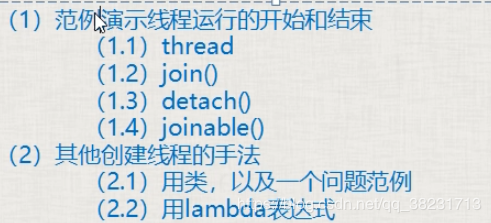
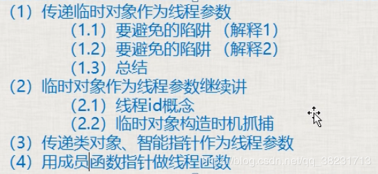

## 第二节 线程启动、结束，创建线程多法、join，detach
<!--more-->



### 一、范例演示线程运行的开始

- 程序运行起来，生成一个进程，该进程所属的主线程开始自动运行；当主线程从main（）函数返回，则整个进程执行完毕
- 主线程从main（）开始执行，那么我们自己创建的线程，也需要从一个函数开始运行（初始函数），一旦这个函数运行完毕，线程也结束运行
- 整个进程是否执行完毕的标志是：主线程是否执行完，如果主线程执行完毕了，就代表整个进程执行完毕了，此时如果其他子线程还没有执行完，也会被强行终止【此条有例外，以后会解释】

创建一个线程：

1. 包含头文件thread
2. 写初始函数
3. 在main中创建thread

必须要明白：有两个线程在跑，相当于整个程序中有两条线在同时走，即使一条被阻塞，另一条也能运行

```cpp
#include <iostream>
#include <thread>
using namespace std;

void myPrint()
{
	cout << "我的线程开始运行" << endl;
	//-------------
	//-------------
	cout << "我的线程运行完毕" << endl;
	return;
}

int main()
{
	//(1)创建了线程，线程执行起点（入口）是myPrint；(2)执行线程
	thread myThread(myPrint);

	//(2)阻塞主线程并等待myPrint执行完，当myPrint执行完毕，join()就执行完毕，主线程继续往下执行
	myThread.join();

	//设置断点可看到主线程等待子线程的过程
	//F11逐语句，就是每次执行一行语句，如果碰到函数调用，它就会进入到函数里面
	//F10逐过程，碰到函数时，不进入函数，把函数调用当成一条语句执行

	//(3)传统多线程程序中，主线程要等待子线程执行完毕，然后自己才能向下执行
	//detach:分离，主线程不再与子线程汇合，不再等待子线程
	//detach后，子线程和主线程失去关联，驻留在后台，由C++运行时库接管
	//myThread.detach();

	//(4)joinable()判断是否可以成功使用join()或者detach()
	//如果返回true，证明可以调用join()或者detach()
	//如果返回false，证明调用过join()或者detach()，join()和detach()都不能再调用了
	if (myThread.joinable())
	{
		cout << "可以调用可以调用join()或者detach()" << endl;
	}
	else
	{
		cout << "不能调用可以调用join()或者detach()" << endl;
	}
	
	cout << "Hello World!" << endl;
	return 0;
}

```

## 重要补充：

**线程类参数是一个可调用对象。**
一组可执行的语句称为可调用对象，c++中的可调用对象可以是**函数、函数指针、lambda表达式、bind创建的对象或者重载了函数调用运算符的类对象。**

### 二、其他创建线程的方法

①创建一个类，并编写圆括号重载函数，初始化一个该类的对象，把该对象作为线程入口地址

```cpp
class Ta
{
public:
	void operator()() 
	{
		cout << "我的线程开始运行" << endl;
		//-------------
		//-------------
		cout << "我的线程运行完毕" << endl;
	}
};

//main函数里的：
	Ta ta;
	thread myThread(ta); //对象被复制到线程中去。主线程结束子线程也不会出现问题。
	//GCC的实现是拷贝了两次.
  //看了6.3.0源码,thread里拷贝了两次.
  //第一次构造bind,这里msvc和gcc都是需要一次拷贝,
  //区别是msvc直接make_unique tuple去invoke,
  //gcc是先构造一个bind,再把bind移动到unique_ptr里.
	//如果创建了移动构造函数，则只调用一次拷贝
	myThread.join();
12345678910111213141516
```

②lambda表达式创建线程

```cpp
//main函数中
auto lambdaThread = [] {
		cout << "我的线程开始执行了" << endl;
		//-------------
		//-------------
		cout << "我的线程开始执行了" << endl;
	};

	thread myThread(lambdaThread);
	myThread.join();
12345678910
```

③把某个类中的某个函数作为线程的入口地址

```cpp
class Data_
{
public:
    void GetMsg(){}
    void SaveMsh(){}
};
//main函数里
    Data_ s;
    //第一个&意思是取址，第二个&意思是引用，相当于std::ref(s)
    //thread oneobj(&Data_::SaveMsh,s)传值也是可以的
    //在其他的构造函数中&obj是不会代表引用的，会被当成取地址
    thread oneobj(&Data_::SaveMsh,&s);
    thread twoobj(&Data_::GetMsg,&s);
    oneobj.join();
    twoobj.join();
```


## 第三节 线程传参详解，detach()大坑，成员函数做线程函数



**一、传递临时对象作为线程参数**
*1.1要避免的陷阱1：*

```cpp
#include <iostream>
#include <thread>
using namespace std;

void myPrint(const int &i, char* pmybuf)
{
	//如果线程从主线程detach了
	//i不是mvar真正的引用，实际上值传递，即使主线程运行完毕了，子线程用i仍然是安全的，但仍不推荐传递引用
	//推荐改为const int i
	cout << i << endl;
	//pmybuf还是指向原来的字符串，所以这么写是不安全的
	cout << pmybuf << endl;
}

int main()
{
	int mvar = 1;
	int& mvary = mvar;
	char mybuf[] = "this is a test";
	thread myThread(myPrint, mvar, mybuf);//第一个参数是函数名，后两个参数是函数的参数
	myThread.join();
	//myThread.detach();
	
	cout << "Hello World!" << endl;
}
12345678910111213141516171819202122232425
```

*1.2要避免的陷阱2：*

```cpp
#include <iostream>
#include <thread>
#include <string>
using namespace std;

void myPrint(const int i, const string& pmybuf)
{
	cout << i << endl;
	cout << pmybuf << endl;
}

int main()
{
	int mvar = 1;
	int& mvary = mvar;
	char mybuf[] = "this is a test";
	//如果detach了，这样仍然是不安全的
	//因为存在主线程运行完了，mybuf被回收了，系统采用mybuf隐式类型转换成string
	//推荐先创建一个临时对象thread myThread(myPrint, mvar, string(mybuf));就绝对安全了。。。。
	thread myThread(myPrint, mvar, mybuf);
	myThread.join();
	//myThread.detach();

	cout << "Hello World!" << endl;
}
12345678910111213141516171819202122232425
```

*1.3总结*

- 如果传递int这种简单类型，**推荐使用值传递，不要用引用和指针**
- 如果传递类对象，**避免使用隐式类型转换**，全部都是创建线程这一行就创建出临时对象，然后在函数参数里，用引用来接，否则还会创建出一个对象
- 终极结论：建议不使用detach

**二、临时对象作为线程参数继续讲**
*2.1线程id概念*

- id是个数字，每个线程（不管是主线程还是子线程）实际上都对应着一个数字，而且每个线程对应的这个数字都不一样
- 线程id可以用C++标准库里的函数来获取。std::this_thread::get_id()来获取

**三、传递类对象、智能指针作为线程参数**
*3.1*

```cpp
#include <iostream>
#include <thread>
using namespace std;

class A {
public:
	mutable int m_i; //m_i即使实在const中也可以被修改
	A(int i) :m_i(i) {} //类型转换构造函数
};

void myPrint(const A& pmybuf)
{
	pmybuf.m_i = 199;
	cout << "子线程myPrint的参数地址是" << &pmybuf << "thread = " << std::this_thread::get_id() << endl;
}

int main()
{
	A myObj(10);
	//myPrint(const A& pmybuf)中引用不能去掉，如果去掉会多创建一个对象
	//const也不能去掉，去掉会出错(因为thread要求传入一个右值)
	//即使是传递的const引用，但在子线程中还是会调用拷贝构造函数构造一个新的对象，
	//所以在子线程中修改m_i的值不会影响到主线程
	//如果希望子线程中修改m_i的值影响到主线程，可以用thread myThread(myPrint, std::ref(myObj));
	//这样const就是真的引用了，myPrint定义中的const就可以去掉了，类A定义中的mutable也可以去掉了
	thread myThread(myPrint, myObj);
	myThread.join();
	//myThread.detach();

	cout << "Hello World!" << endl;
}
12345678910111213141516171819202122232425262728293031
```

*3.2*

```cpp
#include <iostream>
#include <thread>
#include <memory>
using namespace std;

void myPrint(unique_ptr<int> ptn)
{
	cout << "thread = " << std::this_thread::get_id() << endl;
}

int main()
{
	unique_ptr<int> up(new int(10));
	//独占式指针只能通过std::move()才可以传递给另一个指针
	//传递后up就指向空，新的ptn指向原来的内存
	//所以这时就不能用detach了，因为如果主线程先执行完，ptn指向的对象就被释放了
	thread myThread(myPrint, std::move(up));
	myThread.join();
	//myThread.detach();

	return 0;
}

12345678910111213141516171819202122
```
