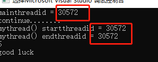
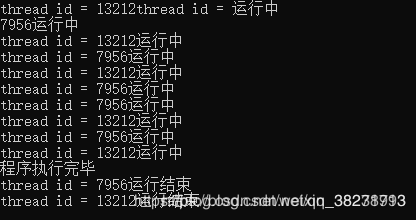

## 第九节、async、future、packaged_task、promise
<!--more-->


**本节内容需要包含头文件#include** 

**一、std::async、std::future创建后台任务并返回值**
**std::async**是一个函数模板，用来启动一个异步任务，启动起来一个异步任务之后，它返回一个**std::future**对象，这个对象是个类模板。

什么叫“启动一个异步任务”？就是自动创建一个线程，并开始 执行对应的线程入口函数，它返回一个std::future对象，这个std::future对象中就含有线程入口函数所返回的结果，我们可以通过调用future对象的成员函数get()来获取结果。

std::future提供了一种访问异步操作结果的机制，就是说这个结果你可能没办法马上拿到，但是在不久的将来，这个线程执行完毕的时候，你就能够拿到结果了，所以，大家这么理解：future中保存着一个值，这个值是在将来的某个时刻能够拿到。

std::future对象的**get()成员函数**会等待线程执行结束并返回结果，拿不到结果它就会一直等待，感觉有点像join()但是，它是可以获取结果的。

std::future对象的**wait()成员函数**，用于等待线程返回，本身并不返回结果，这个效果和 std::thread 的join()更像。

```cpp
#include <iostream>
#include <future>
using namespace std;
class A {
public:
	int mythread(int mypar) {
		cout << mypar << endl;
		return mypar;
	}
};
 
 
int mythread() {
	cout << "mythread() start" << "threadid = " << std::this_thread::get_id() << endl;
	std::chrono::milliseconds dura(5000);
	std::this_thread::sleep_for(dura);
	cout << "mythread() end" << "threadid = " << std::this_thread::get_id() << endl;
	return 5;
}
 
 
int main() {
	A a;
	int tmp = 12;
	cout << "main" << "threadid = " << std::this_thread::get_id() << endl;
	std::future<int> result1 = std::async(mythread);
	cout << "continue........" << endl;
	cout << result1.get() << endl; //卡在这里等待mythread()执行完毕，拿到结果
	
	//类成员函数
	std::future<int> result2 = std::async(&A::mythread, &a, tmp); //第二个参数是对象引用才能保证线程里执行的是同一个对象
	cout << result2.get() << endl;
   //或者result2.wait();
	cout << "good luck" << endl;
	return 0;
}
123456789101112131415161718192021222324252627282930313233343536
```

我们通过向std::async()传递一个参数，该参数是std::launch类型（枚举类型），来达到一些特殊的目的：

*1、std::launch::deferred：*
（defer推迟，延期）表示线程入口函数的调用会被延迟，一直到std::future的wait()或者get()函数被调用时（由主线程调用）才会执行；如果wait()或者get()没有被调用，则不会执行。
实际上根本就没有创建新线程。std::lunch::deferred意思时延迟调用，并没有创建新线程，是在主线程中调用的线程入口函数。

```cpp
#include <iostream>
#include <future>
using namespace std;
 
int mythread() {
	cout << "mythread() start" << "threadid = " << std::this_thread::get_id() << endl;
	std::chrono::milliseconds dura(5000);
	std::this_thread::sleep_for(dura);
	cout << "mythread() end" << "threadid = " << std::this_thread::get_id() << endl;
	return 5;
}
 
 
int main() {
	cout << "main" << "threadid = " << std::this_thread::get_id() << endl;
	std::future<int> result1 = std::async(std::launch::deferred ,mythread);
	cout << "continue........" << endl;
	cout << result1.get() << endl; //卡在这里等待mythread()执行完毕，拿到结果
	cout << "good luck" << endl;
	return 0;
}
123456789101112131415161718192021
```



永远都会先打印出continue…，然后才会打印出mythread() start和mythread() end等信息。

*2、std::launch::async，在调用async函数的时候就开始创建新线程。*

```cpp
int main() {
	cout << "main" << "threadid = " << std::this_thread::get_id() << endl;
	std::future<int> result1 = std::async(std::launch::async ,mythread);
	cout << "continue........" << endl;
	cout << result1.get() << endl; 
	cout << "good luck" << endl;
	return 0;
}
12345678
```

**二、std::packaged_task：打包任务，把任务包装起来。**
类模板，它的模板参数是各种可调用对象，通过packaged_task把各种可调用对象包装起来，方便将来作为线程入口函数来调用。

```cpp
#include <thread>
#include <iostream>
#include <future>
using namespace std;
 
int mythread(int mypar) {
	cout << mypar << endl;
	cout << "mythread() start" << "threadid = " << std::this_thread::get_id() << endl;
	std::chrono::milliseconds dura(5000);
	std::this_thread::sleep_for(dura);
	cout << "mythread() end" << "threadid = " << std::this_thread::get_id() << endl;
	return 5;
}
 
int main() {
	cout << "main" << "threadid = " << std::this_thread::get_id() << endl;
	//我们把函数mythread通过packaged_task包装起来
   //参数是一个int，返回值类型是int
   std::packaged_task<int(int)> mypt(mythread);
	std::thread t1(std::ref(mypt), 1);
	t1.join();
	std::future<int> result = mypt.get_future(); 
	//std::future对象里包含有线程入口函数的返回结果，这里result保存mythread返回的结果。
	cout << result.get() << endl;
   
	return 0;
}
123456789101112131415161718192021222324252627
```

*可调用对象可由函数换成lambda表达式*

```cpp
int main() {
	cout << "main" << "threadid = " << std::this_thread::get_id() << endl;
	std::packaged_task<int(int)> mypt([](int mypar) {
		cout << mypar << endl;
		cout << "mythread() start" << "threadid = " << std::this_thread::get_id() << endl;
		std::chrono::milliseconds dura(5000);
		std::this_thread::sleep_for(dura);
		cout << "mythread() end" << "threadid = " << std::this_thread::get_id() << endl;
		return 5;
	}); 
	
	std::thread t1(std::ref(mypt), 1);
	t1.join();
	std::future<int> result = mypt.get_future(); 
	//std::future对象里包含有线程入口函数的返回结果，这里result保存mythread返回的结果。
	
	cout << result.get() << endl;
 
	cout << "good luck" << endl;
	return 0;
}
123456789101112131415161718192021
```

packaged_task包装起来的可调用对象还可以直接调用，从这个角度来讲，packaged_task对象也是一个可调用对象
*lambda的直接调用*

```cpp
int main() {
	cout << "main" << "threadid = " << std::this_thread::get_id() << endl;
	std::packaged_task<int(int)> mypt([](int mypar) {
		cout << mypar << endl;
		cout << "mythread() start" << "threadid = " << std::this_thread::get_id() << endl;
		std::chrono::milliseconds dura(5000);
		std::this_thread::sleep_for(dura);
		cout << "mythread() end" << "threadid = " << std::this_thread::get_id() << endl;
		return 5;
	}); 
 
	mypt(1);
	std::future<int> result = mypt.get_future();
	cout << result.get() << endl;
}
123456789101112131415
```

*std::promise，类模板*
我们能够在某个线程中给它赋值，然后我们可以在其他线程中，把这个值取出来

```cpp
#include <thread>
#include <iostream>
#include <future>
using namespace std;
 
void mythread(std::promise<int> &tmp, int clac) {
	cout << "mythread() start" << "threadid = " << std::this_thread::get_id() << endl;
	std::chrono::milliseconds dura(5000);
	std::this_thread::sleep_for(dura);
	cout << "mythread() end" << "threadid = " << std::this_thread::get_id() << endl;
	int result = clac;
	tmp.set_value(result); //结果保存到了tmp这个对象中
	return;
}
 
vector<std::packaged_task<int(int)>> task_vec;
 
int main() {
	std::promise<int> myprom;
	std::thread t1(mythread, std::ref(myprom), 180);
	t1.join(); 
	std::future<int> fu1 = myprom.get_future(); //promise和future绑定，用于获取线程返回值
	auto result = fu1.get();
	cout << "result = " << result << endl;
}
12345678910111213141516171819202122232425
```

总结：通过promise保存一个值，在将来某个时刻我们通过吧一个future绑定到这个promise上，来得到绑定的值

注意：使用thread时，必须 join() 或者 detach() 否则程序会报异常

**小结：**

我们学习这些东西的目的并不是，要把他们都用到实际开发中。

相反，如果我们能够用最少的东西写出一个稳定的，高效的多线程程序，更值得赞赏。

我们为了成长必须阅读一些高手写的代码，从而实现自己代码的积累；


## 第十节 future其他成员函数、shared_future、atomic


**一、std::future 的成员函数**
1、**std::future_status status** = result.**wait_for**(std::chrono::seconds(几秒));
卡住当前流程，等待std::async()的异步任务运行一段时间，然后返回其状态std::future_status。如果std::async()的参数是std::launch::deferred（延迟执行），则不会卡住主流程。
std::future_status是枚举类型，表示异步任务的执行状态。类型的取值有
**std::future_status::timeout
std::future_status::ready
std::future_status::deferred**

```cpp
#include <iostream>
#include <future>
using namespace std;
 
int mythread() {
	cout << "mythread() start" << "threadid = " << std::this_thread::get_id() << endl;
	std::chrono::milliseconds dura(5000);
	std::this_thread::sleep_for(dura);
	cout << "mythread() end" << "threadid = " << std::this_thread::get_id() << endl;
	return 5;
}

int main() {
	cout << "main" << "threadid = " << std::this_thread::get_id() << endl;
	std::future<int> result = std::async(mythread);
	cout << "continue........" << endl;
	//cout << result1.get() << endl; //卡在这里等待mythread()执行完毕，拿到结果
	//等待1秒
   std::future_status status = result.wait_for(std::chrono::seconds(1));
	if (status == std::future_status::timeout) {
		//超时：表示线程还没有执行完
		cout << "超时了，线程还没有执行完" << endl;
	}
	//类成员函数
	return 0;
}
1234567891011121314151617181920212223242526
```


```cpp
#include <iostream>
#include <future>
using namespace std;
 
int mythread() {
	cout << "mythread() start" << "threadid = " << std::this_thread::get_id() << endl;
	//std::chrono::milliseconds dura(5000);
	//std::this_thread::sleep_for(dura);
	cout << "mythread() end" << "threadid = " << std::this_thread::get_id() << endl;
	return 5;
}
 
int main() {
	cout << "main" << "threadid = " << std::this_thread::get_id() << endl;
	std::future<int> result = std::async(std::launch::deferred, mythread);
	//std::future<int> result = std::async(mythread);
	cout << "continue........" << endl;
	//cout << result1.get() << endl; //卡在这里等待mythread()执行完毕，拿到结果
	std::future_status status = result.wait_for(std::chrono::seconds(6));
	if (status == std::future_status::timeout) {
		//超时：表示线程还没有执行完
		cout << "超时了，线程还没有执行完" << endl;
	}
	else if (status == std::future_status::ready) {
		//表示线程成功放回
		cout << "线程执行成功，返回" << endl;
		cout << result.get() << endl;
	}
	else if (status == std::future_status::deferred) {
		//如果设置 std::future<int> result = std::async(std::launch::deferred, mythread);，则本条件成立
		cout << "线程延迟执行" << endl;
		cout << result.get() << endl;
	}
 
	cout << "good luck" << endl;
	return 0;
}
12345678910111213141516171819202122232425262728293031323334353637
```

get()只能使用一次，比如如果

```cpp
auto a = result.get();
cout << result.get() << endl;
12
```

就会报告异常
因为get()函数的设计是一个移动语义，相当于将result中的值移动到了a中，再次get就报告了异常。

**二、std::shared_future：也是个类模板**
std::future的 get() 成员函数是转移数据

std::shared_future 的 get()成员函数是复制数据

```cpp
#include <thread>
#include <iostream>
#include <future>
using namespace std;
 
int mythread() {
	cout << "mythread() start" << "threadid = " << std::this_thread::get_id() << endl;
	std::chrono::milliseconds dura(5000);
	std::this_thread::sleep_for(dura);
	cout << "mythread() end" << "threadid = " << std::this_thread::get_id() << endl;
	return 5;
}

int main() {
	cout << "main" << "threadid = " << std::this_thread::get_id() << endl;
	std::packaged_task<int()> mypt(mythread);
	std::thread t1(std::ref(mypt));
	std::future<int> result = mypt.get_future();
	
	bool ifcanget = result.valid(); //判断future 中的值是不是一个有效值
	std::shared_future<int> result_s(result.share()); //执行完毕后result_s里有值，而result里空了
	//std::shared_future<int> result_s(std::move(result));
   //通过get_future返回值直接构造一个shared_future对象
   //std::shared_future<int> result_s(mypt.get_future());
   t1.join();
	
	auto myresult1 = result_s.get();
	auto myresult2 = result_s.get();
 
	cout << "good luck" << endl;
	return 0;
}
1234567891011121314151617181920212223242526272829303132
```

**三、std::atomic原子操作**

*3.1 原子操作概念引出范例：*
互斥量：多线程编程中 用于保护共享数据：先锁住， 操作共享数据， 解锁。

有两个线程，对一个变量进行操作，一个线程读这个变量的值，一个线程往这个变量中写值。

即使是一个简单变量的读取和写入操作，如果不加锁，也有可能会导致读写值混乱（一条C语句会被拆成3、4条汇编语句来执行，所以仍然有可能混乱）

```cpp
#include <iostream>
#include <thread>
using namespace std;
int g_count = 0;
 
void mythread1() {
	for (int i = 0; i < 1000000; i++) {
		g_count++;
	}
}
 
int main() {
	std::thread t1(mythread1);
	std::thread t2(mythread1);
	t1.join();
	t2.join();
	cout << "正常情况下结果应该是200 0000次，实际是" << g_count << endl;
}
123456789101112131415161718
```


使用mutex解决这个问题

```cpp
#include <iostream>
#include <thread>
#include <mutex>
using namespace std;
int g_count = 0;
std::mutex mymutex;

void mythread1() {
	for (int i = 0; i < 1000000; i++) {
		std::unique_lock<std::mutex> u1(mymutex);
		g_count++;
	}
}
 
 
int main() {
	std::thread t1(mythread1);
	std::thread t2(mythread1);
	t1.join();
	t2.join();
	cout << "正常情况下结果应该是200 0000次，实际是" << g_count << endl;
}
12345678910111213141516171819202122
```


*3.2 基本的std::atomic用法范例*
大家可以把原子操作理解成一种：不需要用到互斥量加锁（无锁）技术的多线程并发编程方式。

原子操作：在多线程中不会被打断的程序执行片段。

从效率上来说，原子操作要比互斥量的方式效率要高。

互斥量的加锁一般是针对一个代码段，而原子操作针对的一般都是一个变量。

原子操作，一般都是指“不可分割的操作”；也就是说这种操作状态要么是完成的，要么是没完成的，不可能出现半完成状态。

std::atomic来代表原子操作，是个类模板。其实std::atomic是用来封装某个类型的值的

需要添加#include 头文件

范例：

```cpp
#include <iostream>
#include <thread>
#include <atomic>
using namespace std;
std::atomic<int> g_count = 0; //封装了一个类型为int的 对象（值）

void mythread1() {
	for (int i = 0; i < 1000000; i++) {
		g_count++;
	}
}
 
int main() {
	std::thread t1(mythread1);
	std::thread t2(mythread1);
	t1.join();
	t2.join();
	cout << "正常情况下结果应该是200 0000次，实际是" << g_count << endl;
}
12345678910111213141516171819
```


```cpp
#include <iostream>
#include <thread>
#include <atomic>
using namespace std;
std::atomic<bool> g_ifEnd = false; //封装了一个类型为bool的 对象（值）
 
void mythread() {
	std::chrono::milliseconds dura(1000);
	while (g_ifEnd == false) {
		cout << "thread id = " << std::this_thread::get_id() << "运行中" << endl;
		std::this_thread::sleep_for(dura);
	}
	cout << "thread id = " << std::this_thread::get_id() << "运行结束" << endl;
}
 
int main() {
	std::thread t1(mythread);
	std::thread t2(mythread);
	std::chrono::milliseconds dura(5000);
	std::this_thread::sleep_for(dura);
	g_ifEnd = true;
	cout << "程序执行完毕" << endl;
	t1.join();
	t2.join();
}
12345678910111213141516171819202122232425
```



**总结：**
1、原子操作一般用于计数或者统计（如累计发送多少个数据包，累计接收到了多少个数据包），多个线程一起统计，这种情况如果不使用原子操作会导致统计发生混乱。

2、写商业代码时，如果不确定结果的影响，最好自己先写一小段代码调试。或者不要使用。


## 第十一节 std::atomic续谈、std::async深入谈


**一、std::atomic续谈**

```cpp
#include <iostream>
#include <thread>
#include <atomic>
using namespace std;
std::atomic<int> g_count = 0; //封装了一个类型为int的 对象（值）
 
void mythread1() {
	for (int i = 0; i < 1000000; i++) {
		 //虽然g_count使用了原子操作模板，但是这种写法既读又写，
		 //会导致计数错误
             g_count = g_count + 1;
	}
}

int main() {
	std::thread t1(mythread1);
	std::thread t2(mythread1);
	t1.join();
	t2.join();
	cout << "正常情况下结果应该是200 0000次，实际是" << g_count << endl;
}
123456789101112131415161718192021
```


一般atomic原子操作，针对++，–，+=，-=，&=，|=，^=是支持的，其他操作不一定支持。

**二、std::async深入理解**
*2.1 std::async参数详述，async 用来创建一个异步任务*

延迟调用参数 std::launch::deferred【延迟调用】，std::launch::async【强制创建一个线程】

std::async()我们一般不叫创建线程（他能够创建线程），我们一般叫它创建一个异步任务。

std::async和std::thread最明显的不同，就是 async 有时候并不创建新线程。

①如果用std::launch::deferred 来调用async？

延迟到调用 get() 或者 wait() 时执行，如果不调用就不会执行

②如果用std::launch::async来调用async？

强制这个异步任务在新线程上执行，这意味着，系统必须要创建出新线程来运行入口函数。

③如果同时用 std::launch::async | std::launch::deferred

这里这个或者关系意味着async的行为可能是 std::launch::async 创建新线程立即执行， 也可能是 std::launch::deferred 没有创建新线程并且延迟到调用get()执行，由**系统根据实际情况来决定采取**哪种方案

④不带额外参数 std::async(mythread)，只给async 一个入口函数名，此时的系统给的默认值是 std::launch::async | std::launch::deferred 和 ③ 一样，有系统自行决定异步还是同步运行。

*2.2 std::async和std::thread()区别：*

std::thread()如果系统资源紧张可能出现创建线程失败的情况，如果创建线程失败那么程序就可能崩溃，而且不容易拿到函数返回值（不是拿不到）
std::async()创建异步任务。可能创建线程也可能不创建线程，并且容易拿到线程入口函数的返回值；

*由于系统资源限制：*
①如果用std::thread创建的线程太多，则可能创建失败，系统报告异常，崩溃。

②如果用std::async，一般就不会报异常，因为如果系统资源紧张，无法创建新线程的时候，async不加额外参数的调用方式就不会创建新线程。而是在后续调用get()请求结果时执行在这个调用get()的线程上。

如果你强制async一定要创建新线程就要使用 std::launch::async 标记。承受的代价是，系统资源紧张时可能崩溃。

③根据经验，一个程序中线程数量 不宜超过100~200 。

*2.3 async不确定性问题的解决*
不加额外参数的async调用时让系统自行决定，是否创建新线程。

std::future result = std::async(mythread);
问题焦点在于这个写法，任务到底有没有被推迟执行。

通过wait_for返回状态来判断：

```cpp
std::future_status status = result.wait_for(std::chrono::seconds(6));
//std::future_status status = result.wait_for(6s);
	if (status == std::future_status::timeout) {
		//超时：表示线程还没有执行完
		cout << "超时了，线程还没有执行完" << endl;
	}
	else if (status == std::future_status::ready) {
		//表示线程成功放回
		cout << "线程执行成功，返回" << endl;
		cout << result.get() << endl;
	}
	else if (status == std::future_status::deferred) {
		cout << "线程延迟执行" << endl;
		cout << result.get() << endl;
	}
```


