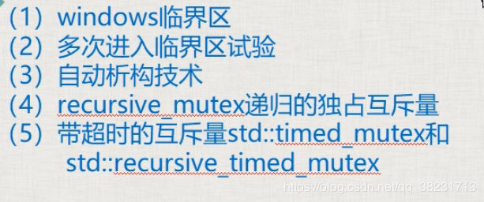
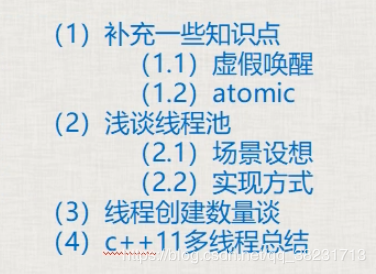

## 第十二节 windows临界区、其他各种mutex互斥量
<!--more-->



**一和二、windows临界区**
Windows临界区，同一个线程是可以重复进入的，但是进入的次数与离开的次数必须相等。
C++互斥量则不允许同一个线程重复加锁。

windows临界区是在windows编程中的内容，了解一下即可，效果几乎可以等同于c++11的mutex
包含#include <windows.h>
windows中的临界区同mutex一样，可以保护一个代码段。但windows的临界区可以进入多次，离开多次，但是进入的次数与离开的次数必须相等，不会引起程序报异常出错。

```cpp
#include <iostream>
#include <thread>
#include <list>
#include <mutex>
#include <Windows.h>

#define __WINDOWSJQ_

using namespace std;

class A
{
public:
	// 把收到的消息传入队列
	void inMsgRecvQueue()
	{
		for (size_t i = 0; i < 1000; ++i)
		{
			cout << "收到消息，并放入队列 " << i << endl;

#ifdef  __WINDOWSJQ_
			EnterCriticalSection(&my_winsec);	//	进入临界区
			//EnterCriticalSection(&my_winsec);	//	可以再次进入临界区,程序不会出错
			msgRecvQueue.push_back(i);
			LeaveCriticalSection(&my_winsec);	//	离开临界区
			//LeaveCriticalSection(&my_winsec);	//	如果进入两次，必须离开两次不会报错
#elif
			my_mutex.lock();
			msgRecvQueue.push_back(i);
			my_mutex.unlock();
#endif //  __WINDOWSJQ_
		}

		cout << "消息入队结束" << endl;
	}

	// 从队列中取出消息
	void outMsgRecvQueue()
	{
		for (size_t i = 0; i < 1000; ++i)
		{
#ifdef  __WINDOWSJQ_
			EnterCriticalSection(&my_winsec);	//	进入临界区
			if (!msgRecvQueue.empty())
			{
				// 队列不为空
				int num = msgRecvQueue.front();
				cout << "从消息队列中取出 " << num << endl;
				msgRecvQueue.pop_front();
			}
			else
			{
				// 消息队列为空
				cout << "消息队列为空 " << endl;
			}
			LeaveCriticalSection(&my_winsec);	//	离开临界区
#elif
			my_mutex.lock();
			if (!msgRecvQueue.empty())
			{
				// 队列不为空
				int num = msgRecvQueue.front();
				cout << "从消息队列中取出 " << num << endl;
				msgRecvQueue.pop_front();
				my_mutex.unlock();
			}
			else
			{
				// 消息队列为空
				cout << "消息队列为空 " << endl;
				my_mutex.unlock();
			}
#endif //  __WINDOWSJQ_
		}

		cout << "消息出队结束" << endl;
	}

	A()
	{
#ifdef __WINDOWSJQ_
		InitializeCriticalSection(&my_winsec);	//	用临界区之前要初始化
#endif // __WINDOWSJQ_

	}

private:
	list<int> msgRecvQueue;
	mutex my_mutex;

#ifdef __WINDOWSJQ_
	CRITICAL_SECTION my_winsec;	//	windows中的临界区，非常类似C++11中的mutex
#endif // __WINDOWSJQ_

};

int main()
{
	A myobj;
	thread	myInMsgObj(&A::inMsgRecvQueue, &myobj);
	thread	myOutMsgObj(&A::outMsgRecvQueue, &myobj);
	myInMsgObj.join();
	myOutMsgObj.join();

	getchar();
	return 0;
}
123456789101112131415161718192021222324252627282930313233343536373839404142434445464748495051525354555657585960616263646566676869707172737475767778798081828384858687888990919293949596979899100101102103104105106107
```

**三、自动析构技术**
C++：lock_guard防止忘了释放信号量，自动释放
windows：可以写个类自动释放临界区：

```cpp
class CWinLock {
public:
    CWinLock(CRITICAL_SECTION *pCritmp)
    {
        my_winsec =pCritmp;
        EnterCriticalSection(my_winsec);
    }
    ~CWinLock()
    {
        LeaveCriticalSection(my_winsec)
    };
private:
    CRITICAL_SECTION *my_winsec;
};
1234567891011121314
```

上述这种类RAII类（Resource Acquisition is initialization），即资源获取及初始化。容器，智能指针属于这种类。

**四、递归独占互斥量 std::recursive_mutex**
std::mutex 独占式互斥量

std::recursive_mutex：允许在同一个线程中同一个互斥量多次被 lock() ，（但是递归加锁的次数是有限制的，太多可能会报异常），效率要比mutex低。

如果你真的用了 recursive_mutex 要考虑代码是否有优化空间，如果能调用一次 lock()就不要调用多次。

**五、带超时的互斥量 std::timed_mutex 和 std::recursive_timed_mutex**

*5.1 std::timed_mutex：是待超时的独占互斥量*

- try_lock_for()：

等待一段时间，如果拿到了锁，或者超时了未拿到锁，就继续执行（有选择执行）如下：

```cpp
std::chrono::milliseconds timeout(100);
if (my_mymutex.try_lock_for(timeout)){
    //......拿到锁返回ture
}
else{
    std::chrono::milliseconds sleeptime(100);
    std::this_thread::sleep_for(sleeptime);
}
12345678
```

- try_lock_until()：

参数是一个未来的时间点，在这个未来的时间没到的时间内，如果拿到了锁头，流程就走下来，如果时间到了没拿到锁，流程也可以走下来。

```cpp
std::chrono::milliseconds timeout(100);
if (my_mymutex.try_lock_until(chrono::steady_clock::now() + timeout)){
    //......拿到锁返回ture
}
else{
    std::chrono::milliseconds sleeptime(100);
    std::this_thread::sleep_for(sleeptime);
}

12345678
```

两者的区别就是一个参数是时间段，一个参数是时间点

*5.2 std::recursive_timed_mutex：是待超时的递归独占互斥量*


## 第十三章 补充知识、线程池浅谈、数量谈、总结



**一、补充一些知识点**
*1.1 虚假唤醒：*
notify_one或者notify_all唤醒wait()后，实际有些线程可能不满足唤醒的条件，就会造成虚假唤醒，可以在wait中再次进行判断解决虚假唤醒。
解决：wait中要有第二个参数（lambda），并且这个lambda中要正确判断所处理的公共数据是否存在。

*2.2 atomic：*

```cpp
std::atomic<int> atm = 0;
 
cout << atm << endl;
123
```

这里只有读取atm是原子操作，但是整个这一行代码 cout << atm << endl; 并不是原子操作，导致最终显示在屏幕上的值是一个“曾经值”。

```cpp
std::atomic<int> atm = 0;
 
auto atm2 = atm; //不可以
123
```

这种拷贝初始化不可以，会报错。

```cpp
atomic<int> atm2(atm.load());
1
```

load()：以原子方式读atomic对象的值。

```cpp
atm2.store(12);
1
```

原子操作实质上是：不允许在进行原子对象操作时进行CPU的上下文切换。

**二、浅谈线程池：**
场景设想：服务器程序， 每来一个客户端，就创建一个新线程为这个客户提供服务。

问题：

1、2万个玩家，不可能给每个玩家创建一个新线程，此程序写法在这种场景下不通。

2、程序稳定性问题：编写代码中，“时不时地突然”创建一个线程，这种写法，一般情况下不会出错，但是不稳定的；

线程池：把一堆线程弄到一起，统一管理。这种统一管理调度，循环利用的方式，就叫做线程池。

实现方式：程序启动时，一次性创建好一定数量的线程。这种方式让人更放心，觉得程序代码更稳定。

**三、线程创建数量谈：**

1、线程创建的数量极限的问题

一般来讲，2000个线程基本就是极限；再创建就会崩溃。

2、线程创建数量建议

a、采用某些计数开发程序提供的建议，遵照建议和指示来确保程序高效执行。

b、创建多线程完成业务；考虑可能被阻塞的线程数量，创建多余最大被阻塞线程数量的线程，如100个线程被阻塞再充值业务，开110个线程就是很合适的

c、线程创建数量尽量不要超过500个，尽量控制在200个之内；
