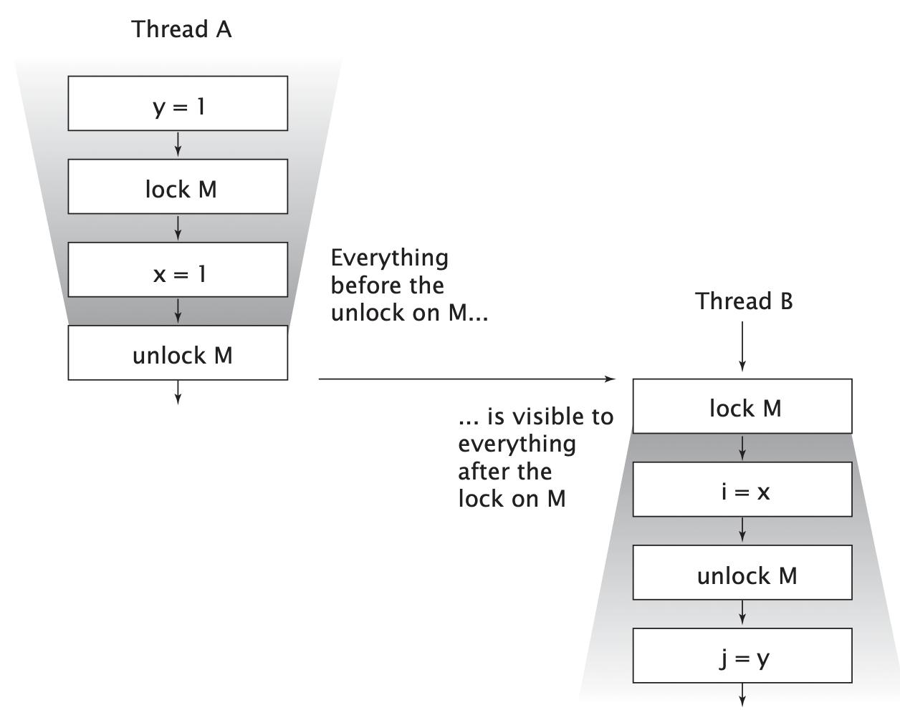

#JAVA #多线程 

## 零、序
在看Effective Java的时候，发现Josh Bloch这个人是真的厉害。想起来之前他写的《Java并发编程实战》，还有Doug Lea等JUC实现者的参与。于是准备好好看看。 

这本书的中文翻译版看着有点别扭，遇到奇怪的地方刚好有英文版的尝试看看。嘿嘿😁

## 一、浅谈多线程
### 1.1 多线程的优势
- **充分发挥多处理器的能力** 操作系统调度的基本单位是线程，如果进程只有一个线程，那么
- **更方便的建模** 处理一种内容的程序要比处理多个线程的程序更容易
- **异步事件的简化处理** 多个线程处理多个请求比同一个线程处理多个请求容易的多
- **响应更灵敏的用户界面** 现代GUI工具使用一个EDT（event dispatch thread）线程来代替事件主循环（事件循环放在了线程内部）

### 1.2 线程的风险
- **线程安全性** 不同线程修改同一变量等。。。
- **活跃性问题** 某件正在执行的事情必须执行。不能因为死锁不执行等
- **性能问题** 线程创建开销、上下文切换开销。此外，同步机制还会抑制编译器优化，使内存中的数据失效、增加共享内存总线的同步流量。

## 二、线程安全性
编写线程安全的代码，核心在于要对**状态访问操作**进行管理，特别是**共享的**和**可变的**状态的访问。

> 状态一般是指存储在状态变量中的数据（直接或间接）
> 如：HashMap中的状态除了HashMap本身，还有Map.Entry

Java中的同步机制：`synchronized`、`volatile`、显式锁、原子变量

### 2.1 定义
线程安全性的核心是正确性。所谓的正确性，就是某个类的行为与其规范完全一致。因此，线程安全性可以定义为：当多个线程访问某个类时，这个类始终都能表现出正确的行为，那么这个类就是线程安全的。

> 线程安全类中封装了必要的同步机制，调用者不需要再采取同步机制确保正确性。

无状态对象一定是线程安全的

> **无状态** 既不包含任何域，也不包含任何对其他类中域的引用

### 2.2 原子性
```java
@NotThreadSafe
public UnSafeCounting {
	private long count = 0;
	public void calc() {
		++count;
	}
}
```
这里的`++count`实际包含三个操作：读取、修改、写入。当多线程执行时，就可能出现count计算错误（如，两个线程同时读到count都是9）。

#### 竞态条件
**竞态条件**：由于不恰当的执行时序而出现不正确的结果。 最常见的竞态条件类型是“先检查后执行”，即通过一个可能失效的观测结果来进行下一步的操作。

#### 延迟初始化中的竞态条件
```java
@NotThreadSafe 
public class LazyInitRace{
	private ExpensiveObject instance = null;
	public ExpensiveObject getInstance() {
		if (instance == null)
			instance = new ExpensiveObject();
		return instance;
	}
}
```
多线程时，不能保证单例。

#### 复合操作
> **原子**：如果有两个操作A和B，如果从执行A的线程来看，当另一个线程执行B时，要么B全部执行完，要么B完全不执行，那么A和B对彼此就是原子的。
> 
> **原子操作**：对于访问同一个状态的所有操作（包括操作本身）来说，这个操作是一个以原子方式执行的操作。

当在无状态类中增加一个状态时，如果该状态完全由线程安全的对象来管理（如增加一个AtomicLong管理的字段），那么该类仍然是线程安全的。当状态由一个变成多个时，就会复杂的多。

> 尽量用现有的线程安全对象（如Atomic对象）来管理类的状态。

### 2.3 锁机制
当一个类中存在多个状态时，即使这些状态都是由线程安全的类管理的（如都是Atomic的），在很多情况下也不能保证该类是线程安全的，仍然会存在竞态条件。

#### 内置锁
同步代码块（`synchronized (lock) {}`）
`sychronized`修饰方法时，默认lock是当前对象（`this`）。

#### 重入
内置锁允许某个线程重复获取一个已经由它自己持有的锁。

> 每个共享的和可变的变量都应该只由一个锁来保护，从而使维护人员知道是哪个锁。

#### 锁的使用
一种常见的加锁约定是，将所有可变状态都封装在对象内部，并通过对象的内置锁对对象所有访问可变状态的代码路径进行同步，使得在该对象上不会发生并发访问。

> 对于每个包含多个变量的不变性条件，其中涉及的所有变量都需要用同一个锁来保护。

虽然`synchronized`可以确保单个操作的原子性，但对多个操作组成的复合操作还需要附加额外的锁来保证操作的原子性。如
```
if (!vector.contains(a)) {
	vector.add(a);
}
```
这里即使contains和add都是原子操作，也不能保证不存在竞态条件。

> 每个方法都所谓同步方法不能保证复合操作的原子性。同时，还会存在活跃性问题、性能问题！


### 2.4 活跃性与性能 

```java
@ThreadSafe  
public class SynchronizedFactorizer implements Servlet {  
    @GuardedBy("this") private BigInteger lastNumber;  
    @GuardedBy("this") private BigInteger[] lastFactors;  
    public synchronized void service(ServletRequest req,  
                                     ServletResponse resp) {  
        BigInteger i = extractFromRequest(req);  
        if (i.equals(lastNumber)) {  
            encodeIntoResponse(resp, lastFactors);  
        } else {  
            BigInteger[] factors = factor(i);  
            lastNumber = i;  
            lastFactors = factors;  
            encodeIntoResponse(resp, lastFactors);  
        }  
    }  
}
```
上述代码锁的粒度太大，影响性能。

```java
@ThreadSafe  
public class CachedFactorizer implements Servlet {  
    @GuardedBy("this") private BigInteger lastNumber;  
    @GuardedBy("this") private BigInteger[] lastFactors;  
    @GuardedBy("this") private long hits;  
    @GuardedBy("this") private long cacheHits;  
  
    public synchronized void service(ServletRequest req,  
                                     ServletResponse resp) {  
        BigInteger i = extractFromRequest(req);  
        BigInteger[] factors = null;  
        synchronized (this) {  
            ++hits;  
            if (i.equals(lastNumber)) {  
                ++cacheHits;  
                factors = lastFactors.clone();  
            }  
        }  
        if (factors == null) {  
            factors = factor(i); //耗时操作不放在锁内  
            synchronized (this) {  
                lastNumber = i;  
                lastFactors = factors.clone();  
            }  
        }  
        encodeIntoResponse(resp, lastFactors);  
    }  
 
}
```

要判断同步代码块的合理大小，需要在各种设计需求之间进行权衡，包括安全性（必须满足）、简单性和性能。不能盲目的为了性能而牺牲简单性（可能对安全性造成破坏）。

> 当执行时间较长的计算或者可能无法快速完成的操作（网络IO或控制台IO）时，一定不要持有锁。

## 三、对象的共享

第二章中的同步是避免多个线程同一时刻访问相同的数据。本章介绍如何共享和发布对象，是他们能够安全的由多个线程同时访问。

synchonized关键字的作用不仅是实现**原子性**或确定**临界区**，还有一个重要的原因**内存可见性**。
- 防止当一个线程正在使用对象状态时，另一个对象同时修改该对象状态
- 当一个线程修改了对象状态后，其他线程能够看到发生的状态变化

### 3.1 可见性
数据只要在多个线程之间共享，**就必须使用同步机制**。在没有同步的情况下，编译器、处理器以及运行时都可能对操作的执行顺序进行一些意想不到的调整。在缺乏足够同步的多线程程序中，要想对内存操作的执行顺序进行判断，几乎无法得出正确的结论。

```java
public class NoVisibility {  
    private static boolean ready;  
    private static int number;  
  
    private static class ReaderThread extends Thread {  
        public void run() {  
            while (!ready) {  
                Thread.yield();  
            }  
            System.out.println(number);  
        }  
    }  
  
    public static void main(String[] args) throws InterruptedException {  
        new ReaderThread().start();  
        number = 42;  
        ready = true;  
    }  
}
```

> `Thread.yield()`方法，使线程由执行状态变为就绪状态。

上述代码打印可能是0，也有可能永远死循环。

```java
@NotThreadSafe  
public class SynchronizedInteger {  
    private int value;  
  
    public int getValue() {  
        return value;  
    }  
  
    public void setValue(int value) {  
        this.value = value;  
    }  
}
```

另一个线程可能看不到一个线程对value的修改。必须使用同步，给getter和setter加上`synchronized`同步。

> 不可见的原因是，每个线程拥有自己的一个高速缓存区——**线程工作内存**。从缓存刷新到内存需要同步。

### 3.2 非原子的64位操作
对于非`volatile`的`long`和`double`，JVM允许将64位的读/写操作分解为两个32位操作。

### 3.3 加锁与可见性
加锁的含义不仅仅局限于互斥行为，还包括内存可见性。为了确保所有线程都能看到共享变量的最新值，所有执行读操作或者写操作的线程必须在同一个锁上同步。



### 3.4 volatile
`volatile`变量不会被缓存在寄存器或者其他处理器不可见的地方，在读取`volatile`变量时，总是返回最新写入的值。

！！不建议过度依赖`volatile`变量提供的可见性。如果在代码中依赖volatile变量控制状态的可见性，通常比使用锁的代码更脆弱，也更难理解。

> 仅当volatile变量能简化代码实现以及对同步策略的验证时，才应该使用。如果在验证正确性时，需要对可见性进行复杂的判断，就不要使用volatile。volatile变量的正确使用方式包括：确保他们自身状态的可见性，确保他们所引用的对象的轧辊台的可见性，以及标识一些重要的程序生命周期事件的发生（例如初始化或关闭）。

下面这个例子是volatile的经典用法，检查某个标记以判断是否退出循环。如果使用锁，会是的代码更复杂。
```java
volatile boolean asleep;

...
	while (!asleep)
		countSomeSheep();
```

> 加锁机制既可以确保可见性，又可以确保原子性，而`volatile`变量只能确保可见性。

当且仅当满足下列条件时，才应该使用`volatile`变量：
- 对变量的写入操作不依赖变量的当前值，或者能确保只有单个线程更新变量的值
- 该变量不会和其他状态变量一起纳入不变性条件中
- 在访问变量时不需要加锁


### 3.5 发布与逸出(publish and escape)
- **发布**一个对象是指使对象能在当前作用域之外的代码中使用
- 当某个不应该发布的对象被发布时，就称为**逸出**

```java
class UnsafeStates{
	private String[] states = new String[] {"AL","AK"};
	public String[] getStates() { return states; }
}
```

UnsafeStates的任何调用者都能修改states中的内容！！

> 外部方法：对类C来说，行为并不完全由C来规定的方法，包括其他类中定义的方法以及类C中可以被改写的方法（既不是private也不是final的方法）

发布对象的几种方法：
- 将对象的引用保存在共有的静态变量中
- 当发布一个对象时，对象的非私有域中引用的对象同样会被发布
- 发布一个内部的类实例。（非静态内部类对隐式的含有外部类的this引用）

构造方法经常会导致this隐性逸出。如
```java
public class ThisEscape {
	public ThisEscape(EventSource eventSource) {
		source.registerListener(
            new EventListener(){
                public void onEvent(Event e) {
                    doSomething(e);
                }
            }
        )
	}
}
```

`ThisEscape`发布EventSource时，也隐含发布了ThisEscape对象本身，因为这个内部类的实例中包含了对ThisEscape实例的隐式引用。

> 不要在构造函数中使this引用逸出。（只有构造函数返回时，this引用才应该从线程中逸出）

- 在构造函数中创建一个线程，无论是显式（传入线程）创建还是隐式（对象的内部类）创建，this引用都会被该线程共享。在构造函数中创建线程没有问题，但最好不要立即启动他，而是通过start或initialize方法来启动。
- 在构造函数调用一个可改写的实例方法（非private/final方法）同样会使得this在构造过程逸出。

如果想在构造函数中注册一个事件监听器或启动线程，那么可以使用一个私有的构造函数和一个公有的工厂方法来避免不正确的构造过程。

```java
public class SafeListener {
    private final EventListener listener;

    private SafeListener() {
        listenr = new EventListener() {
            public void onEvent(Event e) {
                doSomething(e);
            }
        };
    }

    public static SafeListener newInstance(EventSource source) {
        SafeListener safe = new SafeListener();
        source.registerListener(safe.listener);
        return safe;
    }
}
```


### 3.6 线程封闭（Thread Confinement）
仅在单个线程内访问数据，就不需要同步，这就是**线程封闭**

如：JDBC的Connection对象就是线程封闭技术的一种应用。

> JAVA语言没法强制将对象封闭在某个线程中。只是提供了一些机制来帮助维持线程的封闭性，例如局部变量和ThreadLocal类。但是，仍然由程序员自己确保线程中的对象不会逸出。

#### Ad-hoc线程封闭
Ad-hoc线程封闭是指，维护线程封闭性的职责完全由程序实现来承担。

#### 栈封闭
栈封闭是线程封闭的一种特例，在栈封闭中，只能通过局部变量才能访问对象。

#### ThreadLocal类
ThreadLocal提供了get、set方法，这些方法为每个使用改变量的线程都有一份独立的副本，因此get总是返回由当前线程在调用set设置的最新值。ThreadLocal对象通常用于防止对可变的单实例变量或全局变量进行共享。

如果需要将一个单线程应用程序移植到多线程环境中，通过将共享的全局变量转换为ThreadLocal对象，可以维持线程安全性。

应用程序框架中大量使用了ThreadLocal。如，EJB调用期间，J2EE容器需要将一个事务上下文与某个线程关联起来。通过将事务上下文保存在静态的ThreadLocal对象中，可以很容易的实现这个功能：当框架代码需要判断当前运行的是哪个事务时，只需要从这个ThreadLocal对象中读取事务上下文。

> ThreadLocal变量类似于全局变量，他会降低代码的可重用性并在类之间引入隐含的耦合性，在使用时要格外小心。

### 3.7 不变性
满足同步需求的另一种办法是使用不可变对象。不可变对象一定是线程安全的。

当满足以下条件时，对象才是不可变的：
- 对象创建后其状态就不能修改
- 对象的所有域都是final类型（技术上不一定，如String）
- 对象是正确创建的（构造时，this没有逸出）

> 除非需要某个域是可变的，否则应将其声明为final域。

每当需要对一组相关数据以原子方式执行某个操作时，就可以考虑创建一个不可变类来包含这些数据。如下：

```java
@Immutable
class OneValueCache {
    private final BigInteger lastNumber;
    private final BigInteger lastFactors;

    public OneValueCache(BigInteger i, BigInteger[] factors) {
        lastNumber = i;
        lastFactors = Arrays.copyOf(factors, factors.length);
    }

    public BigInteger[] getFactors(BigInteger i) {
        if (lastNumber == null || !lastNumber.equals(i))
            return null;
        else
            return Arrays.copyOf(lastFactors, lastFactors.length);
    }
}

```

### 3.8 安全发布
前面几节是关于如何确保对象不被发布，这一节是关于如何安全发布，安全的在多个线程间共享对象。

#### 不正确发布的例子
```java
public class Holder {
    private int n;
    public Holder(int n) { this.n = n; }
    public void assertSanity() {
        // 有可能会抛出异常
        if (n!=n)
            throw new AssertionError("This statement is false.");
    }
}
```

由于没有使用同步来确保Holder对象对其他线程可见，因此Holder对象未被正确发布。

#### 不可变对象
任何线程都可以在不需要额外同步的情况下安全地访问不可变对象，即使在发布这些对象时没有使用同步。

如果final类型的域所指向的是可变对象，那么在访问这些域所指向的对象的状态时仍然需要同步。

#### 安全发布的常用模式
下面介绍的安全发布主要在于对象发布后的可见性及对可见性修改。

要安全的发布一个对象，对象的引用及状态必须同时对其他线程可见。一个正确构造的对象可以通过下面的方式安全发布：
- 在静态初始化函数中初始化一个对象引用（`private static Holder holder = new Holder(42);`）
  - 静态初始化器由JVM在类的初始化阶段执行。由于在JVM内部存在同步机制，通过这种方式初始化的对象都可以安全发布。
- 将对象的引用保存在volatile或者AtomicReferance对象中
- 将对象的引用保存在某个正确构造对象的final域中
- 将对象的引用保存在一个由锁保护的域中（如线程安全容器，synchronizedList等）

> 在没有额外同步的情况下，任何线程都可以安全的使用被安全发布的事实不可变对象。

#### 可变对象
对象发布的需求取决于他的可变性：
- 不可变对象可以通过任意机制发布
- 事实不可变对象必须通过安全方式发布
- 可变对象必须通过安全方式发布，并且必须是线程安全的或者由某个锁保护起来。

#### 安全的共享对象
在并发程序汇总使用和共享对象时，可以使用一些策略：
- **线程封闭**  线程封闭的对象只能由一个线程拥有，只能由该线程修改。
- **只读共享**  在没有额外同步的情况下，共享的只读对象可以由多个线程并发访问，但任何线程都不能修改。共享的只读对象包括不可变对象和事实不可变对象。
- **线程安全共享**  线程安全的对象在其内部实现同步，因此多个线程对象可以通过对象的公有接口来进行访问而不需要进一步同步。
- **保护对象**  被保护的对象只能通过持有特定的锁来访问。保护对象包括封装在其他线程安全对象中的对象，以及已发布的并且由某个特定锁保护的对象。


## 四、对象的组合
### 4.1 设计线程安全的类
在设计线程安全类的过程中，需要包含以下三个要素：
- 找出构成对象状态的所有变量
- 找出约束状态变量的不变性条件
- 建立对象状态的并发管理策略

同步策略 定义了如何在不违背对象不变条件或后验条件的情况下对其状态的访问操作进行协同

### 4.2 实例封闭
将对象封装在对象内部，可以将数据的访问限制在对象的方法上，从而更容易确保线程在访问数据时总能持有正确的锁。

被封闭的对象一定不能超出他们的既定作用域。

> 当发布其他对象时，例如迭代器或内部类实例，可能会间接发布被封闭的对象，同样会使封闭对象逸出


！！使用**私有的锁对象**，而不是对象的内置锁（或其他可通过公有方式访问的锁），有许多优点。私有的锁对象可以将对象封装起来，使客户端无法得到锁，但客户端可以通过公有方法访问锁，以便参与到他的同步策略中。如果客户代码错误的获得了另一个对象的锁，可能会产生活跃性问题。同时，想要验证某个公有访问的锁在程序汇总是否被正确的使用，需要检查整个程序而不是单个类。

> Java监视器模式：进入和退出同步代码块的字节指令被称为monitorenter和monitorexit，而Java的内置锁也称为监视器锁或监视器。

### 4.3 线程安全的委托
将非线程安全的对象委托给线程安全的对象管理。如普通的list委托给`CopyOnWriteArrayList`。

如果类中各组件都是线程安全的，这个类不一定线程安全。

1. 将一个状态委托给线程安全的类（map委托给ConcurrentHashMap）
```java
@Immutable
public class Point {
    public final int x, y;

    public Point(int x, int y) {
        this.x = x;
        this.y = y;
    }
}

/**
* 保存所有车辆的位置
* unmodifiableMap返回locations的一个实时拷贝（view视图）
*/
@ThreadSafe
public class DelegatingVehicleTracker {
    private final ConcurrentMap<String, Point> locations;
    private final Map<String, Point> unmodifiableMap;

    public DelegatingVehicleTracker(Map<String, Point> points) {
        locations = new ConcurrentHashMap<String, Point>(points);
        unmodifiableMap = collections.unmodifiableMap(locations);
    }

    public Map<String, Point> getLocations() {
        return unmodifiableMap;
    }

    public Point getLocation(String id) {
        return locations.get(id);
    }

    public void setLocation(String id, int x, int y) {
        if (locations.replace(id, new Point(x, y)) == null) 
            throw new IllegalArgumentException("invalid vehicle name: "+id);
    }
}
```

2. 将**相互独立的状态**委托为一个类中不同的线程安全的对象

如果一个类是由多个独立且线程安全的状态变量组成，并且在所有的操作中都不包含无效的转换，那么可以将线程安全性委托给底层的状态变量

如果一个状态变量是线程安全的，并且没有任何不变形条件约束他的值，在变量的操作上也不存在任何不允许的状态转换，那么就可以安全的发布这个变量。前面的DelegatingVehicleTracker如果Point更改为线程安全的Point，就可以安全的发布Point让用户修改。


### 4.4 在现有的线程安全类中增加功能

```java
@ThreadSafe
public class BetterVector<E> extends Vector<E> {
    public synchonized boolean putIfAbsent(E x) {
        boolean absent = !contains(x);
        if (absent)
            add(x);
        return absent;
    }
}
```

要使客户端加锁，必须要知道对象X使用的是哪个锁。
```java
@NotThreadSafe
public class ListHelper<E> {
    public List<E> list = Collections.synchronizedList(new ArrayList<E>());

    ...
    public synchronized boolean putIfAbsent(E x) {
        boolean absent = !list.contains(x);
        if (absent)
            add(x);
        return absent;
    }
}

@ThreadSafe
public class ListHelper<E> {
    public List<E> list = Collections.synchronizedList(new ArrayList<E>());

    ...
    public boolean putIfAbsent(E x) {
        synchronized (list) {
            boolean absent = !list.contains(x);
            if (absent)
                add(x);
            return absent;
        }
    }
```

当为现有的类增加一个原子操作时，更好的方法是**组合**。
```java
@ThreadSafe
public class ImprovedList<T> implement List<T> {
    private final List<T> list;

    public ImprovedList(List<T> list) {
        this.list = list;
    }

    public synchronized boolean putIfAbsent(T x) {
        boolean absent = !list.contains(x);
        if (absent)
            add(x);
        return absent;
    }

    public synchronized void clear() {
        list.clear();
    }

    // ...类似clear委托其他方
}
```


### 4.5 将同步策略文档化
如果某个类没有明确声明他是线程安全的，就不要假设他是线程安全的。


## 五、基础构建模块
### 5.1 同步容器类
同步容器类包括Vector、Hashtable以及由Collections.synchronizedXxx等工厂方法创建的类。这些类都是通过对每个公有方法及性能同步实现的线程安全。

同步类的问题：复合操作可能产生意料之外的行为。
```java
// 可能产生异常的方法
public static Object getLast(Vector list) {
    int lastIndex = list.size() - 1;
    return list.get(lastIndex); //可能已经通过remove方法移除了lastIndex位置的元素。
}

// 修改的方法
public static Object getLast(Vector list) {
    synchronized(list) {
        int lastIndex = list.size() - 1;
        return list.get(lastIndex); //可能已经通过remove方法移除了lastIndex位置的元素。
    }
}
```

### 5.2 并发容器
Java5.0提供了多种**并发容器**来改善的同步容器的性能。通过并发容器来代替同步容器，可以极大的提高伸缩性并降低风险。
- `ConcurrentHashMap`替代同步且基于散列的`Map`
- `CopyOnWriteArrayList`用于替代遍历操作为主要操作的`List`
- `BlockingQueue`在Queue的基础上扩展了可阻塞的插入和获取操作。如果队列为空，那获取操作会一直阻塞，直到出现可用元素。
- `ConcurrentSkipListMap`和`ConcurrentSkipListSet`分贝作为同步的`SortedMap`和`SortedSet`的替代。

#### ConcurrentHashMap
ConcurrentHashMap使用分段锁（Lock Striping）进行加锁。

> 允许size方法返回一个近似值而不是一个精确值。

ConcurrentHashMap实现了ConcurrentMap接口，接口中包含一些常见的复合操作: putIfAbsent、removeIfEqual、ReplaceIfEqual等。

### 5.3 阻塞队列
BlockingQueue提供了可阻塞的put和take方法，以及支持定时的offer和poll。

双端队列适用于工作密取（Work Stealing）。所有消费者有各自的双端队列，如果一个消费者完成了自己双端队列中的任务，可以从其他消费者双端队列的末尾窃取工作。

双端队列的实现：ArrayDeque和LinkedBlockingDeque

### 5.4 同步工具类
阻塞队列、闭锁、信号量、栅栏（barrier）

#### 闭锁（Latch）
闭锁是一种同步工具类，可以延迟线程的进度直到其达到终止状态。闭锁的作用相当于一扇门：在闭锁到达结束状态之前，这扇门一直是关闭的，并且没有任何线程能通过，当到达结束状态时，这扇门会打开并允许所有的线程通过。当闭锁到达活动状态后，将不会改变状态，因为这扇门将永远打开下去。

用途：确保某个计算在其所有需要的资源准备好后再执行。
```java
public class TestHarness {
    public long timeTasks(int nThreads, final Runnable task) {
        final CountDownLatch startGate = new CountDownLatch(1);
        final CountDownLatch endGate = new CountDownLatch(nThreads);

        for (int i = 0; i < nThreads; i++) {
            Thread t = new Thread() {
                public void run() {
                    try {
                        startGate.await();
                        try {
                            task.run();
                        } finally {
                            endGate.count();
                        }
                    } catch (InterruptedException ignored) {}
                }
            };
            t.start();
        }

        long start = System.nanoTime();
        startGate.countDown();
        endGate.await();
        long end = System.nanoTime();
        return end - start;
    }
}
```

#### FutureTask
FutureTask表示的计算是通过Callable实现的，可以处于三种状态：等待运行、正在运行、运行完成。当运行完成后，将永远停在这个状态。

FutureTask-》异步执行任务
```java
public class PreLoader {
    private final FutureTask<ProductInfo> future = 
        new FutureTask<ProductInfo>(new Callable<ProductInfo>() {
            public ProductInfo call() throws DataLoadException {
                return loadProductInfo();
            }
        });
    private final Thread thread = new Thread(future);

    public void start() {
        thread.start();
    }

    public ProductInfo get() throws DataLoadException, InterruptedException {
        try {
            return future.get();
        } catch (ExecutionException e) {
            Throwable cause = e.getCause();
            if (cause instanceof DataLoadException)
                throw (DataLoadException) cause;
            else
                throw launderThrowable(cause);
        }
    }
    // 如果Throwable是Error，抛出它。如果是RuntimeException，返回他，否则抛出IllegalStateException
    public static RuntimeException launderThrowable(Throwable t) {
        if (t instanceof RuntimeException)
            return (RuntimeException) t
        else if (t instanceof Error)
            throw (Error) t
        else
            throw new IllegalArgumentException("Not unchecked", e);
    }
}
```

> 在构造函数或静态初始化方法中启动线程并不是什么好方法

#### 信号量（Semaphore）
计数信号量用来控制同时访问某个特定资源（或同时执行某个操作）的操作数量。

```java
//给容器设置边界
public class BoundedHashSet<T> {
    private final Set<T> set;
    private final Semaphore sem;

    public BoundedHashSet(int bound) {
        this.set = Collections.synchronizedSet(new HashSet<T>());
        sem = new Semaphore(bound);
    }

    public boolean add(T o) throws InterruptedException {
        sem.acquire();
        boolean wasAdded = false;
        try {
            wasAdded = set.add(o);
            return wasAdded;
        } finally {
            if (!wasAdded)
                sem.release();
        }
    }

    public boolean remove(Object o) {
        boolean wasRemoved = set.remove(o);
        if (wasRemoved)
            sem.release();
        return wasRemoved;
    }
}

```


#### 栅栏（Barrier）
栅栏能阻塞一组线程，直到某个事件发生。栅栏与闭锁的关键区别在于，所有线程必须同时到达栅栏位置才能继续执行。闭锁等待事件，而栅栏等待线程。
- CyclicBarrier可以使一定数量的参与方反复在栅栏位置汇集，常用在并行迭代算法。
- Exchanger是一种两方栅栏，各方在栅栏交换数据。如一个线程读数据，另一个写数据。

### 5.5 高效的缓存机制
```java
public class Memoizer<A, V> implements Computable<A, V> {
    // 使用并发容器保证安全
    // 使用Future，避免在A线程执行时，B线程提交相同的任务，重复计算。
    private final ConcurrentHashMap<A, Future<V>> cache = new ConcurrentHashMap<A, Future<V>>();
    private final Computable<A, V> c;

    public Memoizer(Computable<A, V> c) {
        this.c = c;
    }

    public V compute(final A arg) throws InterruptedException {
        while (true) {
            Future<V> f = cache.get(arg);
            if (f == null) {
                Callable<V> eval = new Callable<V>() {
                    public V call() throws InterruptedExcetion {
                        return c.comput(arg);
                    }
                };
                FutureTask<V> ft = new FutureTask<V>(eval);
                f = cache.putIfAbsent(arg, ft); //避免在特定时序下，重复计算。如A、B同时没有获取到缓存，同时put
                if (f == null) {
                    f = ft;
                    ft.run();
                }
            }
            try {
                return f.get();
            } catch (CancellationException e) {
                cache.remove(arg, f);
            } catch (ExecutionException e) {
                throw launderThrowable(e.getCause());
            }
        }
    }
}
```

## 小结
- 可变状态是至关重要的。所有并发问题都可以归结于如何协调对并发状态的访问。可变状态越少，越容易保证线程安全。
- 尽量将域声明为final，除非他们是可变的。
- 不可变对象一定线程安全。
- 封装有助于管理复杂性。易于维护不变性条件
- 用锁来保护每个可变变量。
- 当保护同一个不变性条件中的变量时，用同一把锁。
- 在执行复合操作时，要持有锁。
- 如果多个线程访问同一个可变变量时，没有同步机制，那么程序会出现问题。
- 不要假设不需要使用同步。
- 在设计过程中考虑线程安全，或指明他不是线程安全的。
- 将同步策略文档化。 