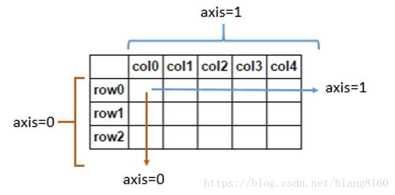

# 通俗易懂的解释numpy中的广播
<!--more-->
原连接： https://blog.csdn.net/xiang_freedom/article/details/77968164

广播是numpy对不同shape的array进行数值计算的方式，符合一定规则的前提下，将较小的array“广播”成更大的、可以计算的array。广播意味着一种向量化操作，从而在类似C语言中产生大量循环，这会导致内存和计算效率的低效。在Python中，广播不会做大量的数据复制并且通常使计算更加高效。

标准的数组计算形式为两个shape形状一样：

```
>>> a = np.array([1.0, 2.0, 3.0])
>>> b = np.array([2.0, 2.0, 2.0])
>>> a * b
array([ 2.,  4.,  6.])
1234
```

如果shape不一致，需要满足一定规则，可以使用广播。

## 广播规则

网上很多文章的写法都是：

1. 让所有输入数组都向其中shape最长的数组看齐，shape中不足的部分都通过在前面加1补齐
2. 输出数组的shape是输入数组shape的各个轴上的最大值
3. 如果输入数组的某个轴和输出数组的对应轴的长度相同或者其长度为1时，这个数组能够用来计算，否则出错
4. 当输入数组的某个轴的长度为1时，沿着此轴运算时都用此轴上的第一组值

我看的时候看了很久都没有看懂。其实可以更简单的描述： 
对两个数组，分别比较他们的每一个维度（若其中一个数组没有当前维度则忽略），满足：

1. 当前维度的值相等
2. 当前维度的值有一个是1

若条件不满足，抛出“ValueError: frames are not aligned”异常。 
输出数组的维度是每一个维度的最大值，广播将值为1的维度进行“复制”、“拉伸”，如图所示

 
需要注意的是这里的“复制”只是一个抽象概念，Python并不会对数据进行真实复制。

举例：

```
Image  (3d array): 256 x 256 x 3
Scale  (1d array):             3
Result (3d array): 256 x 256 x 3
123
```

在第三个维度相等

```
A      (4d array):  8 x 1 x 6 x 1
B      (3d array):      7 x 1 x 5
Result (4d array):  8 x 7 x 6 x 5
123
```

在第2、3、4维度满足第2个条件

```
A      (2d array):      2 x 1
B      (3d array):  8 x 4 x 3
12
```

错误的情况，在第二个维度不满足条件。

参考资料 
numpy文档 ：https://docs.scipy.org/doc/numpy-1.13.0/user/basics.broadcasting.html 
图形化描述：http://scipy.github.io/old-wiki/pages/EricsBroadcastingDoc


#  Python之NumPy（axis=0 与axis=1）区分

2018年06月23日 15:42:06 [hlang8160](https://me.csdn.net/hlang8160) 阅读数 237


转自：http://blog.csdn.net/wangying19911991/article/details/73928172

https://www.zhihu.com/question/58993137 
https://www.cnblogs.com/rrttp/p/8028421.html

python中的axis究竟是如何定义的呢？他们究竟代表是DataFrame的行还是列？考虑以下代码：
```python
df = pd.DataFrame([[1, 1, 1, 1], [2, 2, 2, 2], [3, 3, 3, 3]], \ 
columns=[“col1”, “col2”, “col3”, “col4”]) 
df 
col1 col2 col3 col4 
0 1 1 1 1 
1 2 2 2 2 
2 3 3 3 3 
如果我们调用df.mean(axis=1),我们将得到按行计算的均值

df.mean(axis=1) 
0 1 
1 2 
2 3 
然而，如果我们调用 df.drop((name, axis=1),我们实际上删掉了一列，而不是一行：

df.drop(“col4”, axis=1) 
col1 col2 col3 
0 1 1 1 
1 2 2 2 
2 3 3 3
```


Can someone help me understand what is meant by an “axis” in pandas/numpy/scipy? 
有人能帮我理解一下，在pandas、numpy、scipy三都当中axis参数的真实含义吗？

投票最高的答案揭示了问题的本质：

其实问题理解axis有问题，df.mean其实是在每一行上取所有列的均值，而不是保留每一列的均值。也许简单的来记就是axis=0代表往跨行（down)，而axis=1代表跨列（across)，作为方法动作的副词（译者注）

换句话说:

使用0值表示沿着每一列或行标签\索引值向下执行方法 
使用1值表示沿着每一行或者列标签模向执行对应的方法 
下图代表在DataFrame当中axis为0和1时分别代表的含义:

axis参数作用方向图示



另外，记住，Pandas保持了Numpy对关键字axis的用法，用法在Numpy库的词汇表当中有过解释：

轴用来为超过一维的数组定义的属性，二维数据拥有两个轴：第0轴沿着行的垂直往下，第1轴沿着列的方向水平延伸。

所以问题当中第一个列子 df.mean(axis=1)代表沿着列水平方向计算均值，而第二个列子df.drop(name, axis=1) 代表将name对应的列标签（们）沿着水平的方向依次删掉。
