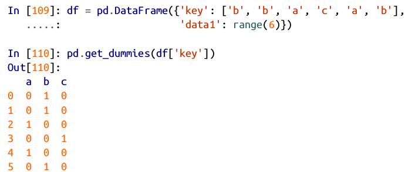
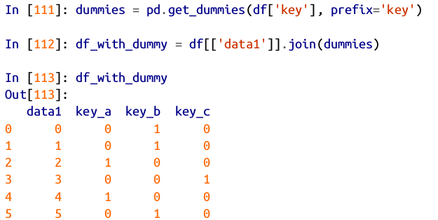
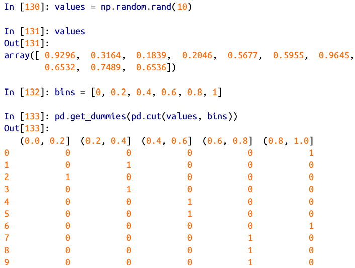
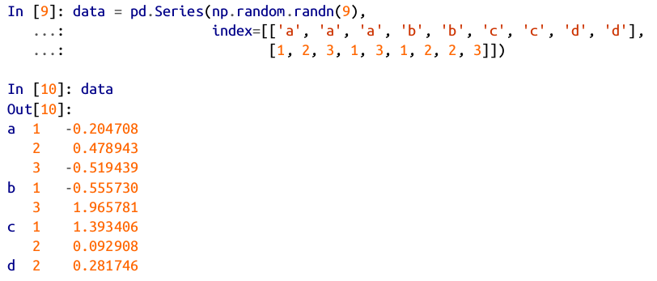
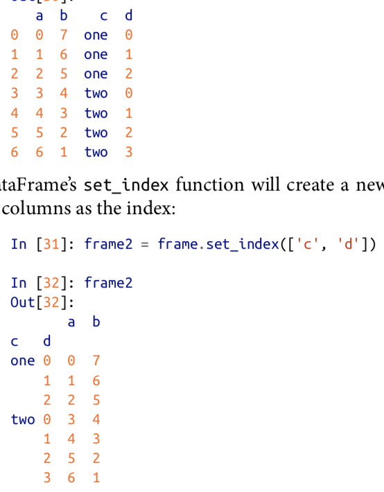
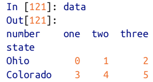
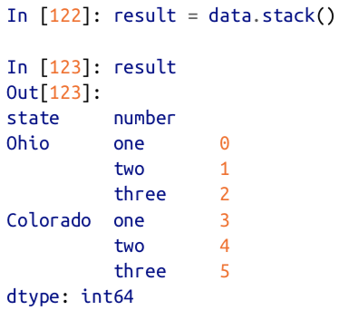
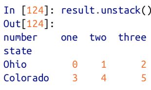
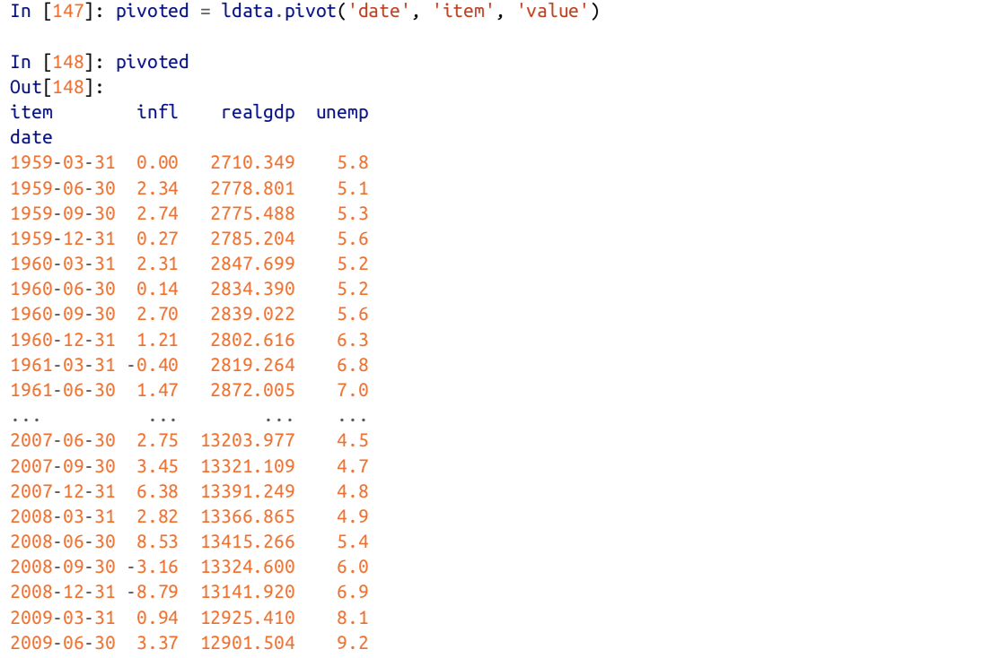

pandas中的字符串方法
<!--more-->
df["col1"].str.startswith()


# 三、数据载入，存储及文件格式

## 1。文本格式数据的读写

方法

| 函数           | 描述                                                   |
| -------------- | ------------------------------------------------------ |
| read_csv       | 从文件对象读取分隔好的数据，默认分隔符为逗号           |
| read_table     | 从文件对象读取分隔好的数据，默认分隔符为制表符（‘\t’） |
| read_fwf       | 从特定宽度的文件中读取数据，无分隔符                   |
| read_clipboard | read_table的剪贴板版本                                 |
| read_excel     | 从xls或xlsx中读取数据                                  |
| read_hdf       | 读取用pandas存储的HDF5文件                             |
| read_json      | 从json字符串读取表格数据                               |
| read_html      | 从html文件读取表格数据                                 |
| read_msgpack   | 读取MessagePack二进制格式的Pandas数据                  |
| read_pickle    |                                                        |
| read_sas       | 读取储存在SAS系统中定制储存格式的SAS数据集             |
| read_sql       | 将SQL查询结果（使用SQLAlchemy）读取为DataFrame         |
| read_stata     | 读取Stata格式的数据集                                  |
| read_feather   | 读取Feather二进制格式                                  |

参数：

```
pd.read_table(tablename,sep=',')
pd.read_csv(csv_file,names=['a','b','c']，index_col='c')  #names列名，index_col将指定列作为索引列

分层索引:
pd.read_csv(csv_file,names=['a','b','c']，index_col=['a','b'])

可以使用正则表达式
pd.read_csv(csv_file,sep='\s+') 以多个空格分开

跳过行
pd.read_csv(csv_file,skiprows=[1，2，3])

处理缺省值(na_values需要用NA替换的对象)
pd.read_csv(file,na_values=["NULL"])
指定缺省值标识(将message列中的foo和NA认为是缺省值，赋值np.nan)
sentinels = {'message':['foo','NA']}
pd.read_csv(file,na_values=sentinels)
```

参数（P170）

| 参数          | 描述                                                         |
| ------------- | ------------------------------------------------------------ |
| path          | 文件路径                                                     |
| sep/delimiter | 分隔符                                                       |
| header        | 用作索引的行号，默认为0，如果没有，应为None                  |
| index_col     | 应作行索引的列名或列号                                       |
| names         | 结果的列名列表，和header=None连用                            |
| skiprows      | 跳过的行数或行号列表                                         |
| na_values     | 需要用NA替换的值序列                                         |
| comment       | 在行结尾处分隔注释的字符                                     |
| parse_dates   | 尝试将数据解析为datetime，默认时False。如果为True，将尝试解析所有的列。也可以指定列名。如果列表的元素是元组或列表，将会组合起来进行解析 |
| keep_date_col | 如果连接列到parse_dates，保留被连接的列，默认False           |
| converters    | 包含列名称映射到函数的字典（）                               |
| dayfirst      | 解析非明确日期，按照国际标准格式处理                         |
| date_parser   | 用于解析日期的函数                                           |
| nrows         | 从文件开头处读入的行数                                       |
| iterator      | 返回一个TextParser，用于零散的读文件                         |
| chunksize     | 用于迭代的块大小                                             |
| skip_footer   | 忽略文件尾部的行数                                           |
| verbose       | 打印各种解释器输出的信息，如缺失值的数量                     |
| encoding      | 文本编码                                                     |
| squeeze       | 如果解析数据只包含一列，返回一个 Series                      |
| thousands     | 千位分隔符                                                   |

### （1）分块读取文件

```python
	pd.options.display.maxrow = 10 显示设置
  
  分块读取
  chunk = pd.read_csv(file,chunksize=1000)
  for item in chunk:
    pass
```

### (2)将数据写入文本格式

```
data.to_csv(file)
data.to_csv(file,sep='|')
data.to_csv(sys.stdout,na_rep='NULL') 缺省值的表示
data.to_csv(sys.stdout,index=False) 不输出行的标签
data.to_csv(sys.stdout,header=False) 不输出列的标签
data.to_csv(sys.stdout,columns=['a','b']) 写入列的子集

Series也有to_csv方法
```

### （3）使用分隔CSV格式

python自带了csv库

```
import csv
with open('file','r') as f:
	read = csv.reader(f)
	for i in read():
		pass
逐行读取
```

reader可选参数

| 参数             | 描述                                                         |
| ---------------- | ------------------------------------------------------------ |
| delimiter        | 分隔符                                                       |
| lineterminator   | 平台默认的行终止符                                           |
| quotechar        | 用在含有特殊字符字段中的引号，默认是“                        |
| quoting          | 引用惯例。csv.QUOTE_ALL：引用所有字段，csv.QUOTE_MINIMAL:只使用特殊字符，。。。 |
| skipinitialsqace | 忽略分隔分隔符后的空白，默认False                            |
| doublequote      | 如何处理字段内部的引号。                                     |
| escapechar       | 默认禁用。                                                   |
|                  |                                                              |

写入

```python
with open(file,'w') as f:
  writer = csv.writer(f,dialect = my_dialect)
  writer.writerow(('a','b','c'))
```

### (4) JSON

```
import json
json.dumps(obj)
json.load(pbj)

pandas.read_json('json file path') 默认每个对象是表里的一行
data.to_json(orient='record') 按照每一行数据一个{}记录
```

### (5) XML和HTML网络抓取

html

```
table = pd.read_html('filename') 会搜并尝试解析所有包含在<table>标签中的表格型数据类型。
table[0]
```

xml

```
from lxml import objectify

parsed = objectify.parse(open(path))
root = parsed.getroot()

```

## 2.二进制格式

```
pickle仅作为临时储存格式，由于库的更新，pickle化的对象未来可能无法被反序列化
pd.read_pickle()
pd.to_pickle()
```

### (1)使用HDF5格式

HDF代表分层数据格式

每个HDF5文件可以储存多个数据集并且支持元数据

HDF5适用于处理不适合在内存中存储的超大型数据

```
store = pd.HDFStore('file')
store['obj1'] = frame
store['obj2'] = frame['a']
store.put('obj2',frame,format='table') 两种格式：table和fixed，TABLe格式支持特殊语法的查询操作
store.select('obj2',where=['index>=10 and index<=15'])
```

高阶方法

```
frame.to_hdf('file','obj3',format='table')
pd.read_hdf('mydata.h5','obj3',where=['index<5'])
```

### (2)读取Microsoft Excel文件

```
读取(推荐):
xlsx = pd.ExcelFile('exp.xlsx')
df = pd.read_excel(xlsx,'sheet1')
读取简化
df = pd.read_excel('exp.xlsx','sheet1')
```

### （3）与Web API交互

```
request.get()
request.post()
```

### (4) 与数据库交互

```
import sqlalchemy as sqla
db = sqlalchemy.create_engine('sqlite://mydata.sqlite')
pd.read_sql('select * from test',db)
```


# 四、数据的清洗与准备

## 1.处理缺失值

对于数据值型的数据，pandas使用NaN(Not a number)表示缺失值。我们称NaN为容易检测到的标识值。

方法

| 方法    | 描述                                                         |
| ------- | ------------------------------------------------------------ |
| dropna  | 根据每个标签的值是否是缺失值来筛选轴标签，并根据允许丢失的数据量来确定阈值 |
| fillna  | 用某些值填充缺失的数据或使用差值方法                         |
| isnull  | 返回表明哪些值是缺失值的布尔值                               |
| notnull |                                                              |

### （1）过滤缺失值

```
from numpy import nan as NA

# 删除缺失值
# 处理Series对象
data = pd.Series([1,NA,2,3423,4,NA])
data.dropna()

data[data.notnull()]

#处理dataframe对象
df.dropna() #默认删除包含缺失值的行
df.dropna(how='all') #删除所有值均为NA的行
df.dropna(axis=1，how='all') #删除所有值均为NA的列
df.dropna(thresh=2) #保留至少有两个非NA数据的行
```

### （2）补全缺失值

```
# 所有的缺失值用相同的值补全
df.fillna(0)
# 不同列使用不同的值进行补全
df.fillna({'a':1,'b':2})
修改已经存在的对象
df.fillna(0,inplace=True)
```

fillna函数参数

| 参数    | 描述                                    |
| ------- | --------------------------------------- |
| value   | 标量值或字典型对象用于填充缺失值        |
| method  | 差值方法，如果没有其他参数，默认是ffill |
| axis    | 需要填充的轴                            |
| inplace | 修改对象，而不是生成一个视图            |
| limit   | 用于前向或后向填充时最大的填充范围      |

## 2.数据转换

### （1）删除重复值

```
df.duplicated()  返回布尔值的Series，表示每一行是否存在重复

data.drop_duplicates()  #删除相同的行

data.drop_duplicates(['k1'])  #删除k1列相同的行

data.drop_duplicates(['k1','k2'],keep='last') #保留重复的最后一行
```

### （2）使用函数或映射进行数据转换

```
lowercased = data['food'].str.lower()
lowercased.map({'meat':'pig'})

data[food].map(lambda x:meat_to_animal[x])
```

### (3) 替代值

```
替换某些值
data.replace(999,np.nan)
data.replace([999,1000],np.nan)

不同的值用不同的替换
data.replace([999,1000],[np.nan,0])
data.replace({999:np.nan,1000:0})

data.str.replace是对字符串按照元素替代的
```

### （4）重命名轴索引

```
map索引并赋值
data.index = data.index.map(lambda x:x[:4].upper())

使用rename函数
data.rename(index=str.title,columns=str.upper)
data.rename(index={'ohio':'OHIO'})

inplace:替换原有数据集
```

### （5）离散化和分箱(分段)

将数据分段

```
cut按照数据值进行切分
cats = pd.cut(ages,bins)  ages是想要划分的数据，bins是区间的断点
返回一个Categorical对象。

cats.codes 返回每个数据属于那个箱的Series
cats.categories 返回每个箱的区间
pd.value_count(cats) 返回cats的值

改变区间的开闭
cats = pd.cut(ages,bins，right=false) 默认是右封闭
自定义箱名
cats = pd.cut(ages,bins,lables=['Youth',"YoungAdult"])

根据最大值和最小值，创建等长的箱
pd.cut(data,4,precision=2)  将数据切成4份,每个区间长度相同

qcut按照数据分位数进行切分
pd.qcut(data,4) 	将数据切成4份，每个区间的数据数量相同
pd.qcut(data,[0,0.1,0.5,1])

labels=False可以使得分组名返回数值
```

### (6) 检测和过滤异常值

```
输出每列的信息
data.describe()

找出存在绝对值大于3的行
data[(np.abs(data)>3).any(axis=1)]
```

### (7)置换和随机抽样

```
随机抽样：先生成一个随机序列，然后取样
df.take(np.random.permutation(5))

df = pd.DataFrame(np.arange(20).reshape(5,4))
生成一个不含重复值的随机序列
df.sample(n=3)  #随机三个列

生成一个含重复值的随机序列(有放回的抽取)
df.sample(n=10,replace=True)
```

### （8）计算指标/虚拟变量

`pd.get_dummies`将某一列变量转换为机器学习或统计建模可用的矩阵



给变量添加前缀



将get_dummies和cut等离散化函数连用



## 3.字符串操作

### （1）Python中的字符串方法

### （2）正则表达式

### （3） pandas中的字符串函数

```
pattern = re.compile('\s+')
data.str.findall(pattern,flags=re.IGNORECASE)
data.str.match(pattern)
返回索引处的元素
data.str.get(1)
data.str[0]
```


# 五、数据规整：连接、联合和重塑

## 1、分层索引

多级index



将多层索引重塑 unstack()


恢复 stack()


多层索引对象


### （1）重排序和层级排序

```
df.swaplevel('key1','key2')
df.sort_index(level=0)  按照第0级的索引重新排序
```

### （2）按层级进行汇总统计

```
df.sum(level='key1')
df.sum(level='color',axis=1)
```

###  (3)使用DataFrame的列进行索引

```
df.set_index(['c','d'])
恢复
df.reset_index()
```



## 2.联合与合并数据集

```
pd.merge:根据一个或多个键的值进行连接，类似于数据库中的join操作
pd.concat:在axis的方向堆叠
combine_first:允许将重叠数据拼接，来使用一个对象中的值填充到另一个对象中的缺失值。
```

### （1）数据库风格的DataFrame join操作

```
pd.merge(df1,df2,on='key')  内连接
pd.merge(df1,df2,left_on='key1',right_on='key2') 当inner join的两个df的间不相同时，可以使用这种方法，等效inner join.
pd.merge(df1,df2,how='outer')  外连接
pd.merge(df1,df2,on='key',how='left')  左连接

多个键
pd.merge(df1,df2,on=['key1','key2'])

当两组数据中存在重叠的列名时，需要使用suffixes参数添加后缀
pd.merge(df1,df2,on='key1',suffixes=['_left','_right'])

每一行数据的来源
indicator参数，添加一个列返回数据来源

使用行索引进行连接
left_index=True
pd.merge(df1,df2,left_on='key1',right_index='True',how='outer')
简单的写法
df1.join([df2,df3],how='outer') 将直接根据索引进行连接
```

### (2)沿轴向连接

```
pd.concat([s1,s2,s3]) 默认沿着axis=0的轴向生效，默认外连接
pd.concat([s1,s2],axis=1,join='inner',join_axes=[['a','b','e']])

连接轴上创建多层索引
pd.concat([s1,s2],keys=['one','two']) 每一个连接对象对应一个索引
pd.concat({'one':s1,'two':s2})

pd.concat([s1,s2],ignor_index=True)  忽略默认的index
```

### （3）联合重叠数据

使用传入的对象修补缺失值

```
df1.combine_first(df2)
与下面的等价
np.where(np.isnull(df1),df2,df1)
```

## 3.重塑和透视

stack：“旋转”或将列中的数据透视到行

unstack:将行中的数据透视到列

```
df1.unstack(0)
df1.unstack('state')
```







### （1）将long的数据转换为wide的格式

```
df.pivot('data','item','value')  第一个参数作为行索引，第二个参数为列索引，第三个参数是填充df的值。

pivot方法等价于按照set_index方法建立分层索引，然后unstack。
```



### （2）将width的数据转换为long的格式

pivot的相反的操作是melt：将多列合并为一列

```
pd.melt(df,['key'])  ['key']为分组指标

指定列作为值列
pd.melt(df,id_vars=['key'],value_vars=['A','B'])
```

# pandas1.0.0新特性
## markdown导出

```python
In [1]: df = pd.DataFrame({"A": [1, 2, 3], "B": [1, 2, 3]}, index=['a', 'a', 'b'])

In [2]: print(df.to_markdown())
|    |   A |   B |
|:---|----:|----:|
| a  |   1 |   1 |
| a  |   2 |   2 |
| b  |   3 |   3 |
```

## 实验特性

### NA

```python
In [3]: s = pd.Series([1, 2, None], dtype="Int64")

In [4]: s
Out[4]: 
0       1
1       2
2    <NA>
Length: 3, dtype: Int64

In [5]: s[2]
Out[5]: <NA>
```

### string和bool类型

之前的时间和字符串都为object类型，现在可以更改为string和bool类型

### select_dtypes

`df.select_dtypes("string")`可以选择所有类型为string的列


