# 七、数据聚合和分组操作
<!--more-->
## 1.GroupBy机制

groupby的结果会自动过滤掉非数值列

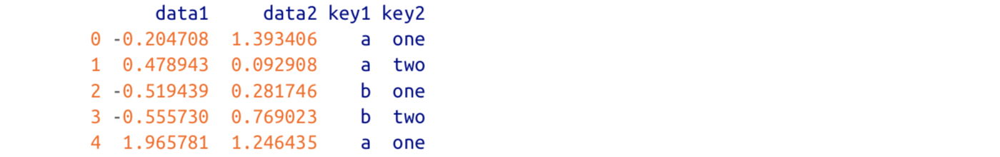

```
####以自身的列作为键
grouped = df['data1'].groupby(df[key1])
grouped 是一个GroupBy对象
grouped.mean() 返回对应键的均值

grouped = df['data1'].groupby([df['key1'],df['key2']]).mean()  #多层

# 还可以直接使用列名进行分组
df['data1'].groupby('key1').mean()
df['data1'].groupby(['key1','key2']).mean()
```


分组的键还可以是正确长度的任何数组：

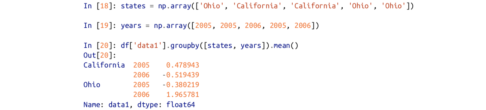

`grouped.size()`返回一个包含组大小信息的Series。

### （1）遍历各分组

1.

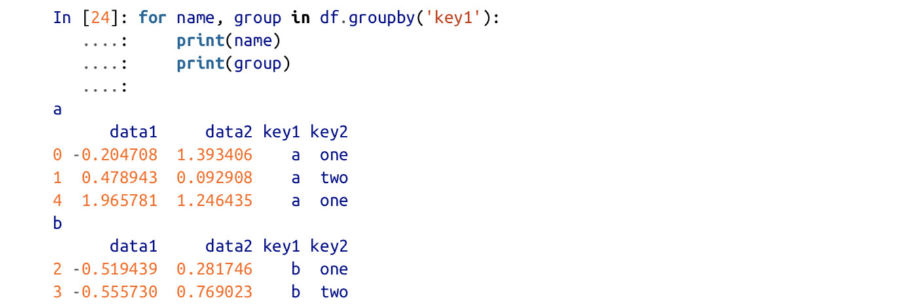

2.


3.


4.

​	axis=1 表示将每一列分给不同的组

​	默认axis=1表示将每一行分给不同的组

### （2）使用字典/Series分组

1.使用字典作为索引


2.使用Series作为索引


### （3）使用函数分组

将行索引作为调用函数的参数，以返回值作为分组依据

`df.groupby(len).sum()`

### （4）以索引层级进行分组


## 2.数据聚合

apply方法传入的是整个dataframe，而agg方法传入的是每一列数据

常用的聚合方法

| 函数名      | 描述                          |
| ----------- | ----------------------------- |
| count       | 非NA值的数量                  |
| sum         | 非NA值的和                    |
| mean        | 非NA值的均值                  |
| median      | 非NA值的中位数                |
| std，var    | 无偏的（分母n-1）标准差和方差 |
| min，max    | 非NA值的最值                  |
| prod        | 非NA值的乘积                  |
| first，last | 非NA值的第一个，最后一个      |

Series的方法生来就可以用于聚合

自定义聚合方法：


同时使用多个聚合函数：传入函数名列表

​		`grouped.agg(['sum','std',peak_to_peak])`

使用多个聚合函数时的列名难以辨认：可以通过传入元组列表（name，function）

​		`grouped.agg([('mean','foo')])`	

对不同的列使用不同的聚合函数：传入字典列表{列名：函数名}

​	`grouped.agg({'tip':np.max})`

​	`grouped.agg({'tip':[np.max,'sum']})`

返回不含行索引的聚合数据：

​		`df.groupby('key1',as_index=False)`

也可以将结果进行reset_index()获得，但as_index方法可以避免不必要的计算

## 3.应用（split-apply-combine）

对分组后的df采用apply（）方法，函数必须返回标量值或pandas对象


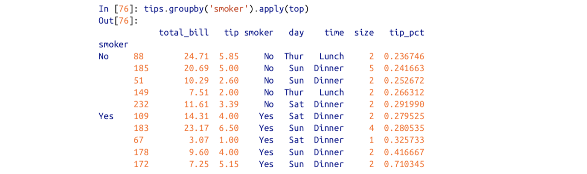

apply方法可以传入关键字参数：


### （1）压缩分组键

不显示分组的键：

`df.groupby('key1',group_keys=False)`

### （2）分位数与桶分析

cut后的对象可直接传入groupby方法。


## 4.数据透视表与交叉表

`df.pivot_table(index=['day','smoker'])`

如果只想在tip_pct和size上聚合，并根据time分组。把day放入行，smoker放入列。

`df.pivot_table(['tip_pct','size'],index=['time','day'],columns='smoker')`

添加margins=True会添加All行和列表标签，这会返回单层中所有数据的分组统计值。All为均值

可以添加aggfunc参数：


参数：


### **（1）交叉表**

计算的是分组中的数据出现的次数。

`pd.crosstab([df.time,df.dat],tips.smoker,margins=True)`

参数依次为：index，columms，


# 八、时间序列

`pd.read_csv(filename,parse_dates=True,index_col=0)`

### 1.日期和时间数据的类型及工具

常用的python库：`time,datetime,calendar`


### (1)字符串与datetime的转化

str方法和strftime方法

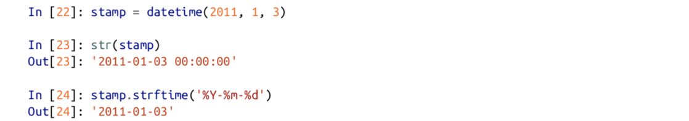

datetime格式


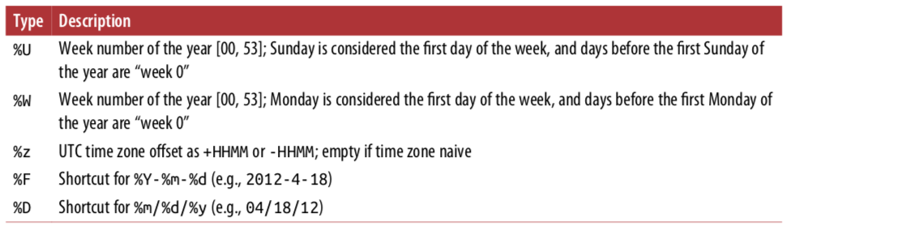

使用相同的方法可以将str转换为datetime格式


dateutil库能够自动解析日期并转换为datetime格式（日期在月份前可以使用dayfirst=True参数）：

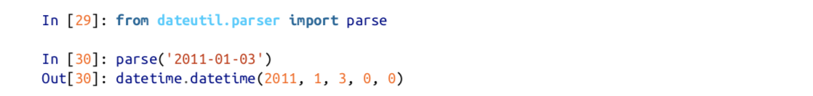

pandas中的日期：

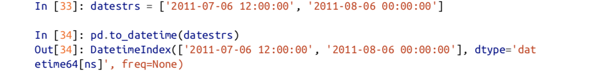

## 2.时间序列基础

不同索引的时间序列之间的算术运算在日期上自动对齐


### （1）索引、选择、子集

索引：

1）基于标签索引

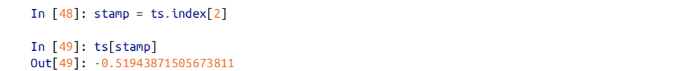

2）使用能解释为日期的字符串

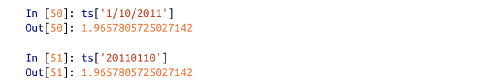

3）使用切片：通过传递年份或年份加月份（可以使用不在索引中的时间戳进行切片）

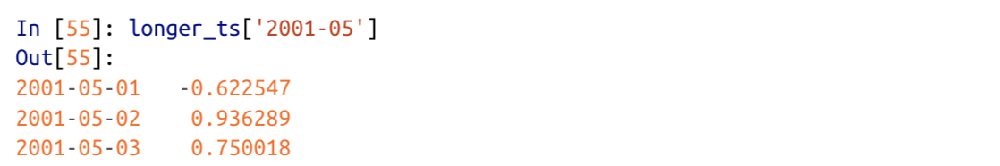


​	使用truncate切片：

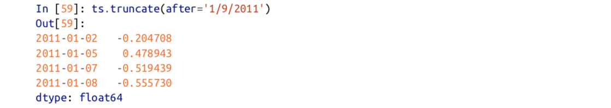

## 3.日期范围、频率和移位

### （1）生成日期范围

```
pd.date_range('2012-04-01','2012-06-01')  #默认以天为间隔
pd.date_range(start='2012-04-01',periods=20)  #生成20个时间
pd.date_range(end='2012-04-01',periods=20)  #生成20个时间
pd.date_range('2000-01-01','2000-12-01',freq='BM') #在区间内按照频率生成
pd.date_range('2012-05-06 12:56:31',periods=5,normalize=True) #生成的列表中不包含时刻，只有日期
```

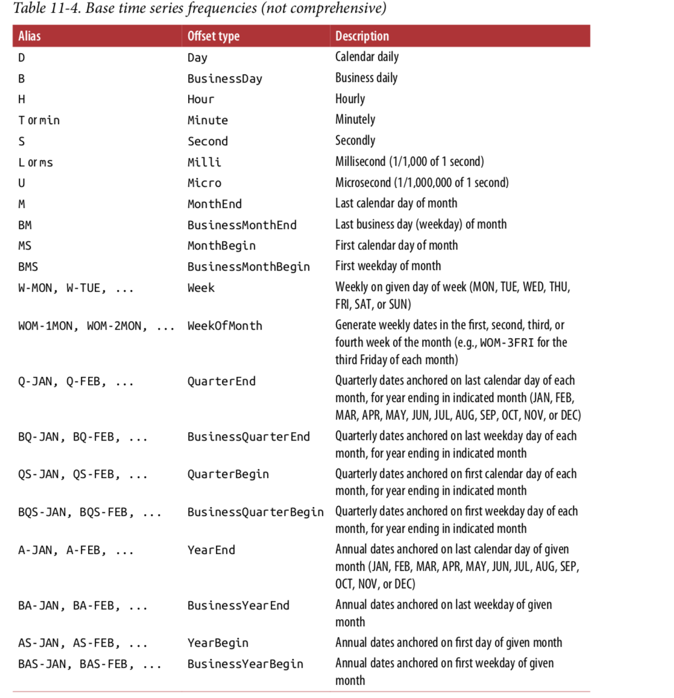

### （2）频率和日期offset

`pandas.tseries.offsets`中有Hour，Minute等对象，大多数情况下不需要主动创建

可以传递的freq参数：‘4h‘，’1h30min‘

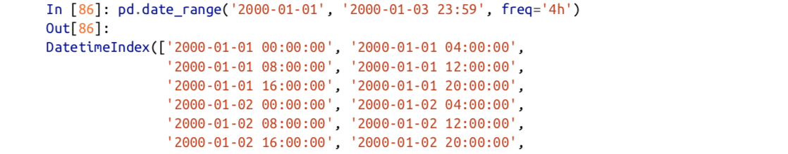

offset可以通过加法结合：


### (3)移位

将时间戳对应的数据前移或后移。


指定freq后，将会改变时间戳，而不会改变数据


使用offset：	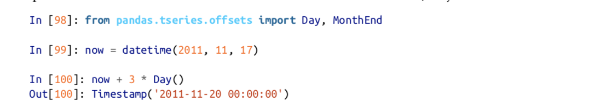

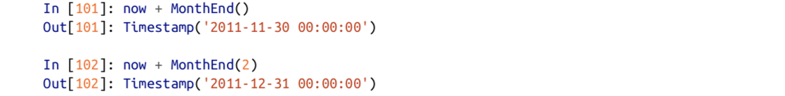

rowback和rollforward：

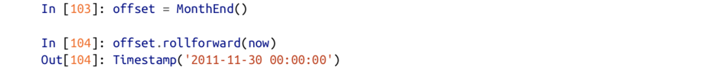

offset与groupby结合

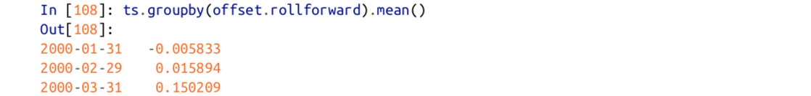

## 4.时区处理

### （1）时区的本地化和转换

```
df.index.tz      查看当前的index的时区属性
生成时直接设定
rng = pd.data_range('2012-01-01 12:01',period=10,tz='UTC')
ts = pd.Series(np.random.randn(len(rng)),index=rng)

将时区转化为本地化时区
ts.tz_localize('UTC')
ts_shanghai = ts.tz_localize('Asia/Shanghai')
ts_shanghai.tz_convert('UTC')
```

### (2)时区感知时间戳对象的操作

时间戳对象也可直接进行时区操作

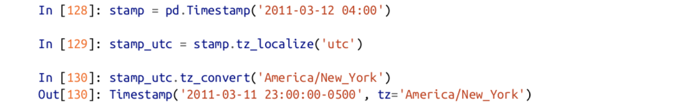

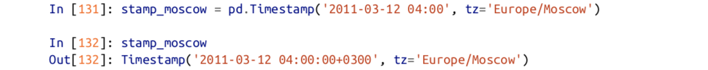

### （3）不同时区间的操作

两个时区不同的时间序列联合时，结果为UTC时间

## 5.时间区间和区间算数

```
pandas区间：
p = pd.Period(2007,freq='A-DEC')
p+2
p-5
p - pd.Period(2005,freq='A-DEC')  # 2

pandas区间序列：
pd.period_range('2000-01-01','2000-06-30',freq='M')
使用数组生成区间序列：
pd.PeriodIndex(['200103','200104'],freq='Q-DEC')
pd.PeriodIndex(year=yearlist,quarter=quaterlist,freq='Q-DEC')

区间频率的转换
p.asfreq('M',how='start')  # 低频率向高频率转换
# 高频率向低频率转换时，直接根据自区间所属决定父区间

# 时间戳转化为区间
pts = ts.to_period('M')  #转换的频率可以不指定
# 区间转换为时间戳
ts = pts.to_timestamp(how='end')

# 从数组生成PeriodIndex
```

## 6.重采样

从低频率转换到高频率：向上采样

从高频率转换到低频率：向下采样

resample方法的参数：

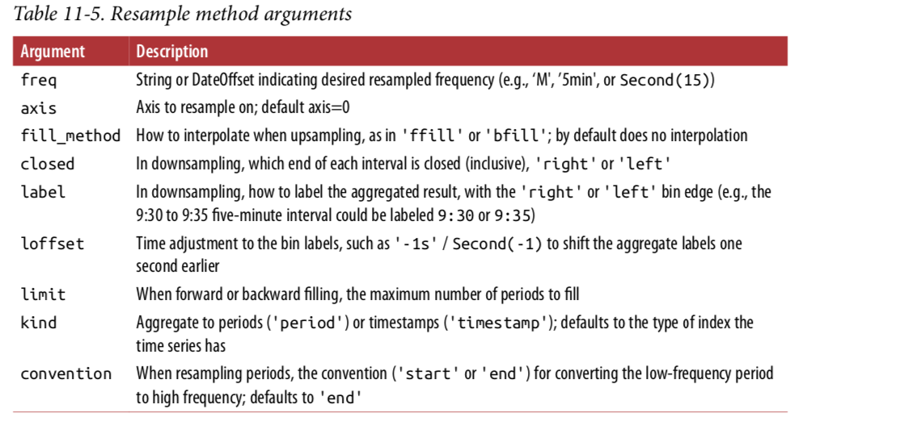

### （1）下采样

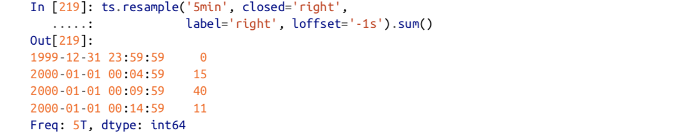

### （2）开高低收

`ts.resample('5min').ohlc()`

### (3)向上采样与差值

使用asfreq()在不聚合的情况下转到高频率

`df.resample('D').asfreq()`

差值或向前填充

`df.resample('D').ffill()`

### (4)使用时间区间进行重采样

由于区间涉及时间范围：

- 在向下采样中，目标频率必须是原频率的子区间
- 在向上采样中，目标频率必须是原频率的父区间

## 7.移动窗口函数

```
df.COL1.rolling(250,min_periods=10).mean()
df.COL1.expanding().mean()
df.COL1.ewm(span=30).mean() #指数加权函数，给近期的观测值更高的权重,span为跨度

二元移动窗口
pd.COL2.rolling(125,min_period=10).corr(pd.COL1)
pd.rolling(125,min_period=10).corr(pd.COL1)

自定义窗口函数只要输入为一个序列返回一个单值即可
```


# 九、高阶Pandas

## 1.分类数据

### （1）Categorical对象

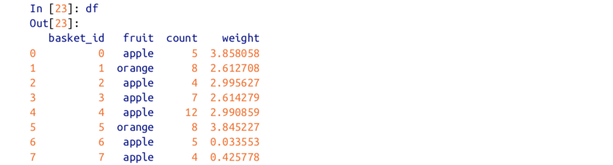

Series转换为category类型的数据

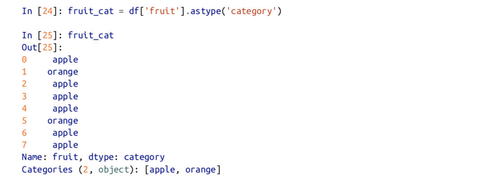

category.value对象有两个属性：codes和categories。


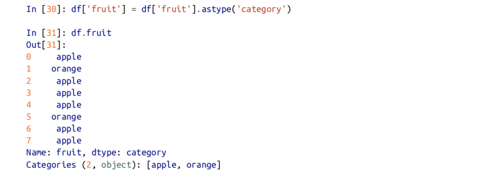

可以通过python序列直接创建pandas.Categorical对象


通过codes和categories构建

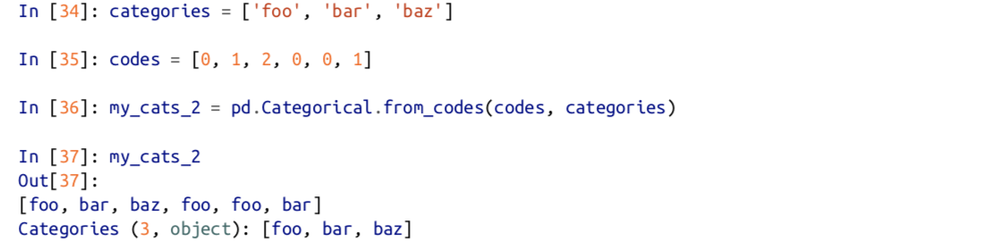

访问category对象的分类方法(通过cat)：

```
df1.cat.codes
df1.cat.categories
df2.cat.set_categories(['a','b','c'])
```

Categories方法


```python
pd.Categorical(df['thal']).cat.codes  #Categorial对应的index值
```


## 2.GroupBy高阶应用

### （1）分组转换和展开Groupby

```
df = pd.DataFrame({'key':['a','b','c']*4,'value':np.arange(12)})
gdf = df.groupby('key').value  #返回的是Series对象
gdf.mean()  #	每一组的平均值
gdf.transform('mean')  #将每一组的平均值赋值给该组每一个元素，然后返回
gdf.transform(lambda x:x.mean())
```

### （2）方法链技术

方法链可以减少中间变量

两种等价的赋值方式

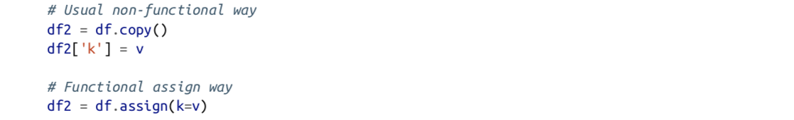

### （3）pipe方法

两种等价形式

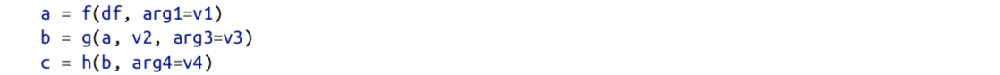


## 十、Python建模库

将pandas的DataFrame对象转换为numpy数组：df1.value


Patsy库

Statsmodels库

scikit-learn库
