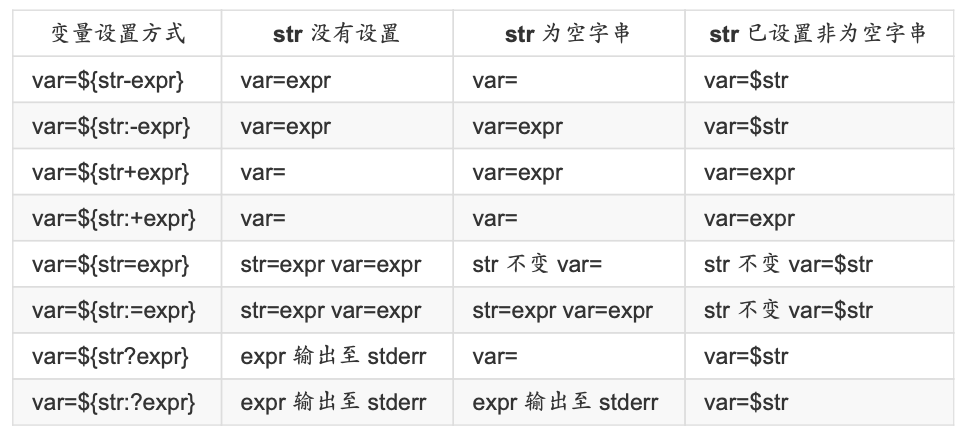
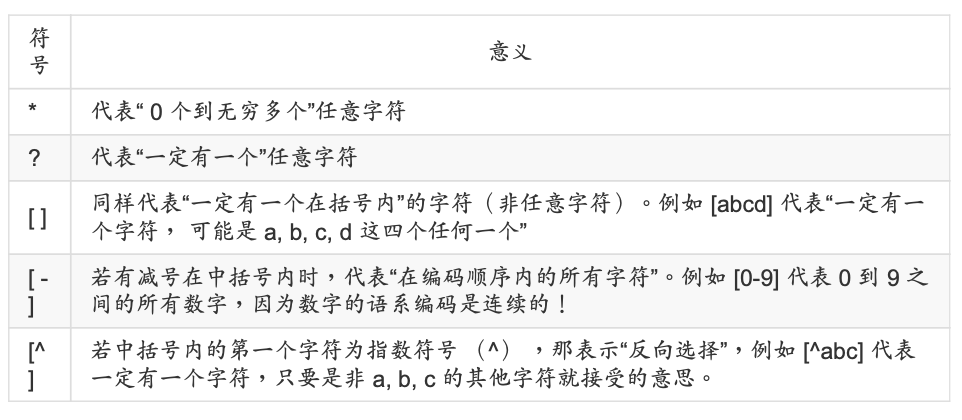
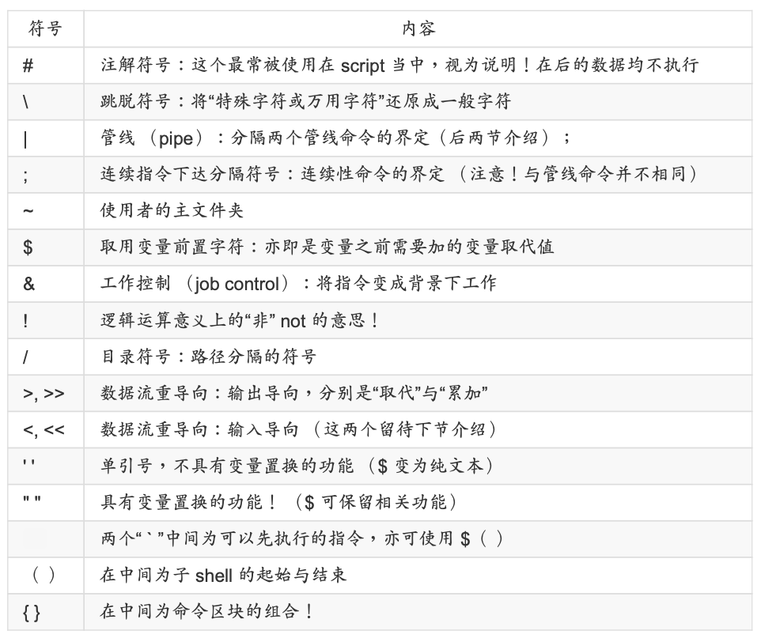

# 认识bash
<!--more-->
## echo
变量设置
```
NAME=shell
```

变量取用
```
echo $HOME
echo ${HOME}

双引号内的特殊字符如 $ 等，可以保有原本的特性，如下所示: 
“var="lang is $LANG"”则“echo $var”可得“lang is zh_TW.UTF-8” 
单引号内的特殊字符则仅为一般字符 (纯文本)，如下所示: 
“var='lang is $LANG'”则“echo $var”可得“lang is $LANG”
```

扩增变量内容
```
PATH="$PATH":/home/bin
PATH=${PATH}:/home/bin
```

取消变量
```
unset NAME
```

## env和set
`env`为环境变量

`set`为自定义变量

`export`自定义变量转为环境变量

## read、array、declare
```shell
# 输入
read -p "Please keyin your name: " -t 30 named

# 声明变量类型
declare [-aixr] variable

# array
var[1]="min"
```

## ulimit文件系统限制
```
ulimit文件系统限制
```

## 删除字串
```
# 从头删
echo ${path#/*:}  # 删掉/到：的最长部分
echo ${path##/*:}  # 删掉/到：的最短部分

# 从末尾删
echo ${path%:bin} 
```

|变量设置方式|说明|
|------------|----|
|${变量#关键字}| 若变量内容从头开始的数据符合“关键字”，则将符合的最短数据删除|
|${变量##关键字}| 若变量内容从头开始的数据符合“关键字”，则将符合的最长数据删除|
|${变量%关键字}|若变量内容从尾向前的数据符合“关键字”，则将符合的最短数据删除 |
|${变量%%关键字}| 若变量内容从尾向前的数据符合“关键字”，则将符合的最 长数据删除|
|${变量/旧字串/新字串}|若变量内容符合“旧字串”则“第一个旧字串会被新字串取代” |
|${变量//旧字串/新字串}|若变量内容符合“旧字串”则“全部的旧字串会被新字串取代”|



## 命令别名与历史命令
```shell
alias lm='ls -al|more'

history

```

# Bash环境
bash初始化会读取两个文件`/etc/profile`和`~/.bash_profile`或类似名称的文件

## `/etc/profile.d/*.sh`
只要在 /etc/profile.d/ 这个目录内且扩展名为 .sh ，另外，使 用者能够具有 r 的权限， 那么该文件就会被 /etc/profile 调用进来。在 CentOS 7.x 中，这个 目录下面的文件规范了 bash 操作接口的颜色、 语系、ll 与 ls 指令的命令别名、vi 的命令别 名、which 的命令别名等等。如果你需要帮所有使用者设置一些共享的命令别名时， 可以在 这个目录下面自行创建扩展名为 .sh 的文件，并将所需要的数据写入即可喔!




## `$$`
1.若 cmd1 执行完毕且正确执行($?=0)，则开始执行 cmd2。 2. 若 cmd1 执行完毕且为错误 ($?≠0)，则 cmd2 不执行。

## `||`
1.若 cmd1 执行完毕且正确执行($?=0)，则 cmd2 不执行。 2. 若 cmd1 执 cmd2 行完毕且为错误 ($?≠0)，则开始执行 cmd2。

## 管道`|`

## cut和grep
cut分析每行，截取对应部分

grep截取满足要求的行。

## sort,wc,uniq

## tee
双重重定向：同时屏幕和文件

## 字符转换命令 tr, col, join, paste, expand

## 参数代换: xargs

## 分区命令: split


# shell script
## 执行方式
通过`./test.sh`和`sh test.sh`的方式是在子程序中执行的。

通过`source test.sh`的方式是在父程序中执行的。

## 判断符号
`[ "$HOME" == "$MAIL" ]`

## 参数变量(`$0,$1,$2`)

## 条件判断式
```shell
if [ 条件判断式 ]; then 当条件判断式成立时，可以进行的指令工作内容;
fi &lt;==将 if 反过来写，就成为 fi 啦!结束 if 之意!
```

```shell
if [ 条件判断式一 ]; then
  当条件判断式一成立时，可以进行的指令工作内容;
elif [ 条件判断式二 ]; then
 当条件判断式二成立时，可以进行的指令工作内容;
else
 当条件判断式一与二均不成立时，可以进行的指令工作内容;
fi

```

```shell
case  $变量名称 in   &lt;==关键字为 case ，还有变量前有钱字号
  "第一个变量内容"）   &lt;==每个变量内容建议用双引号括起来，关键字则为小括号 ）
    程序段
    ;;            &lt;==每个类别结尾使用两个连续的分号来处理！
  "第二个变量内容"）
    程序段
    ;;
  *）                  &lt;==最后一个变量内容都会用 * 来代表所有其他值
    不包含第一个变量内容与第二个变量内容的其他程序执行段
    exit 1
    ;;
esac                  &lt;==最终的 case 结尾！“反过来写”思考一下！
```

function
```shell

function printit（）{
    echo "Your choice is ${1}"   # 这个 $1 必须要参考下面指令的下达
}

echo "This program will print your selection !"
case ${1} in
  "one"）
    **printit 1**  # 请注意， printit 指令后面还有接参数！
    ;;
  "two"）
    **printit 2**
    ;;
  "three"）
    **printit 3**
    ;;
  *）
    echo "Usage ${0} {one&#124;two&#124;three}"
    ;;
esac
```

```shell
while [ condition ]  &lt;==中括号内的状态就是判断式
do            &lt;==do 是循环的开始！
    程序段落
done          &lt;==done 是循环的结束
```

```shell
until [ condition ]
do
    程序段落
done
```

```shell
for var in con1 con2 con3 ...
do
    程序段
done
```

```shell
for （（ 初始值; 限制值; 执行步阶 ））
do
    程序段
done
```
